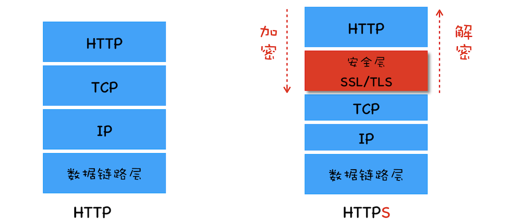
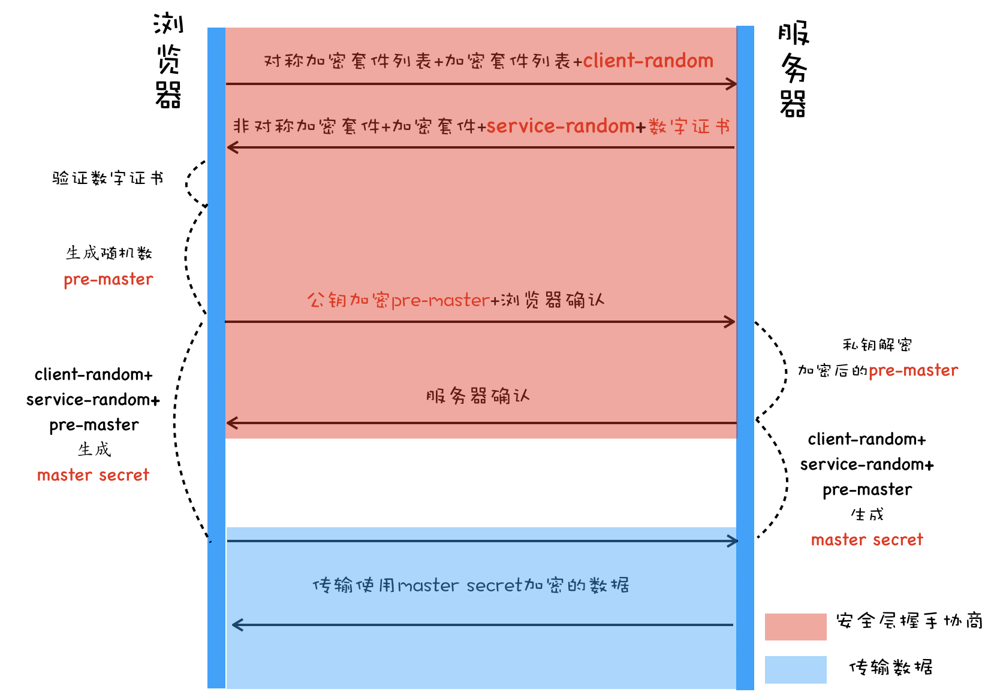

# 网络安全-HTTPS
## 背景
### HTTP 的缺陷
  HTTP 是明文传输。所以在传输的过程中，数据都有可能被窃取、伪造或者篡改（中间人攻击），所以在 HTTP 协议栈中引入了安全层，所有经过安全层的数据都会被加密或者解密。

  

### 安全层的职责
  安全层的主要职责：对发起 HTTP 请求的数据进行加密操作，对接收到 HTTP 的内容进行解密操作。

## HTTPS
### 基础概念
#### 对称加密
  加密和解密都是用相同的密钥。
#### 非对称加密
  非对称加密有 A、B 两把密钥，如果用 A 来加密，只能用 B 来解密。反过来，如果用 B 加密，只能用 A 来解密。
#### 公钥和私钥
  在 HTTPS 中，服务器会将其中的一个密钥通过明文的形式发送给浏览器，这个密钥称为公钥，服务器自己浏览的那个密钥称为私钥。

  **公钥是每个人都能获取到的，私钥只有服务器才知道，不对任何人公开。**   
#### CA 证书
  对于浏览器来说，数字证书的作用是：
  - 通过数字证书向浏览器证明服务器的身份
  - 数字证书里包含了服务器公钥。
   
### HTTPS的加密过程
 
1. 首先浏览器向服务器发送对称加密套件列表、非对称加密套件列表 和 随机数 client-random
2. 服务器保存随机数 client-random， 选择对称加密和非对称加密套件，然后生成随机数 service-random，向浏览器发送选择的加密套件、service-random 和 CA 证书，公钥包含在了 CA 证书中。
3. 浏览器验证 CA 证书
4. 生成随机数 pre-master, 利用公钥对 pre-master 加密， 并向服务器发送加密后的数据
5. 服务器拿出私钥，解密出 pre-master 数据，并返回确认消息。

到此为止，服务器和浏览器就有了共同的 client-random，service-random, pre-master, 然后服务器和浏览器会使用这三组随机数生成对称密钥，因为服务器和浏览器使用同一套方法来生成密钥，所以最终生成的密钥也是相同的。

有了对称加密的密钥之后，双方就可以使用对称加密的方式来传输数据了。

**pre-master 是经过公钥加密之后传输的，所以黑客无法获取到 pre-master，这样黑客就无法生成密钥，也就保证了黑客无法破解传输过程中的数据了。**

### 数字证书的申请
1. 申请公司需要准备一套私钥和公钥，私钥留着自己使用
2. 向 CA 机构提交公钥、公司、站点等信息并等待认证，这个认证过程可能是收费的
3. CA 通过线上、线下多种渠道来验证申请公司所提供信息的真实性。如公司是否存在，企业是否合法，域名是否归属企业等问题
4. 如果信息审核通过，CA 会像申请公司签发认证的数字证书，**包含了公司的公钥、组织信息、CA 的信息、有效时间、证书序列号等，这些信息都是明文的，同时包含一个 CA 生成的签名。**

**CA 签名生成的过程：**
- CA 使用 Hash 函数 来计算申请公司提交的明文信息，并得出信息摘要
- CA 使用它的私钥对信息摘要进行加密，加密后的密文就是 CA 颁发给申请公司的数字签名。

### 数字证书的验证
1. 浏览器读取证书中相关的明文信息，采用和 CA 签名相同的 Hash 函数来计算并得到摘要信息 A；
2. 然后利用对应的 CA 的公钥解密签名数据，得到信息摘要 B；
3. 对比信息摘要 A 和 信息摘要 B ，如果一致，则证明这个服务器是该公司的；同时浏览器还会验证证书相关的域名信息、有效时间等信息。

另外，在申请和使用证书的过程中，还需要注意以下三点：
- 申请数字证书是不需要提供私钥的，要确保私钥永远只能由服务器掌握；
- 数字证书最核心的是 CA 使用它的私钥生成的数字签名；
- 内置 CA 对应的证书称为根证书，根证书是最权威的机构，它们自己为自己签名，我们把这称为自签名证书。

### 验证 CA 机构的真实性
1. 根证书和中间证书颁发机构（Intermediate CA）：浏览器内置了一组根证书，这些根证书是受信任的CA机构颁发的。但由于根证书数量有限，CA机构通常还会使用中间证书颁发机构。中间证书由根证书颁发机构签发，用于进一步签发其他证书。浏览器可以根据根证书验证中间证书颁发机构的真实性。

2. 数字证书链验证：数字证书链是一系列证书的链条，从服务器证书一直追溯到受信任的根证书。浏览器会验证数字证书链，确保每个证书都是由下一个证书颁发机构签发的，直至达到根证书为止。如果任何一个证书无效或不可信，整个证书链将被认为无效。

3. 证书颁发机构的合法性：浏览器会检查证书中的颁发机构名称，并与其内置的受信任CA机构列表进行比对。如果颁发机构在受信任列表中，证书将被接受。否则，如果该颁发机构不在列表中，浏览器会警告用户或显示不信任的标志。

4. 证书撤销检查：CA机构可以在需要时撤销证书，例如在证书被泄露或出现问题时。浏览器会检查证书撤销列表（CRL）或在线证书状态协议（OCSP）来确认证书是否被撤销。

5. 安全连接指示：浏览器通常会在地址栏显示一些安全连接指示，如锁图标或 HTTPS 标志，以表示当前连接是受信任的安全连接。

## 小结
由于 HTTP 的明文传输特性，在传输过程中的每一个环节，数据都有可能被窃取或者篡改，这倒逼着我们需要引入加密机制。于是我们在 HTTP 协议栈的 TCP 和 HTTP 层之间插入了一个安全层，负责数据的加密和解密操作。

我们使用对称加密实现了安全层，但是由于对称加密的密钥需要明文传输，所以我们又将对称加密改造成了非对称加密。但是非对称加密效率低且不能加密服务器到浏览器端的数据，于是我们又继续改在安全层，采用对称加密的方式加密传输数据和非对称加密的方式来传输密钥，这样我们就解决传输效率和两端数据安全传输的问题。

采用这种方式虽然能保证数据的安全传输，但是依然没办法证明服务器是可靠的，于是又引入了数字证书，数字证书是由 CA 签名过的，所以浏览器能够验证该证书的可靠性。