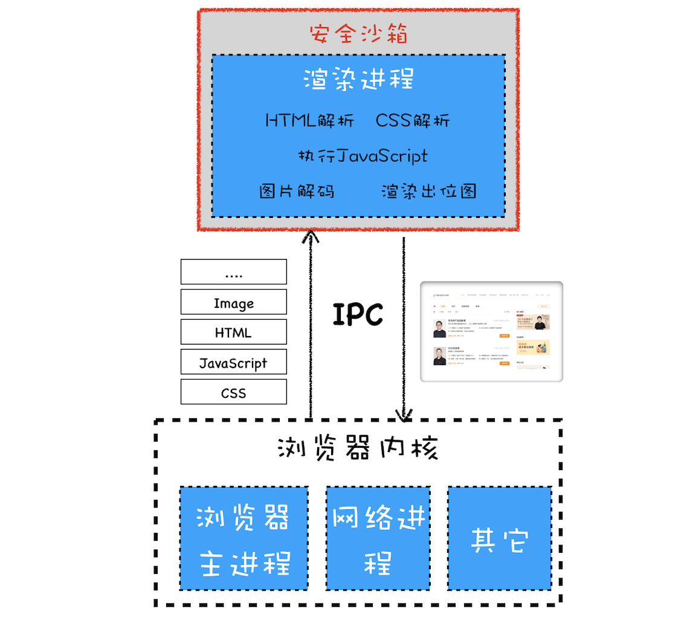

# 操作系统安全
## 单进程浏览器的安全问题
  浏览器本身的漏洞是单进程浏览器的一个主要问题。通过浏览器漏洞进行的攻击可以入侵到浏览器进程内部，可以读取和修改浏览器进程内部的任意内容，还可以穿透浏览器，在用户的操作系统上悄悄地安装恶意软件、监听用户键盘输入信息以及读取用户硬盘上的文件内容。

## 多进程架构
  现代浏览器设计的目标是安全、快速和稳定。

    

  浏览器被划分为浏览器内核和渲染内核两个核心模块，其中浏览器内核是由网络进程、浏览器主进程和 GPU 进程组成的，渲染内核就是渲染进程。

### 安全沙箱
  渲染进程需要执行 DOM 解析、CSS 解析、网络图片解码等操作，如果渲染进程中存在系统级别的漏洞，那么以上操作就有可能让恶意的站点获取到渲染进程的控制权限，进而又获取操作系统的控制权限，这对于用户来说是非常危险的。

  因为网络资源的内容存在着各种可能性，浏览器默认网络资源是不可信的，都是不安全的。但是谁也不能保证浏览器不存在漏洞，只要出现漏洞，黑客就可以通过网络内容对用户发起攻击。

  浏览器可以安全地下载各种网络资源，但是如果要执行这些网络资源，比如解析 HTML、解析 CSS、执行 JavaScript、图片编解码等操作，就需要非常谨慎了，因为一不小心，黑客就会利用这些操作对含有漏洞的浏览器发起攻击。

  基于以上原因，我们需要在渲染进程和操作系统之间建一道墙，即便渲染进程由于存在漏洞被黑客攻击，但由于这道墙，黑客就获取不到渲染进程之外的任何操作权限。**将渲染进程和操作系统隔离的这道墙就是我们要聊的安全沙箱。**

  **浏览器中的安全沙箱是利用操作系统提供的安全技术，让渲染进程在执行过程中无法访问或者修改操作系统中的数据，在渲染进程需要访问系统资源的时候，需要通过浏览器内核来实现，然后将访问的结果通过 IPC 转发给渲染进程。**

  **安全沙箱的最小保护单位是进程。因为单进程浏览器需要频繁访问或修改操作系统的数据，所以单进程浏览器是无法被安全沙箱保护的，而现代浏览器采用的多进程架构使得安全沙箱可以发挥作用。**

### 安全沙箱对模块功能的影响
#### 持久存储
  现代浏览器将文件读写的操作全部放在浏览器内核中实现，然后通过 IPC 将操作结果转发给渲染进程。
#### 网络访问
  渲染进程内部想要访问网络需要通过浏览器内核。不过浏览器内核在处理 URL 请求之前，会检查渲染进程是否有权限请求该 URL, 比如检查 XMLHttpRequest 或者 Fetch 请求是否是跨站点请求，或者检测 Https 请求中是否包含了 HTTP 请求。 
#### 用户交互
  - **渲染进程需要渲染出位图。**为了向用户显示渲染进程渲染出来的位图，渲染进程需要将生成好的位图发送到浏览器内核，然后浏览器内核将位图复制到屏幕上。
  - **操作系统没有将用户输入事件直接传递给渲染进程，而是将这些事件传递给浏览器内核。**浏览器内核根据当前浏览器界面的状态来判断如何调度这些事件，如果当前焦点位于浏览器地址栏上，则输入事件会在浏览器内核内部处理；如果当前焦点在页面的区域内，则浏览器内核会将事件转发给渲染进程。   

  **之所以这样设计，就是为了限制渲染进程有监控到用户输入事件的能力，所以所有的键盘鼠标事件都是由浏览器内核来接收的，然后浏览器内核再通过 IPC 将这些事件发送给渲染进程。**

### 站点隔离
 站点隔离是指 Chrome 将同一站点（包含了相同根域名和相同协议的地址）中相互关联的页面放到同一个渲染进程中执行。

 目前所有操作系统都面临着两个 A 级漏洞——幽灵（Spectre）和熔毁（Meltdown），这两个漏洞是由处理器架构导致的，很难修补，黑客通过这两个漏洞可以直接入侵到进程的内部，如果入侵的进程没有安全沙箱的保护，那么黑客还可以发起对操作系统的攻击。
 
 所以如果一个银行站点包含了一个恶意 iframe，然后这个恶意的 iframe 利用这两个 A 级漏洞去入侵渲染进程，那么恶意程序就能读取银行站点渲染进程内的所有内容了，这对于用户来说就存在很大的风险了。
 
 因此 Chrome 几年前就开始重构代码，将标签级的渲染进程重构为 iframe 级的渲染进程，然后严格按照同一站点的策略来分配渲染进程，这就是 Chrome 中的站点隔离。
 
 实现了站点隔离，就可以将恶意的 iframe 隔离在恶意进程内部，使得它无法继续访问其他 iframe 进程的内容，因此也就无法攻击其他站点了。
