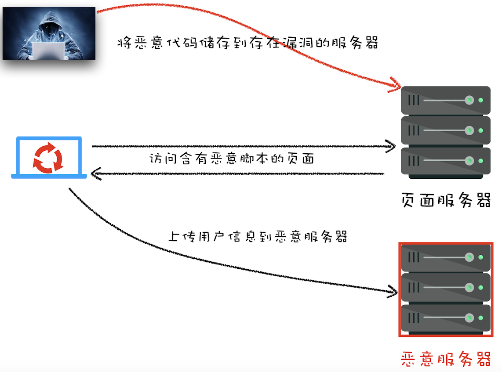

# 网站安全-XSS攻击
  xss（cross site scripting）是指黑客往 HTML 文件或者 DOM 中注入恶意脚本，从而在用户浏览页面时利用注入的恶意脚本对用户实施攻击的一种手段。

  恶意脚本可以做的事情：
  - 窃取cookie信息
  - 监听用户行为
  - 修改 DOM
  - 页面生成广告等

## 常见的xss攻击
  - 存储型xss攻击
  - 反射型xss攻击
  - 基于DOM的xss攻击

### 存储型xss攻击
  
  
  存储型 xss 攻击步骤：
  - 黑客利用网站漏洞将恶意脚本提交到网站的数据库中
  - 用户向网站请求包含了恶意脚本的页面
  - 当用户浏览页面的时候，恶意脚本会将用户的 cookie 信息等数据上传到服务器

### 反射型xss攻击
  反射型 xss 攻击步骤：
  - 用户向网站发送包含了恶意脚本的请求（恶意脚本是请求中的一部分）
  - 网站将恶意脚本返回给用户
  - 当恶意脚本在用户页面中被执行时，黑客就可以利用该脚本做一些恶意操作。

  **web 服务器不会存储反射型 xss 攻击的恶意脚本，这是和存储型 xss攻击的不同之处。**

### 基于 DOM 的 xss 攻击
  基于 DOM 的 xss 攻击是不牵扯到页面web服务器的。

  基于 DOM 的 xss 攻击的步骤：
  - 黑客基于各种手段将恶意脚本注入到用户的页面中（在web资源传输或者用户使用页面的过程中修改页面的数据）

## 如何阻止xss攻击
  xss攻击的共同点：首先往浏览器注入恶意脚本，然后再通过恶意脚本将用户信息发送至黑客部署的恶意服务器上。

  所以要阻止 xss 攻击，可以通过阻止恶意脚本的注入和恶意消息的发送来实现

### 阻止xss攻击的策略
  - 服务器对输入脚本进行过滤或者转码
  - 前端对输入内容进行过滤
  - 充分利用CSP
    * 限制加载其他域下的资源文件，这样即使黑客插入了一个恶意js脚本，这个脚本也是无法被加载的。
    * 禁止向第三方域提交数据，这样数据也不会外泄
    * 禁止直行内联脚本和未授权的脚本
    * 提供上报机制，帮助快速发现xss攻击，以便尽快修复问题。
  - HttpOnly属性
    由于很多 xss 攻击都是用来盗用cookie的，因此可以通过使用 HttpOnly 属性来保护 cookie 的安全。

    使用了 HttpOnly 的 cookie 只能使用在 HTTP 请求过程中，所以无法通过js来读取这段 cookie

    由于js无法读取设置了 HttpOnly 的 Cookie数据，所以即使页面被注入了恶意脚本，也无法获取到设置了 HttpOnly 的数据。     

### CSP
  为了解决 XSS 攻击，浏览器中引入了内容安全策略，称为 CSP

  CSP的核心思想是让服务器决定浏览器能够加载那些资源，让服务器决定浏览器能否执行内联js代码。