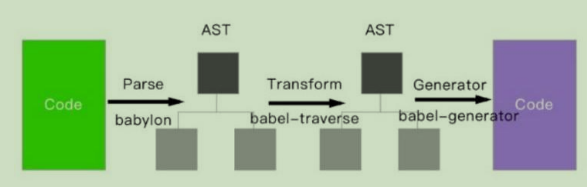

# 前端工程化-Babel
## Babel
### Babel 的原理是什么？
  
  
  babel 的转译过程也分为三个阶段：

  1. 解析 Parse: 将代码解析生成先后向语法树（AST），即词法解析与语法解析的过程。

  2. 转换 Transform: 对于 AST 进行变化一系列的操作，babel 接受得到 AST 并通过 babel-traverse 对其进行遍历，在此过程中进行添加、更新及移除等操作。

  3. 生成 Generate: 将变换后的 AST 再转换为 JS 代码，使用到的模块是 babel-generator

  