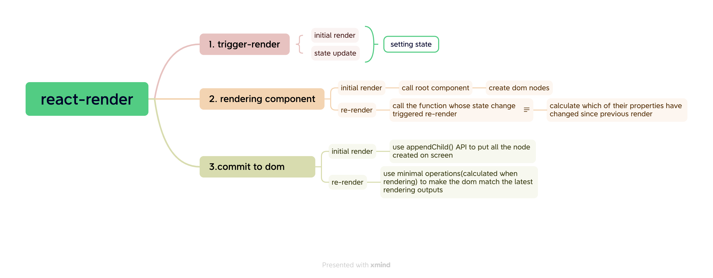
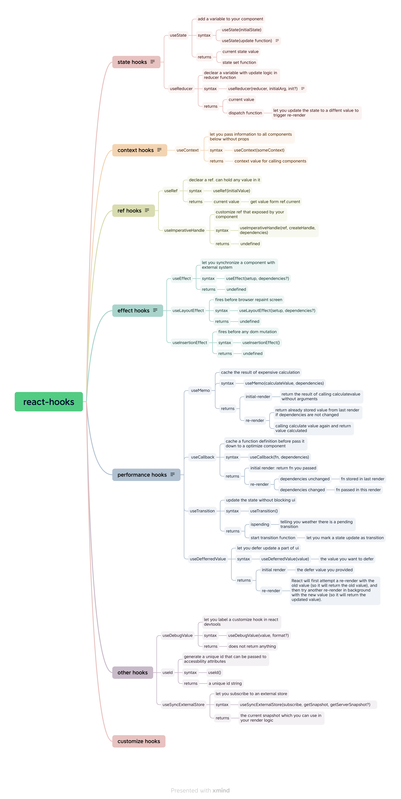

## react-base

### strict mode
- ```<React.StrictMode>```
- call function twice in development to help find components that break the pure components rules  

### components(functional components)
A component is a piece of ui that has its own logic and appearance.

In react a component is a javascript function that return jsx. 
- **feature**
  * One component only can return one jsx tag.
  * es6 import and export components
  * can call hooks on the top of function 
  * handle interactive by event handlers
  * component must be pure function
    * mind its own business: does not change any variable or object that existed before it was called
    * same inputs, same outputs: give same inputs, the pure funtion must return same results

### JSX syntaxs
  - group rendering logic and markup together
  - similar with html but is more stricter than html
    * return single root elements
    * must have close tag
    * camelCase
      * jsx cannot contain dash and reserved words, like class
  - pass string with quotes    
  - curly braces 
    * bring javascript variable or logic into markup
    * {{}} is a javascript object trunked in jsx curly braces

### React keys
  - it let react uniquely identify an item between their siblings even if item's position changed due to rendering
  - do not use index or random data as key;

### components communication
  - props
    * parent components pass information to child components
    * how to use
      1. pass - like html attributes; 
      2. read - distructuring syntax
      3. specify default value: use '='
          * the props's default value is only used when the value is missing or the value is undefined except null and 0;
      4. spread syntax: forward all of their props to their child components
      5. content prop: will appear as parent component's children prop
      6. change props: props event handler
    * props is immutable
  - pass event handler as props so that child component can call it to trigger props change
  - context
    * parent component pass information to entire tree below it 

### interactivity
  #### event handler --> state change --> render and commit --> browser paint
  

  * **event handler**
    * handle user interaction
    * handle sideEffect
    * receive event object to handle propagation, perventDefault, capture
  * **state**
    * components memory: remain data between renders;trigger react render component with new data(re-render)
    * syntax: ```useState(initial value)```
    * isolated and private
    * react keeps the state fixed within one react event handler
    * treat state as read only
    * ```setNumber(value)``` and ```setNumber(updater function)```
    * updater function is used to update the same state multiple times before a render

    ```
      const [number, setNumber] = useState(0);
      
      const handleBtnClick = () => {
        setNumber(number+1); // output: 1
        setTimeout(() => {
          setNumber(number+2) //output: 2, expect:3
        },1000)
      }

      //fixed
      const handleBtnClick = () => {
        setNumber(number+1); // output: 1  or setNumber((n) => n+2)
        setTimeout(() => {
          setNumber((n) => n+2) //output: 3; output === expect
        },1000)
      }
  ```
  * render and commit 
    * initial render or re-render
    * commit dom 
      * initial render: appendChild()
      * re-render: use minmal operation to update screen to match render outputs
  * browser paint

#### the relationship between state and render
  - state change -> re-render(call function -> update the ui match the new snapshot)   
#### refs
  - store information that remain between react renders and it is mutable;
  - communicate with external api
  - operate DOM  
#### forwardRef
  - to get another components's DOM
  - useImperativeHandle
#### flushSync  
  - force react to flush any pending work and update dom synchronously

### pure function opportunities
  - components could run in diffrent environment
  - safe to cache: same input same output
  - makes is safe to stop calculate at any time

### is SetState async or sync？
  - sync
    * setTimeout, setTimeInterval
    * original javascript event

## hooks
  
  - feature:
    * only available when react in rendering
    * only can be used at top level of the component or your own hooks
  - useState()
    * provide a ```state variable``` to remain data between renders
    * provide a ```state setter function``` to update state variable and trigger react to re-render components based pervious state
    * the update function must be 
  - useReducer(): extracting state logic;
   * input args: reducer function; initial state
   * output value: a stateful value; dispatch function  
  - useEffect()
    * syntax: useEffect(function, dependencies?)
    * start and stop synchronizing something
    * 发生在组件每一次渲染之后(componentDidMount,compoentDidUpdate,componentwillUnmount,dom真正更新之后)
    * the difference between different dependencies
      * without dependencies: rendered every time after component rendered
      * []: only execute once after component initial rendered
      * [dep1, dep2]: only execute when the dependencies changed
  - useEffectEvent()
    * it is a non-reactive pieces of your effects code
    * only can be used in useEffect()  
  - useSyncExternalStore(): let you subscribe a external store 
  - useCallback(): cache function defination between re-renders
  - useMemo(): cache expensive calculating between re-renders
  - useContext(): let a parent component provide data to entire tree below it
    * the context does not hold any information, it only persents information that you can provide or read  from your component
  - useRef(): remember some information only needed in event handler and change it doesn't need to trigger 
  render
    * store timeoutId
    * store DOMElement
    * store other objects that aren't neccessary to calculate jsx
### how to use
  - only used in top level of components
  - can not be used in ```if```、```for```、```function```
    * 因为react是根据hook的调用顺序来确保每次的state和useState
### what problems does react hooks want to resolve
  - to resolve some complex problems like pass values
  - to resolve the problem that it is difficult to retain components with components become more complex
  - in order to pre-compiler component and class will influence performance optimization