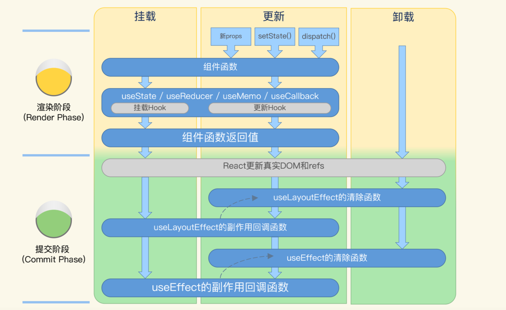

# react-深层理解
## JSX(JavaScript XML)
  [JSX 详细解释](https://facebook.github.io/jsx/)
### 什么是 JSX?
  [见React基础知识-JSX syntaxs]

  主要包含两点：

  - 类 HTML，可以包含逻辑

  - 可以直接使用 JS 表达式，不用学习新的特定语言

### 如何理解声明式语法糖？
  总的来说，React 是一套声明式、组件化的前端框架。顾名思义，**声明（动词）组件**是前端工作中最重要的组成部分。在声明组件的代码中使用了 JSX 语法，JSX 不是 HTML， 也不是组件的全部。

  **以声明式开发视图，就需要把控制逻辑代码也加入到声明语句中去。**

  在组件中，需要被渲染的内容是用 ```React.createElement(component, props, ...children)``` 声明的，而 JSX 正是createElement函数的语法糖。浏览器本身不支持 JSX，所以**在应用发布上线前，JSX 源码需要工具编译成由若干createElement函数组成的 JS 代码，然后才能在浏览器中正常执行。**

  在 Web 领域，类 HTML 语法天生就更受欢迎。**JSX 提供的类 HTML/XML 的语法会让声明代码更加直观，在 IDE 的支持下，语法高亮更醒目，比起纯 JS 也更容易维护。**相比 JSX 带来的开发效率的提升，编译 JSX 的成本基本可以忽略不计。

  **JSX 则直接利用了 JS 语句。很明显，JS 表达式能做的，JSX 都能做，不需要开发者再去学习一套新的 DSL。**

  例子：

  ```jsx
    //可以直接使用js语句
    { showAdd && <KanbanNewCard onSubmit={handleSubmit} /> }
  ```

  ```java ssh
    // 需要学习新的 DSL（Domain-Specific Language,领域特定语言）
    <s:if test="showAdd">
      <div>KanbanNewCard ...</div>
    </s:if>

  ```

### 声明式与命令式
  

  React 是声明式的前端技术，这一点首先就体现在创建组件的视图上，**无论是使用 JSX 语法还是直接利用React.createElement() 函数，都是在描述开发者期待的视图状态。**开发者只需关心渲染结果，而 React 框架内部会实现具体的渲染过程，最终调用浏览器 DOM API

### JSX 使用方法及陷阱
#### 为什么 return 语句返回 JSX 时，将 JSX 包在了一对括号 ( ) 里?
  为了避免踏入 JS 自动加分号的陷阱。
#### 命名规则
  - 组件以大写字母开头
  - 编写标签时，HTML 标签为小写字母，自定义组件首字母务必大写
  - 属性名使用驼峰命名，且区分大小写
#### 元素类型  
  - React 封装的 DOM 元素，如```<div></div>、 ```这部分元素会最终被渲染为真实的 DOM；
  - React 组件渲染的元素，如 ```<CustomComponent />```，这部分元素会调用对应组件的渲染方法；
  - React Fragment 元素，```<React.Fragment></React.Fragment>```或者简写成 ```<>```，这一元素没有业务意义，也不会产生额外的 DOM，主要用来将多个子元素分组。
  - Portal
  - Suspense 等

  React 封装的 DOM 元素将浏览器 DOM 整体做了一次面向 React 的标准化，```比如在 HTML 中很容易引起混淆的readonly="true" ，它的 W3C 标准应该是 readonly="readonly" ，而常被误用的readonly="false" 其实是无用的（谐音梗），在 React JSX 中就统一为 readOnly={true} 或 readOnly={false} ，更贴近 JS 的开发习惯。```

  至于前面反复出现的 className="kanban-card" ，更多是因为 HTML 标签里的class 是 JS 里的保留字，需要避开。

  React 组件渲染的元素，JSX 中的 props 应该与自定义组件定义中的 props 对应起来；如果没有特别处理，没有对应的 props 会被忽略掉。这也是开发 JSX 时偶尔会犯的错误，在组件定义中改了 props 的属性名，但忘了改对应的 JSX 元素中的 props，导致子组件拿不到属性值。至于 Fragment 元素，没有 props。

#### JSX 子元素类型
  JSX 元素可以指定子元素。**子元素不一定是子组件，子组件一定是子元素。**  

  子元素的类型包括：
  
  - 字符串，最终会被渲染成 HTML 标签里的字符串；
  - 另一段 JSX，会嵌套渲染；
  - JS 表达式，会在渲染过程中执行，并让返回值参与到渲染过程中；
  - 布尔值、null 值、undefined 值，不会被渲染出来；
  - 以上各种类型组成的数组。

#### JSX 中的 JS 表达式
  在 JSX 中可以插入 JS 表达式，特征是用大括号 { } 包起来，主要有两个地方：
  
  1. 作为 props 值，如 添加新卡片；

  2. 作为 JSX 元素的子元素，如{title}。

  这些表达式可以简单到原始数据类型 {true} 、{123} ，也可以复杂到一大串 Lambda 组成的函数表达式 ```{ todoList.filter(card => card.title.startsWith('TODO:')).map(props => <KanbanCard {...props} />) }``` ，只要确保最终的返回值符合 props 值或者 JSX 子元素的要求，就是有效的表达式。

  JSX 是声明式的，所以它的内部不应该出现命令式的语句，如 if ... else ...。当你拿不准自己写到 JSX { } 里的代码到底是不是表达式，可以试着把这部分代码直接赋值给一个 JS 变量。如果这个赋值能成功，说明它确实是表达式；如果赋值不成功，可以从如下四个方面进行检查：
  
  - 是否有语法错误；
  - 是否使用了for...of的声明式变体array.forEach ，这个中招几率比较高；
  - 是否没有返回值；
  - 是否有返回值，但不符合 props 或者子元素的要求。

  另外有个 props 表达式的特殊用法：属性展开， 利用 JS ```...``` 语法把 props 这个对象中的所有属性都传给 KanbanCard 组件。

  如果你想在 JSX 里加注释，会发现 HTML 注释 根本没法通过编译，这时需要改用 {/* */} 来加注释，编译时它会被识别成 JS 注释然后抛弃掉。

#### JSX 与 React 组件的关系
  JSX 是 React 组件的一部分。
#### 函数组件得以快速发展的原因？
  - React 的 哲学 ```UI=f(state)```
  - 更彻底的关注点分离（Separation of Concerns）
  - 函数式编程的影响
  - React 内部实现的不断优化
  - 开源社区的反哺  

## React JSX runtime


## React 组件化
### 为什么要组件化？
  **组件是对视图以及视图相关的逻辑、数据、交互等的封装。**

  **低耦合高内聚的封装已经被证明是更加有效的软件工程实践。**

### 为什么要有组件层次结构？

  组件层次结构可以帮助我们在设计开发组件过程中，**将前端应用需要承担的业务和技术复杂度分摊到多个组件中去，并把这些组件拼接在一起。**

  React 组件层次结构从一个根部组件开始，一层层加入子组件，最终形成一棵组件树

### React 子组件

  严格来说，React 没有组件树（Component Tree），只有元素树（Element Tree），即从根元素开始，父元素子元素之间形成的树。

  我们经常提到的组件树和父子组件，其实可以从**组件声明和组件实例**两个层面来理解。
  
  从组件声明层面：根据静态代码，**在一个组件返回的 JSX 中，加入另一个组件作为子元素，那么可以说前者是父组件，后者是子组件。**父子组件形成的树即为组件树。

  从组件实例层面：**组件树是来自运行时的 React 元素树、从逻辑上排除掉 HTML、Fragment 等元素，仅保留对应 React 组件的元素节点而形成的精简树。**在这棵组件树中，对应元素呈父子关系的一对组件可以称作父子组件。

### React组件设计原则
  - **有意义：** 命名准确，充分表意；参数准确，必要的类型检查；适当的注释。
  - **通用性：** 不要耦合特殊的业务功能；不要包含特定的代码处理逻辑。
  - **无状态，无副作用：** 状态向上层提取，尽量少用内部状态；解耦IO操作。
  - **避免过度封装，遵循简约（KISS，Keep It Simple & Stupid）原则：** 合理冗余，避免过度抽象。
  - **单一职责：** 一个组件只能完成一个功能；尽量避免不同组件间相互依赖、互相循环。 
  - **关注点分离原则：** 将不同的功能和责任分配到不同的组件、模块或者层次中，以降低耦合度，提高代码的可读性和维护性。
  - **一次且仅一次（DRY, Don’t Repeat Yourself）原则：** 特定的信息或逻辑应该只被定义、记录或实现一次，以避免重复和冗余。
  - **易于测试：** 更容易得单元测试覆盖。

  **就组件拆分方向而言，一般面对中小型应用，更倾向于从上到下拆分，先定义最大粒度的组件，然后逐渐缩小粒度；面对大型应用，则更倾向于从下往上拆分，先从较小粒度的组件开始。**

### 受控组件

  以 React state 为单一事实来源（Single Source of Truth），并用 React 合成事件处理用户交互的组件，被称为“受控组件”。

## 虚拟DOM

  React 提供了包括 JSX 语法在内的声明组件 API，在运行时，开发者声明的组件会渲染成虚拟 DOM，虚拟 DOM 再由 React 框架渲染成真实的 DOM；虚拟 DOM 的变动，最终会自动体现在真实 DOM 上；真实 DOM 上的交互，也会由 React 框架抽象成虚拟 DOM 上的副作用（Side-effect），与开发者编写的交互逻辑关联起来

  

### VDOM 作用
  - **减少代码量**
  - **是 React 面向开发者的API 与 React 内部实现对接的桥梁。**
  - **可以连接多端**

    如果没有虚拟 DOM 这个中间模型，那么 React API 就需要直接对接 DOM API，耦合程度提高，React 概念和 API 设计也会受制于浏览器，React Native 这样对接多端的愿景也无从实现了，React 也许就很难称作是 React 了。

### 真实 DOM 存在的问题
  - **操作真实 DOM 是比较耗费资源的。**
    
    无脑的大量调用 DOM API 绘制页面，页面很容易就卡了。

### 协调
  开发者使用的是 React 的声明式 API，在此基础上，每次有 props、state 等数据变动时，组件会渲染出新的元素树，React 框架会与之前的树做 Diffing 对比，将元素的变动最终体现在浏览器页面的 DOM 中。这一过程就称为协调（Reconciliation）。

### Diff 过程
  Diff 基本逻辑可以归纳为以下几点：

  1. 从根元素开始，React 将递归对比两棵树的根元素和子元素；

  2. 对比不同类型的元素，如对比 HTML 元素和 React 组件元素，React 会直接清理旧的元素和它的子树，然后建立新的树；

  3. 对比同为 HTML 元素，但 Tag 不同的元素，如从 ```<a>```变成 ```<div>```，React 会直接清理旧的元素和子树，然后建立新的树；

  4. 对比同为 React 组件元素，但组件类或组件函数不同的元素，如从 KanbanNewCard 变成 KanbanCard ，React 会卸载旧的元素和子树，然后挂载新的元素树；

  5. 对比 Tag 相同的 HTML 元素，如  ```<input type="text" value="old" /> 和 <input type="text" value="new" />``` ，React 将会保留该元素，并记录有改变的属性，在这个例子里就是 value 的值从 "old" 变成了 "new" ；

  6. 对比组件类或组件函数相同的组件元素，如 ```<KanbanCard title="老卡片" /> 和 <KanbanCard title="新卡片" />``` ，React 会保留组件实例，更新 props，并触发组件的生命周期方法或者 Hooks。

### 触发协调的场景

  props, state 和 context。其中props 从组件外面传进来，state 则是活跃在组件内部，至于 context ，在组件外面的 Context.Provider 提供数据，组件内部则可以消费 context 数据。
   
  **只要这三种数据之一发生了变化，React 就会对当前组件触发协调过程，最终按照 Diffing 结果更改页面。**

### 什么是 Fiber 协调引擎
  从 React v16 开始，协调从之前的同步改成了异步过程，这主要得益于新的 Fiber 协调引擎。从此在 React 中更贴近虚拟 DOM 的，是在 Fiber 协调引擎中的核心模型 FiberNode。
  
  FiberNode 依靠对元素到子元素的双向链表、子元素到子元素的单向链表实现了一棵树，这棵树可以随时暂停并恢复渲染，触发组件生命周期等副作用（Side-effect），并将中间结果分散保存在每一个节点上，不会 block 浏览器中的其他工作。  

### 小结
  React 中的虚拟 DOM 远是真实 DOM 的抽象，且远比后者更轻量，是 React 面向开发者的 API 与内部实现对接的桥梁。
  
  React 组件的 props、state 或者 context 改变时，React 会触发协调过程对比新旧两棵元素树，计算出有哪些真实 DOM 需要变更。
  
  这些就是 React 组件的渲染机制。理解了渲染机制，你就更清楚该如何写出对的组件、快的组件。

## CSS-in-JS
  - 模板字面量
  - Object Styles
### 标签模板字符串


## 组件生命周期
  **组件生命周期并不等同于类组件的生命周期方法。**

  组件生命周期首先是一组抽象概念，类组件生命周期方法和 Hooks API 都可以看作是这组概念的对外接口。因此，无论是选择函数组件加 Hooks，还是在类组件上一条路走到黑，都要学习组件生命周期。

### **类组件生命周期：**

  

### **函数式组件生命周期：**  

  

  1. **挂载阶段。**React 会执行组件函数，在函数执行过程中遇到的 useState 、 useMemo 等 Hooks 依次挂载到 FiberNode 上，useEffect 其实也会被挂载，但它包含的副作用（Side-effect，在 Fiber 引擎中称为 Effect）会保留到提交阶段。组件函数的返回值通常会使用 JSX 语法，React 在渲染阶段根据返回值创建 FiberNode 树。在提交阶段，React 更新真实 DOM 之前会依次执行前面定义的 Effect。
  
  2. **更新阶段。** 当组件接收到新 props，调用 useState 返回的 setter 或者 useReducer 返回的 dispatch 修改了状态，组件会进入更新阶段。组件函数本身会被再次执行，Hooks 会依次与 FiberNode 上已经挂载的 Hooks 一一匹配，并根据需要更新。组件函数的返回值用来更新 FiberNode 树。进入提交阶段，React 会更新真实 DOM。随后 React 会先执行上一轮 Effect 的清除函数，然后再次执行 Effect。这里的 Effect 包括 useEffect 与 useLayoutEffect ，两者特性很相像。其中useLayoutEffect 的 Effect 是在更新真实 DOM 之后同步执行的，与类组件的 componentDidMount、componentDidUpdate 更相似一些；而 useEffect 的 Effect 是异步执行的，一般晚于 useLayoutEffect 。
  
  3. **卸载阶段。** 主要是执行 Effect 的清除函数。函数组件也有错误处理阶段，但没有对应的生命周期 Hooks，错误处理依赖于父组件或祖先组件提供的错误边界。
  
  从内部实现来看，类组件和函数组件的生命周期已经有了比较大的区别。

## React Hooks
  React 对 UI 的理想模型是 UI=f(state)，其中 UI 是视图，state 是应用状态，f 则是渲染过程。比起类组件，函数组件更加贴近这一模型。

  Hooks 是一套为函数组件设计的，用于访问 React 内部状态或执行副作用操作，以函数形式存在的 React API。

### 什么是副作用？
  计算机领域的副作用是指：当调用函数时，除了返回可能的函数值之外，还对主调用函数产生附加的影响。例如修改全局变量，修改参数，向主调方的终端、管道输出字符或改变外部存储信息等。

  总之，**副作用就是让一个函数不再是纯函数的各类操作。** 注意，这个概念并不是贬义的，在 React 中，大量行为都可以被称作副作用，比如挂载、更新、卸载组件，事件处理，添加定时器，修改真实 DOM，请求远程数据，在 console 中打印调试信息，等等。

## React 合成事件
  **合成事件的底层仍然是 DOM 事件，但隐藏了很多复杂性和跨浏览器时的不一致性，更易于在 React 框架中使用。**
### 合成事件与原生 DOM 事件区别？
  1. 注册事件监听函数的方式不同

    原生 DOM 可以通过内联，JS， 以及 addEventListener 方法来注册监听事件。

    合成事件需要使用驼峰写法，不能用 addEventListener 来监听，如果需要以捕获方式监听事件，可以使用 ```onClickCapture``` 

  2. 特定事件的行为不同

    React 合成事件规范化了一些在各个浏览器间行为不一致，甚至是在不同元素上行为不一致的事件，其中有代表性的是 onChange 。

  3. 实现注册的目标 DOM 元素不同

    React 使用了事件代理模式。React 在创建根（ createRoot ）的时候，会在容器上监听所有自己支持的原生 DOM 事件。当原生事件被触发时，React 会根据事件的类型和目标元素，找到对应的 FiberNode 和事件处理函数，创建相应的合成事件并调用事件处理函数。

## 组件数据流转
### 什么是数据流？
  提到数据流，要先提一下函数响应式编程（Functional Reactive Programming），顾名思义，函数响应式编程是一种利用函数式编程的部件进行响应式编程的编程范式。
  
  **数据流（Data Flow）则是其中响应式编程的重要概念，响应式编程将程序逻辑建模成为在运算（Operation）之间流动的数据及其变化。**  

  举个最简单的例子，对于 b = a * 2 这个赋值语句，如果把 a * 2 定义为一个运算，那么如果流动进来的 a 发生了改变，则 b 会自动响应前者的变化。
  
  估计你看到这个例子，马上就会想到 React 的设计哲学 UI = f(state) ，比如一个函数组件 ({ a }) => ({ a * 2 }) ，只要 prop 属性 a 发生变化，组件渲染的包含的内容就会自动变化。

### React 中的数据流包含哪些数据？
  - props
  - state
  - context

  

### React 单向数据流
  props、state 和 context 三种数据，共同组成了 React 组件的数据流。React 是一种声明式的前端框架，在 React 的数据流上也体现了这一点。在典型场景下，你可以通过声明这三种数据来设计 React 应用的数据流，进而控制应用的交互和逻辑。
  
  只有这三种数据的变更会自动通知到 React 框架，触发组件必要的重新渲染。当你的数据流中混入了不属于它们其中任意一种的数据，就要小心，这种跳出“三界之外”的数据很有可能带来 Bug，比如数据改变了但组件并不重新渲染。


## 不可变数据
### 不可变数据特征
  **不可变数据（Immutable Data）在创建以后，就不可以再被改变。**

  特征：

  - 不可变数据对象只能在创建时为属性赋值，创建后就不能修改；

  - 不可变数据对象的属性也应该是不可变数据，即整个对象树都不可变；

  - 变更（Mutate）不可变数据只能通过创建新对象、同时显式地指定需要变更的属性的方式，创建出的新对象依旧不可变；

  - 用相同属性创建出来的两个同类型的不可变对象，它们逻辑上相等但对象引用是不相等的。

### React 为什么需要不可变数据？
  这主要还是因为 React 是声明式的框架，为了更新用户看到的页面，我们需要让开发出来的 React 组件响应数据流的变化。这就是说无论开发者，还是 React 框架本身都关注 props、state、context 的数据是否有变化。**对 React 框架，不可变数据可以简化比对数据的实现，降低成本；对开发者，不可变数据在开发和调试过程中更容易被预测。**

### React 哪些环节会检查数据的变化？
  - **协调过程中的数据对比**

    首先是最核心的 Fiber 协调引擎，常提到的 Diffing 对比算法就在引擎里，这些对比绝大部分都是在渲染阶段发生的。

  - **合成事件中的数据对比**

## 状态管理
### 状态管理工具
  - redux
  - MobX
  - XState


## 代码复用
### React 应用中两种主要的抽象方式：
  - 自定义 Hooks
  - 组件组合
    * 高阶组件（HOC）
