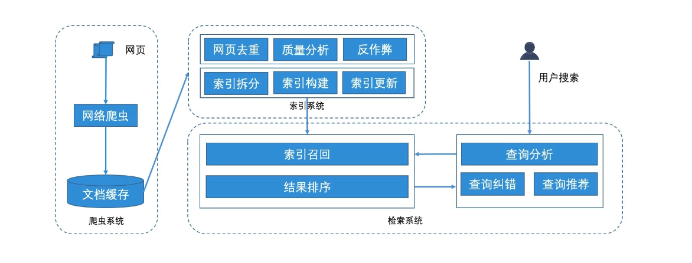
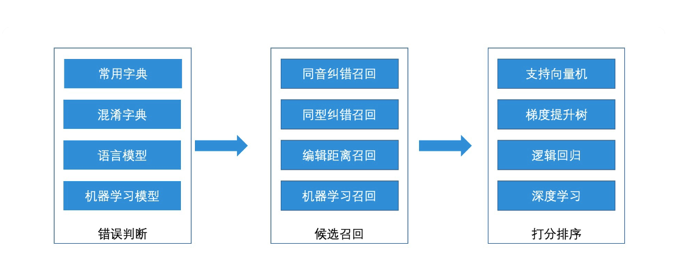

# 搜索引擎与 SEO
## 搜索引擎核心
  **搜索引擎的核心系统包含三部分：爬虫系统、索引系统 与 检索系统**
  
### 爬虫系统
  **搜索引擎通过高性能的爬虫系统来完成持续的网页抓取，并且将抓取到的网页存入存储平台中。**一般来说，可以将主渠道的网页存放在基于 LSM 树的 HBase 中，以便支持数据的高效读写。
### 索引系统
  在爬虫系统抓取到网页之后，需要对这些网页进行一系列的处理，它们才可以变成可用的索引。 **处理分为两个阶段，首先对网页进行预处理，主要的手段包括相似网页去重、网页质量分析、分词处理等工作，然后是对网页进行反作弊的分析工作，来避免一些作弊网页干扰搜索结果。**    

  处理好网页之后，我们就要为搜索引擎生成索引，索引的生成过程主要分为三步。

  - **第一步，索引拆分。**

    由于抓取到的网页量级非常大，把它们全部生成索引不太现实，因此**会在离线阶段，根据之前的网页预处理结果，进行计算和筛选，分别分离出高质量和普通质量的网页集合。**这样就可以进行**分层索引**了。由于网页集合还是很多，因此还需要进行基于文档的拆分，以便生成索引。

  - **第二步，索引构建。**

    在确认索引分片机制后，可以使用 Map Reduce 服务，来为每个索引分片生成对应的任务，然后生成相应的倒排索引文件。每个倒排索引文件代表一个索引分片，它们都可以加载到线上的服务器中，来提供检索服务。

  - **第三步，索引更新。**

    为了保证能实时更新数据，搜索引擎会使用全量搜索结合增量索引的机制来完成索引更新。并且由于搜索引擎的全量索引数据量巨大，因此，一般使用**滚动合并法**来完成索引更新。

  有了创建出来的索引之后，搜索引擎就可以为万亿级别的网页提供高效的检索服务了。

### 检索系统
  
  在检索阶段，如果用户搜索了一个关键词，那么搜索引擎首先需要做查询分析，也就是通过分析查询词本身以及用户行为特征，找出用户的真实查询意图。如果发现查询词有误或者结果很少，搜索引擎还会进行拼写更正或者相关查询推荐，然后再以改写后的查询词去检索服务中的查询结果。

  在检索服务中，搜索引擎会将查询词发送给相应的索引分片，索引分片通过倒排索引的检索机制，将自己所负责的分片结果返回。对于返回的结果，搜索引擎再根据相关性分析和质量分析，使用机器学习进行打分，选出 Top K 个结果来完成检索。

  与广告引擎和推荐引擎相比，**搜索引擎最大的特点，就是它有一个很强的检索体约束条件，那就是用户输入的查询词。可以说，查询词是搜索引擎进行检索的最核心的信息。**
  
### 搜索引擎是如何进行查询分析的

   

### 搜索引擎是如何进行查询纠错的
  

## SEO
### 简介
  SEO（Search Engine Optimization），即搜索引擎优化， SEO 是随着搜索引擎的出现而来的，两者是相互促进，互利共生的关系。**SEO 的存在就是为了提升网页在搜索引擎自然搜索结果中的收录数量以及排序位置而做的优化行为。而优化的目的是为了提升网站在搜索引擎中的权重，增加对搜索引擎的优化度，使得用户在访问网站时能够排名在前面。**

  分类：白帽 SEO 和黑帽 SEO。白帽 SEO，起到了改良和规范网站设计的作用，使网站对搜索引擎和用户更加友好，并且网站也能从搜索引擎中获取合理的流量，这是搜索引擎鼓励和支持的。黑帽 SEO，利用和放大搜索引擎政策缺陷来获取更多用户的访问量，这类行为大多是欺骗搜索引擎，一般搜索引擎公司是不支持与鼓励的。

### SEO 能做什么
  1. 对网站的标题、关键字、描述精心设置，反映网站的定位，让搜索引擎明白网站是做什么的；

  2. 网站内容优化：内容与关键字的对应，增加关键字的密度；

  3. 在网站上合理设置 Robots.txt 文件；

  4. 生成针对搜索引擎友好的网站地图；

  5. 增加外部链接，到各个网站上宣传。
## 前端 SEO 规范
### 网站结构布局优化
  - 控制首页链接数量
  - 扁平化的目录层次
  - 导航优化
  - 网站的结构布局
  - 版权信息和友情链接
  - 利用布局，把重要内容 HTML 代码放在最前面
  - 控制页面的大小，减少 http 请求，提高网站的加载速度。

### 网页代码优化
  - 突出重要内容： 合理的 TDK 信息

    标题：只强调重点即可，尽量把重要的关键词放在前面，关键词不要重复出现，尽量做到每个页面的```<title>```标题中不要设置相同的内容。

    标签：关键词，列举出几个页面的重要关键字即可，切记过分堆砌。

    标签：网页描述，需要高度概括网页内容，切记不能太长，过分堆砌关键词，每个页面也要有所不同。

  - 语义化书写 HTML 代码，符合 W3C 标准。 

    尽量让代码语义化，在适当的位置使用适当的标签，用正确的标签做正确的事。让阅读源码者和“蜘蛛”都一目了然。比如：h1-h6 是用于标题类的，

    标签是用来设置页面主导航，列表形式的代码使用 ul 或 ol，重要的文字使用 strong 等。

    #### 标签

      * 页内链接，要加 “title” 属性加以说明，让访客和 “蜘蛛” 知道。而外部链接，链接到其他网站的，则需要加上 el="nofollow" 属性, 告诉 “蜘蛛” 不要爬，因为一旦“蜘蛛”爬了外部链接之后，就不会再回来了。
      * 正文标题要用标签：h1 标签自带权重“蜘蛛” 认为它最重要，一个页面有且最多只能有一个 h1 标签，放在该页面最重要的标题上面，如首页的 logo 上可以加 h1 标签。副标题用 h2 标签, 而其它地方不应该随便乱用 h 标题标签。
      * img 标签应该使用 alt 属性加以说明
      * 表格应该使用 caption 表格标题标签
      * br 标签只用于文本内容的换行
      * strong、em标签：**需要强调时使用。**strong 标签在搜索引擎中能够得到高度的重视，它能突出关键词，表现重要的内容，em 标签强调效果仅次于 strong 标签；b、i 标签：只是用于显示效果时使用，在 SEO 中不会起任何效果。

    #### 文本缩进不要使用特殊符号
    #### 重要内容不要使用 JS 输出
    #### 尽量少使用 iframe 框架，因为“蜘蛛”一般不会读取其中的内容。
    #### 谨慎使用 display:none

### 前端性能优化
  - 减少 http 请求数量
  - 控制资源文件加载优先级
  - 尽量外链 CSS 和 JS
  - 利用浏览器缓存
  - 减少重排
  - 减少 DOM 操作
  - 图标使用 IconFont 替换
  - 不要使用 CSS 表达式，会影响效率
  - 使用 CDN 网格缓存，加快用户的访问速度，减轻服务器压力
  - 使用 GZIP 压缩，浏览速度变快，搜索引擎的蜘蛛抓取信息量也会加大
  - 伪静态设置

## SEO 优化方式
- 网站的正常运行时间
- 网站的年龄，网页内容的新鲜程度，好的原创内容是最好的优化方式
- 网站采用 HTTPS 
- HTML 代码的质量，是否存在错误
- 网站在站点访问的深度。

具体：
- 添加关键字：TDK, og相关信息
- HTML 语义化标签
- 网站根目录方式 robots.txt 告知哪些内容是可以爬取的
- 连接是否进行爬取 比如设置 nofollow
- 构建 sitemap，可以让搜索引擎有目的和有条件的扫描和爬取页面数据。
- 将网站链接放置在一些本不该进行外链的其他网站上
- 将其他网站的内容拷贝过来，欺骗搜索引擎。

## SEM
### 简介
  SEM，即搜索引擎营销（Search Engine Marketing）

  SEM 一般指竞价推广，在搜索引擎后台账户投钱，使广告获取相关的排名，一般搜索页面上会展现“广告”两个词，SEO（Search Engine Optimization，即搜索引擎优化）是一种技术手段，对网站进行有针对性的优化，提高网站在搜索引擎中的自然排名，吸引更多的用户访问网站，提高网站的访问量。

  SEM：见效快，只要开始投放，效果立马可见，反之亦然。

  SEO：是一个长期优化，逐步完善的过程，见效慢。如果停止 SEO 优化，效果也可以持续半年左右


    
## 面试题
### 搜索引擎的工作原理
  搜索引擎的核心主要包含了爬虫系统、索引系统 和 检索系统。

  具体的工作流程：

  1. 爬虫系统-爬取网页

    搜索引擎会使用爬虫程序从互联网上抓取网页内容，并将其存储在数据库中。

  2. 索引系统-网页预处理
    
    拿到网页之后，为了方便构建索引，搜索引擎会对网页进行一些预处理，比如网页去重，网页质量分析，分词处理等。

  3. 索引系统-构建索引
    
    搜索引擎会对抓取到的网页进行索引，建立一个包含关键词和网页链接的索引数据库，这样当用户输入关键词时，搜索引擎就可以快速的找到相关的网页。

  4. 检索系统-用户查询

    当用户输入关键词进行搜索时，搜索引擎会对用户的查询进行处理，包括分词、去除停用词等操作，以便更好的理解用户的意图。

  5. 检索系统-检索与排序
    
    搜索引擎会根据用户的查询，在索引数据库中查找包含相关关键词的网页，并根据一定的算法对这些网页进行排序，以便将相关的网页展示给用户。

  6. 结果展示
    
    搜索引擎会将排序后的网页结果展示给用户，通常以列表的形式呈现，并提供相关的标题、摘要和链接等信息，以便用户选择点击查看。

  7. 网页重排

    搜索引擎会根据用户的点击行为和反馈信息，对搜索结果进行优化和调整，以提供更好的搜索结果。

  具体流程可以参考[搜索引擎核心](#搜索引擎核心)  
