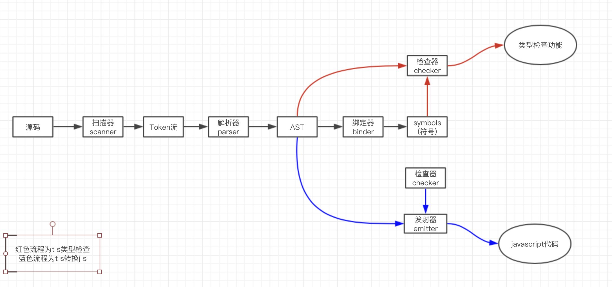
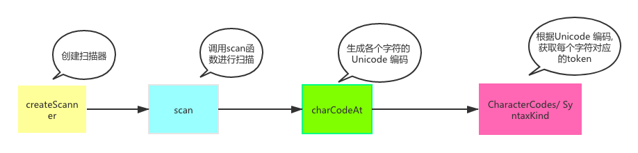
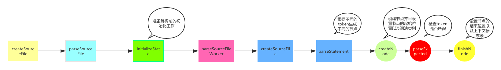
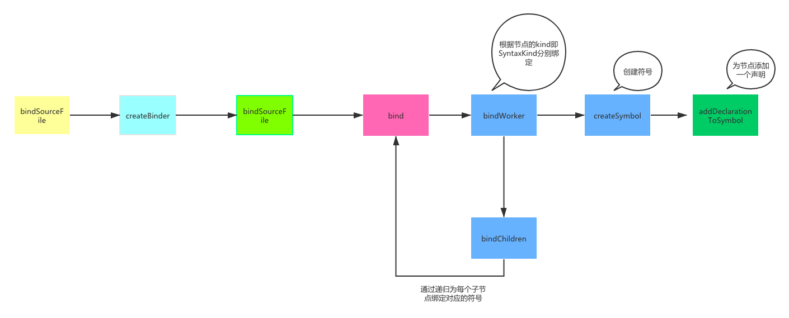
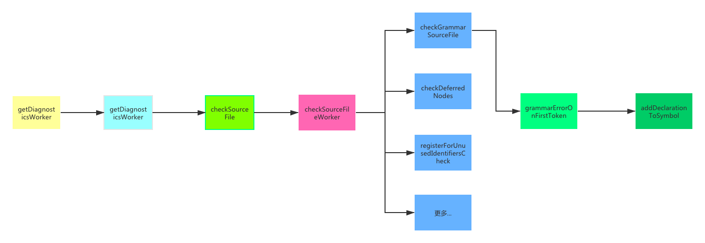
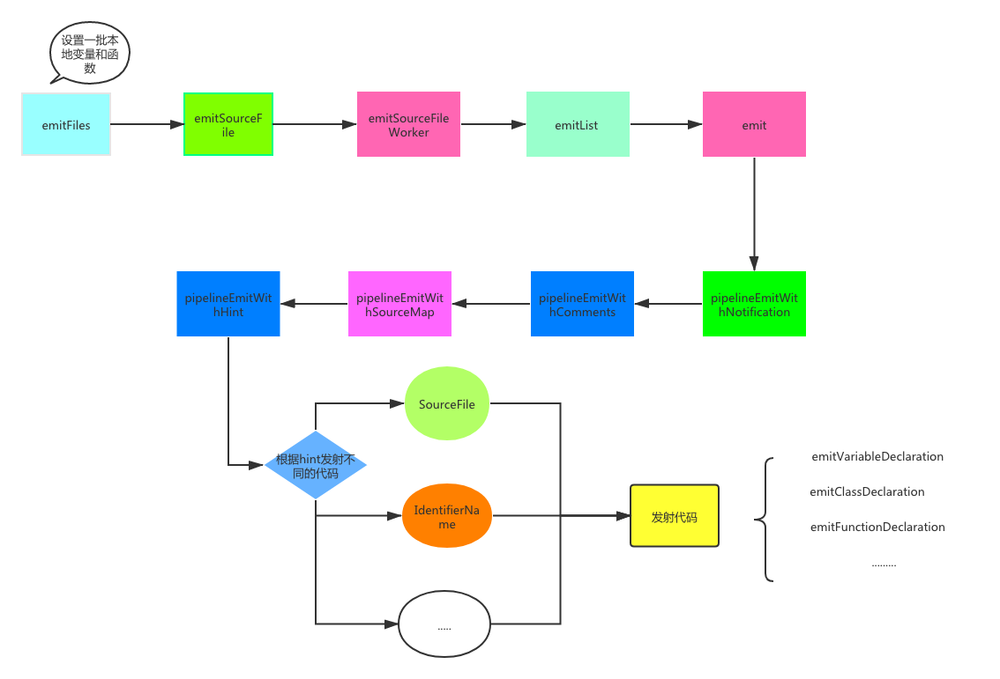
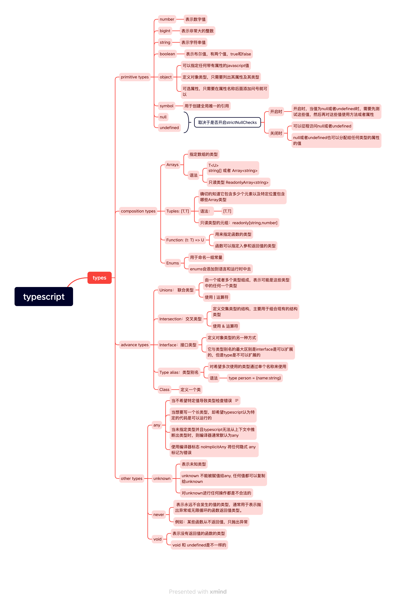

## TypeScript 原理
### ts编译流程
  
### Scanner 扫描器
  
  * 扫描器的作用就是将源代码生成token流
### Parser 解析器
  
### Binder 绑定器
  
  * 符号将 AST 中的声明节点与其它声明连接到相同的实体上。符号是语义系统的基本构造块。
  ```js
  function Symbol(flags: SymbolFlags, name: string) {
      this.flags = flags;
      this.name = name;
      this.declarations = undefined;
  }
  ```
  * SymbolFlags 符号标志是个标志枚举，用于识别额外的符号类别（例如：变量作用域标志 FunctionScopedVariable 或 BlockScopedVariable 等）.
### Checker 检查器
  
  * 根据我们生成AST节点的声明起始节点位置，对传进来的字符串做位置类型语法等的校验与异常的抛出。
### Emitter 发射器
  
  * TypeScript 编译器提供了两个发射器:
    * emitter.ts: 它是 TS -> JavaScript 的发射器
    * declarationEmitter.ts: 用于为 TypeScript 源文件（.ts） 创建声明文件

## 编译配置
  ### 部分配置解释
  ```js
    {
      "compilerOptions": {

        /* 基本选项 */
        "target": "es5",                       // 指定 ECMAScript 目标版本: 'ES3' (default), 'ES5', 'ES2015', 'ES2016', 'ES2017', or 'ESNEXT'
        "module": "commonjs",                  // 指定使用模块: 'commonjs', 'amd', 'system', 'umd' or 'es2015'
        "lib": [],                             // 指定要包含在编译中的库文件
        "allowJs": true,                       // 允许编译 javascript 文件
        "checkJs": true,                       // 报告 javascript 文件中的错误
        "jsx": "preserve",                     // 指定 jsx 代码的生成: 'preserve', 'react-native', or 'react'
        "declaration": true,                   // 生成相应的 '.d.ts' 文件
        "sourceMap": true,                     // 生成相应的 '.map' 文件
        "outFile": "./",                       // 将输出文件合并为一个文件
        "outDir": "./",                        // 指定输出目录
        "rootDir": "./",                       // 用来控制输出目录结构 --outDir.
        "removeComments": true,                // 删除编译后的所有的注释
        "noEmit": true,                        // 不生成输出文件
        "importHelpers": true,                 // 从 tslib 导入辅助工具函数
        "isolatedModules": true,               // 将每个文件做为单独的模块 （与 'ts.transpileModule' 类似）.

        /* 严格的类型检查选项 */
        "strict": true,                        // 启用所有严格类型检查选项
        "noImplicitAny": true,                 // 在表达式和声明上有隐含的 any类型时报错
        "strictNullChecks": true,              // 启用严格的 null 检查
        "noImplicitThis": true,                // 当 this 表达式值为 any 类型的时候，生成一个错误
        "alwaysStrict": true,                  // 以严格模式检查每个模块，并在每个文件里加入 'use strict'

        /* 额外的检查 */
        "noUnusedLocals": true,                // 有未使用的变量时，抛出错误
        "noUnusedParameters": true,            // 有未使用的参数时，抛出错误
        "noImplicitReturns": true,             // 并不是所有函数里的代码都有返回值时，抛出错误
        "noFallthroughCasesInSwitch": true,    // 报告 switch 语句的 fallthrough 错误。（即，不允许 switch 的 case 语句贯穿）

        /* 模块解析选项 */
        "moduleResolution": "node",            // 选择模块解析策略： 'node' (Node.js) or 'classic' (TypeScript pre-1.6)
        "baseUrl": "./",                       // 用于解析非相对模块名称的基目录
        "paths": {},                           // 模块名到基于 baseUrl 的路径映射的列表
        "rootDirs": [],                        // 根文件夹列表，其组合内容表示项目运行时的结构内容
        "typeRoots": [],                       // 包含类型声明的文件列表
        "types": [],                           // 需要包含的类型声明文件名列表
        "allowSyntheticDefaultImports": true,  // 允许从没有设置默认导出的模块中默认导入。

        /* Source Map Options */
        "sourceRoot": "./",                    // 指定调试器应该找到 TypeScript 文件而不是源文件的位置
        "mapRoot": "./",                       // 指定调试器应该找到映射文件而不是生成文件的位置
        "inlineSourceMap": true,               // 生成单个 soucemaps 文件，而不是将 sourcemaps 生成不同的文件
        "inlineSources": true,                 // 将代码与 sourcemaps 生成到一个文件中，要求同时设置了 --inlineSourceMap 或 --sourceMap 属性

        /* 其他选项 */
        "experimentalDecorators": true,        // 启用装饰器
        "emitDecoratorMetadata": true          // 为装饰器提供元数据的支持
      }
    }
  ```

## 基础知识
### 类型

### 使用方法
  - 对变量进行类型注释,通常不需要进行变量类型注释
    ```js
      let myName: string = "Alice";
      // No type annotation needed -- 'myName' inferred as type 'string'
      let myName = "Alice";
    ```
  - 对函数进行类型注释
    * ts中允许对函数的入参和返回值进行类型注释
    * 通常不需要对返回类型进行注释，因为ts会根据函数的语句推断函数的返回类型
    ```js
      function greet(name:string):string{
        return "hello"+name;
      }
    ```
  - 匿名函数类型注释
    * 匿名函数和函数声明略有不同。当一个函数出现在typescript可以确定如何调用它的地方时，该函数的参数会自动被赋予类型。
    ```js
    const names = ["Alice", "Bob", "Eve"];
 
      // Contextual typing for function - parameter s inferred to have type string
      names.forEach(function (s) {
        console.log(s.toUpperCase());
      });
      
      // Contextual typing also applies to arrow functions
      names.forEach((s) => {
        console.log(s.toUpperCase());
      });
    ```
  - 联合类型
    ```js
      // Return type is inferred as number[] | string
      function getFirstThree(x: number[] | string) {
        return x.slice(0, 3);
      }
    ```  
  - 类型别名
    ```js
      type Person = {
        firstName: string,
        lastName: string,
      }
      function getFullName(person:Person){
        return person.firstName + person.lastName
      }
      getFullName({firstName: 'xxx', lastName: 'li'})
    ```
### 其他基础知识
  - typeof
    typeof 操作符可以用来获取一个变量声明或对象的类型。

    ```ts
    function toArray(x: number): Array<number> {
      return [x];
    }

    type Func = typeof toArray; // -> (x: number) => number[]
    ```
  - keyof
    keyof 操作符可以用来一个对象中的所有 key 值：

    ```ts
      interface Person {
          name: string;
          age: number;
      }

      type K1 = keyof Person; // "name" | "age"
    ```

  - in
    in 用来遍历枚举类型：

    ```ts
    type Keys = "a" | "b" | "c"

    type Obj =  {
      [p in Keys]: any
    } // -> { a: any, b: any, c: any }

    ```
  - extends
    有时候我们定义的泛型不想过于灵活或者说想继承某些类等，可以通过 extends 关键字添加泛型约束。

    ```ts
      interface ILengthwise {
        length: number;
      }

      function loggingIdentity<T extends ILengthwise>(arg: T): T {
        console.log(arg.length);
        return arg;
      }

      loggingIdentity(3);
      loggingIdentity({length: 10, value: 3});
    ```
  - Paritial
    ```Partial<T>``` 的作用就是将某个类型里的属性全部变为可选项 ?。

  - Reuqired
    ```Required<T>``` 的作用就是将某个类型里的属性全部变为必选项。

  - Readonly 
    ```Readonly<T>``` 的作用是将某个类型所有属性变为只读属性，也就意味着这些属性不能被重新赋值。

  - Record 
    ```Record<K extends keyof any, T>``` 的作用是将 K 中所有的属性的值转化为 T 类型。

    ```ts
      interface PageInfo {
        title: string;
      }

      type Page = "home" | "about" | "contact";

      const x: Record<Page, PageInfo> = {
        about: { title: "about" },
        contact: { title: "contact" },
        home: { title: "home" }
      };
    ```
  - Exclude
    ```Exclude<T, U>``` 的作用是将某个类型中属于另一个的类型移除掉。

    ```ts
      type T0 = Exclude<"a" | "b" | "c", "a">; // "b" | "c"
      type T1 = Exclude<"a" | "b" | "c", "a" | "b">; // "c"
    ```
  - Extract 
    ```Extract<T, U>``` 的作用是从 T 中提取出 U。

    ```ts
      type T0 = Extract<"a" | "b" | "c", "a" | "f">; // "a"
      type T1 = Extract<string | number | (() => void), Function>; // () => void
    ```

## 常见问题 
### 使用ts的好处是什么?
  * 1.1 TypeScript是JavaScript的加强版，它给JavaScript添加了可选的静态类型和基于类的面向对象编程，它拓展了JavaScript的语法。所以ts的功能比js只多不少.
  * 1.2 Typescript 是纯面向对象的编程语言，包含类和接口的概念.
  * 1.3 TS 在开发时就能给出编译错误， 而 JS 错误则需要在运行时才能暴露。
  * 1.4 作为强类型语言，你可以明确知道数据的类型。代码可读性极强，几乎每个人都能理解。
  * 1.5 ts中有很多很方便的特性, 比如可选链. 
### any
  - when to use any?
    * whenever can not tell the type of expression should be
  - feature
    * it will close type checker when it appear
    * if you initialize a variable with type any, the variable's type will be any
    * When a value is of type any, you can access any properties of it (which will in turn be of type any), call it like a function, assign it to (or from) a value of any type, or pretty much anything else that’s syntactically legal:
    ```js
      let obj: any = { x: 0 };
      // None of the following lines of code will throw compiler errors.
      // Using `any` disables all further type checking, and it is assumed 
      // you know the environment better than TypeScript.
      obj.foo();
      obj();
      obj.bar = 100;
      obj = "hello";
      const n: number = obj;
    ```
    * The any type is useful when you don’t want to write out a long type just to convince TypeScript that a particular line of code is okay.
    * Use the compiler flag ```noImplicitAny``` to flag any implicit any as an error.
### Type Assertions: 类型断言
  - 对于typescript无法知道的值类型的信息，可以使用类型断言
    * 比如：```document.getElementById``` ts只知道返回的是 ```HTMLElement``` ，但是你可能知道你的特免将始终具有 ```HTMLCanvasElement``` 给定的id，这个时候可以使用类型断言
    * 语法：
      ```js
       const myCanvas = document.getElementById("my_canvas") as HTMLCanvasElement;
       // or
       const myCanvas = <HTMLCanvasElement>document.getElementById("my_canvas");
      ```
  - 与类型注释一样，编译器会删除类型断言，并不会影响代码的运行 
  - 类型断言是在编译时进行删除的，因此没有类型断言相关联的运行时检查，所以如果类型断言错误，则不会有异常或者null生成
  - 非空断言运算符：
    * 用于在不执行任何显示类型检查的情况下，从类型中删除null和undefined
    * 语法：在表达式后面加入!
    ```js
      function test(x?:number|string){
        console.log(x!.toFixed())
      }
    ```    
### type 和 interface 区别
  - 用type来描述类型，用interface来描述数据结构
  - 都可以描述一个对象或者函数
  ```ts
    interface User {
      name: string
      age: number
    }

    interface SetUser {
      (name: string, age: number): void;
    }

    type User = {
      name: string
      age: number
    };

    type SetUser = (name: string, age: number)=> void;
  ```
  - 都允许拓展
    interface 和 type 都可以拓展，并且两者并不是相互独立的，也就是说 interface 可以 extends type, type 也可以 extends interface 。 虽然效果差不多，但是两者语法不同。
    ```ts
      // interface extends interface
      interface Name { 
        name: string; 
      }
      interface User extends Name { 
        age: number; 
      }

      // type extends type
      type Name = { 
        name: string; 
      }
      type User = Name & { age: number  };

      // interface extends type
      type Name = { 
        name: string; 
      }
      interface User extends Name { 
        age: number; 
      }

      // type extends interface
      interface Name { 
        name: string; 
      }
      type User = Name & { 
        age: number; 
      }
    ```
  - type是不能重新打开类型添加属性，interface是可以的
  - type不能参与声明合并，但是interface可以
  - interface只能用于声明对象的形状，不能用于重命名
  - interface name始终以原始形式出现在错误信息中，但仅当按名称使用时
  - 只有type可以做的
    * type 可以声明基本类型别名，联合类型，元组等类型
    ```ts
      // 基本类型别名
      type Name = string

      // 联合类型
      interface Dog {
          wong();
      }
      interface Cat {
          miao();
      }

      type Pet = Dog | Cat

      // 具体定义数组每个位置的类型
      type PetList = [Dog, Pet]

      // 当你想获取一个变量的类型时，使用 typeof
      let div = document.createElement('div');
      type B = typeof div
    ```
### 如何基于一个已有类型, 扩展出一个大部分内容相似, 但是有部分区别的类型?
  * 首先可以通过Pick和Omit
  ```ts
    interface Test {
        name: string;
        sex: number;
        height: string;
    }

    type Sex = Pick<Test, 'sex'>;

    const a: Sex = { sex: 1 };

    type WithoutSex = Omit<Test, 'sex'>;

    const b: WithoutSex = { name: '1111', height: 'sss' };
  ```
  比如Partial, Required.
  * 再者可以通过泛型. 

### 什么是泛型, 泛型的具体使用?

泛型是指在定义函数、接口或类的时候，不预先指定具体的类型，使用时再去指定类型的一种特性。

可以把泛型理解为代表类型的参数

```ts
  interface Test<T = any> {
      userId: T;
  }

  type TestA = Test<string>;
  type TestB = Test<number>;

  const a: TestA = {
      userId: '111',
  };

  const b: TestB = {
      userId: 2222,
  };

```  
### 联合类型和交叉类型区别
  - 联合类型 | ；交叉类型 & 
  - 联合类型一次只能一种类型；而交叉类型每次都是多个类型的合并类型。
### 类型推断和可赋值性
  - 什么是类型推断
  - 以下代码ts推出的类型是什么
  - 是否可以相互赋值  
### 在react项目中使用ts
  * https://create-react-app.dev/docs/adding-typescript/
  * react + ts 备忘录：https://github.com/typescript-cheatsheets/react#reacttypescript-cheatsheets
