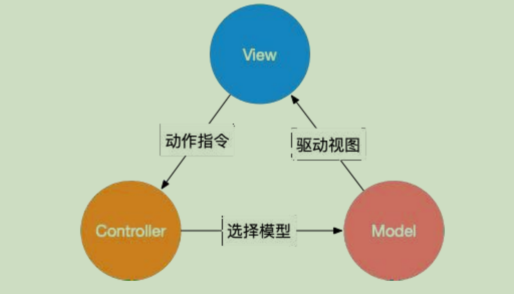
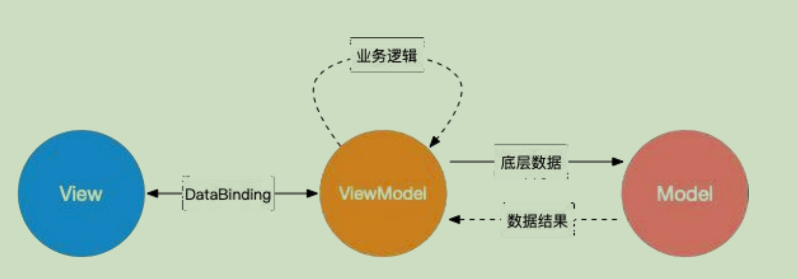
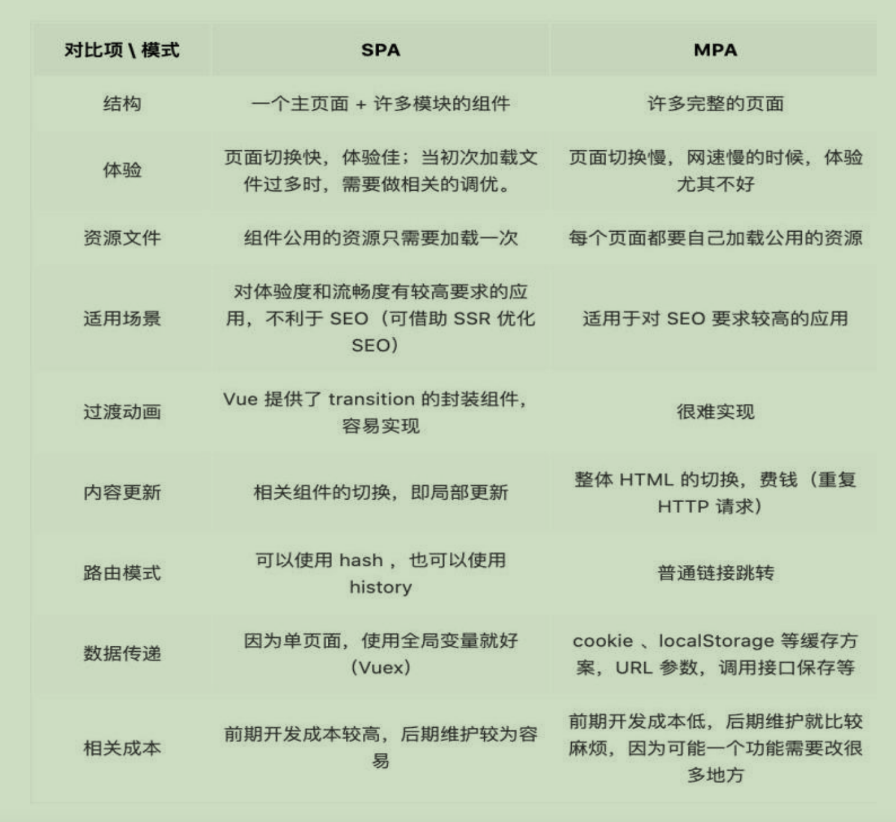

# vue-基础
## mvc和mvvm
### 定义
   
  
  - mvc:
    * m: model - 应用程序的业务和逻辑
    * v: view - 负责展示数据给用户
    * c: controller - 负责接收用户的输入，更新模型和视图
  - mvvm:
    * m: model - 应用程序的业务和逻辑，代表数据模型，数据和业务逻辑都在 model 中定义。
    * v: view - 负责展示数据给用户
    * vm: viewModel - 作为view和model之间的连接，处理视图的行为和状态，并通过视图绑定的形式将model和view关联

    **model 和 view 之间并无直接关联，而是通过 View Model 来进行联系的， Model 和 ViewModel 有着双向数据绑定的关系。因此当 Model 中的数据改变时，会触发 View 层更新，View 中由于用户交互操作而改变的数据也会在 Model 中同步**

### mvc 和mvvm的区别
  - 数据绑定的方式
    * mvc为单项数据流（只能通过controller将数据传递给模型，然后更新视图），
    * mvvm为双向数据流（通过viewmodel将视图和模型进行双向绑定，viewmodel层将数据转换为视图所需要的格式，并且以数据绑定的格式使得视图和模型保持同步）
### vue解除双向绑定
  * 使用 v-once 只会渲染一次，之后将会作为静态内容，直接跳过，不再做渲染
  * 使用 v-bind 代替 v-model
  * 使用 object.freeze() 设置值
  * 使用计算属性
  * 父组件传递给子组件props，子组件内部克隆数据 

## vue插槽(实现模版定制化，信息需要从外部传入内部)
  * 默认插槽: 一个组件内部只能有一个默认插槽

    又名匿名插槽，当 slot 没有指定 name 属性值的时候的默认显示插槽

  * 具名插槽：多个插槽一起使用，以name为标识在组件内部做区分

  ```js
  // 组件内部管
    <slot name="slotA"></slot>
    <slot name="slotB"></slot>
  // 外部调用
    a. <template v-slot:slotA></template>
    b. <template #slotA>

  ```
  * 作用域插槽：父组件需要读取子组件的数据（slot的结构描述写在外部，内部对slot赋值，并且内部的值会反馈到外部）
  ```js
    <current-component>
      <template v-slot:default="slotProps">
        <div> {{slotProps.name}}</div>
      </template>
    </current-component>

    // 组件内部使用v-bind来绑定数据
    // user: {name: 111}
    <div>
      <slot :slotProps="user"></slot>
    </div>
  ```
    **作用域插槽原理：**

    当子组件 vm 实例化时，获取到父组件传入的 slot 标签的 内容，存放在vm.$slot 中，默认插槽为vm.$slot.default，具名插槽为vm.$slot.xxx，xxx 为插槽名，当组件执行渲染函数时候，遇到 slot 标签，使用 $slot 中的内容进行替换，此时可以为插槽传递数据，若存在数据，则可称该插槽为作用域插槽

## 模版数据的二次加工
  * computed watch 不建议
  * 函数
  * v-html
  * filter （无上下文，可以理解为纯函数）
  ```js
    <template>
      <div>{{num | numFilter}}</div>
    </template>
    export default {
      name: 'filter',
      data() {
        return {
          num: 100
        }
      }
      filters: {
        numFilter(num){
          return num > 99 ? 99 : num;
        }
      }
    }
  ```

## render函数
  jsx更自由的基于js编写
  vue的编译原理： template => render() => vdom render => dom render
  使用render函数会损失掉一部分的性能优化

## vue逻辑复用
  * mixin: 实现逻辑复用
  * extends: 拓展独立的逻辑；和mixin区别：mixin是数组形式传入，extends传入方式：extends: extendsDemo
  * 整体拓展：extend => 从预定义的配置中拓展出来一个独立的配置，进行合并
  * 插件
    a.注册外部插件，作为整体实例的补充
    b.会除值，不会重复注册
    c.手写插件
      i. 外部调用使用vue.use(pluginnanme,options)
      ii. 内部封装install方法

### 组件的高级引用
  * 递归组件：自身调用，实现无限嵌套
  * 动态组件： ```<component :is="currentComponentName"></component>```
  * 异步组件  ```const component = () => import('xxxxx.vue');```

### vue中实现懒加载的方式
  * 使用异步组件
  * 使用路由懒加载
    ```js
    const router = new VueRouter({
      routes: [{
        path:'xxxx',
        component: () => import('..../xxx.vue')
      }]
    })
    ```
  * 使用webpack动态导入
    const {default: component} = await import('xxx.vue');
  * chunk分包
    a. webpack配置项
      ```
        module.exports = {
          entry: 'xxx.js',
          output: {
            filename: [name].bundle.js,
            chunkFilename: [name].chunk.js
          }
        }
      ```
    b. require.ensure()
      ```
      const Home = resolve => require.ensure('./views/Home.vue'), () => {
        resolve(require('./views/Home.vue'))
      })
      ```
### chunk分包实现懒加载的缺点
  * 加载额外资源：
    使用 chunk 分包时，会将代码和资源进行切分，需要额外加载许多模块和资源文件。如果没有得到很好的处理，可能会导致加载时间变慢，影响网页的性能和速度。
  * 多次请求：
    使用 chunk 分包会将应用程序切分为多个块，这些块可能需要在不同的情况下进行请求。如果请求过程中发生了网络中断或缓存被清除等情况，可能会导致网页加载失败或变慢。
  * 调试不方便：
    使用 chunk 分包会将代码切分成许多块，使得调试变得更加困难。这时，需要使用特定的工具来处理问题，这可能会增加调试难度。
  * 依赖关系复杂：
    使用 chunk 分包时，需要考虑模块之间的依赖关系。如果模块之间的依赖关系非常复杂，可能会导致分包过程变得更加困难，需要更多的工具和平台来处理依赖关系。
  * 代码维护困难：
    使用 chunk 分包时，需要对代码进行切割处理，这使得代码维护变得更加困难。如果应用程序非常庞大，可能需要在切割过程中增加更多的标准和规则。  


## 面试题
### vue中key的作用
  key是虚拟dom的唯一标识。key的作用主要用在vue的diff算法上。
  
  在新旧dom对比时，key可以帮助快速准确定位更新的元素，管理可以复用的元素，减少不必要的更新，能够高效的重用和渲染优化。

  vue 中 key 可以分两种情况来考虑

  1. v-if 中使用 key

    由于 Vue 会尽可能高效地渲染元素，通常会复用已有元素而不是从头开始渲染。因此当使用 v-if 来实现元素切换的时候，如果切换前后含有相同类型的元素，那么这个元素就会被复用。如果是相同的 input 元素，那么切换前后用户的输入不会被清除掉，这样是不符合需求的。因此可以通过使用 key 来唯一的标识一个元素，这个情况下，使用 key 的元素不会被复用。 这个时候 key 的作用是用来标识一个独立的元素

  2. v-for 中使用 key
  
    用 v-for 更新已渲染过的元素列表时，它默认使用“就地复用”的策略。如果数据项的顺序发生了改变，Vue 不会移动 DOM 元素来匹配数据项的顺序，而是简单复用此处的每个元素。因此通过为每个列表项提供一个 key 值，来以便 Vue 跟踪元素的身份，从而高效的实现复用。这个时候 key 的作用是为 高效的更新渲染虚拟 DOM

    key 是 Vue 中 vnode 的唯一标记，通过这个 key，diff 操作可以更准确、更快速 
    
    更准确：因为带 key 就不是就地复用了，在 sameNode 函数 a.key === b.key 对比中可以避免就地复用的情况。所以会更加准确。 

    更快速：利用 key 的唯一性生成 map 对象来获取对应节点，比遍历方式更快
    
### v-for 中为什么不建议使用index作为key
- **用 index 作为 key 时，在对数据进行，逆序添加，逆序删除等破坏顺序的操作时，会产生没必要的真实 DOM更新，从而导致效率低**
  ```js
    <template>
      <div class="hello">
        <ul>
          <li v-for="(item,index) in studentList" :key="index">{{item.name}}</li>
          <br>
          <button @click="addStudent">添加一条数据</button>
        </ul>

      </div>
    </template>

    <script>
    export default {
      name: 'HelloWorld',
      data() {
        return {
          studentList: [
            { id: 1, name: '张三', age: 18 },
            { id: 2, name: '李四', age: 19 },
          ],
        };
      },
      methods:{
        addStudent(){
          const studentObj = { id: 3, name: '王五', age: 20 };
          this.studentList=[studentObj,...this.studentList]
        }
      }
    }
    </script>
  ```
- **用 index 作为 key 时，如果结构中包含输入类的 DOM，会产生错误的 DOM 更新**
  ```js
    <template>
      <div class="hello">
        <ul>
          <li v-for="(item,index) in studentList" :key="index">{{item.name}}<input /></li>
          <br>
          <button @click="addStudent">添加一条数据</button>
        </ul>
      </div>
    </template>

    <script>
    export default {
      name: 'HelloWorld',
      data() {
        return {
          studentList: [
            { id: 1, name: '张三', age: 18 },
            { id: 2, name: '李四', age: 19 },
          ],
        };
      },
      methods:{
        addStudent(){
          const studentObj = { id: 3, name: '王五', age: 20 };
          this.studentList=[studentObj,...this.studentList]
        }
      }
    }
    </script>

  ```
### vue2和vue3的区别

### vue中单页应用和多页应用的区别
#### 概念：

SPA 单页面应用（SinglePage Web Application），指只有一个主页面的应用，一开始只需要加载一次 js、css 等相关资源。所有内容都包含在主页面，对每一个功能模块组件化。单页应用跳转，就是切换相关组件，仅仅刷新局部资源。 

MPA 多页面应用 （MultiPage Application），指有多个独立页面的应用，每个页面必须重复加载js、css 等相关资源。多页应用跳转， 需要整页资源刷新。

#### 区别：


### vue 中封装的数组方法有哪些，其如何实现页面更新
  在 Vue 中，对响应式处理利用的是 Object.defineProperty 对数据进行拦截，而这个方法并不能监听到数组内部变化，数组长度变化，数组的截取变化等，所以需要对这些操作进行 hack，让 Vue 能监听到其中的变化

  包括：

  - push()
  - pop()
  - shift()
  - unshift()
  - splice()
  - sort()
  - reverse()

  **实现原理：**
  

  简单来说就是，重写了数组中的那些原生方法，首先获取到这个数组的 ob ， 也就是它的 Observer 对象， 如果有新的值， 就调用 observeArray 继续对新的值观察变化（也就是通过 target proto == arrayMethods 来改变了数组实例的型），然后手动调用notify， 通知渲染watcher，执行update。

### delete 和 Vue.delete 删除数组的区别
  delete 只是被删除的元素变成了 empty/undefined，其他的元素的键值还是不变。 
  
  Vue.delete 直接删除了数组，改变了数组的键值。

### assets 和 static 的区别
#### 同：

  - 都用来存放静态资源文件。项目中所需要用的资源文件，图片，字体图标，样式文件等都可以放在这两个文件下。

#### 异：

  - assets 中存放的静态资源文件在项目打包时，会进行打包上传（可简单理解为压缩体积，代码格式化）。压缩后的静态资源文件最终都会放到 static 文件中跟随着 index.html 一同上传到服务器。

  - static 中存放的静态资源文件就不会走打包压缩格式化等流程，而是直接进入打包好的目录，直接上传到服务器。因为避免了压缩直接进行上传，在打包时会提升一定的效率，但是由于没有进行压缩等操作，文件体积相对较大，在服务器中会占据更大的空间。

**建议：**    

  将项目中 template 需要的样式文件 js 文件等都可以放置在 assets 中，走打包这一流程。减少体积。
  
  而项目中引入的第三方的 资源文件如 iconfoont.css 等文件可以放置在 static 中，因为这 些引入的第三方文件已经经过处理，不再需要处理，直接上传。

### Vue 子组件和父组件执行顺序
#### 加载渲染过程
  - 父组件 beforeCreate
  - 父组件 created
  - 父组件 beforeMount
  - 子组件 beforeCreate
  - 子组件 created
  - 子组件 beforeMount
  - 子组件 mounted
  - 父组件 mounted

#### 更新过程
  - 父组件 beforeUpdate
  - 子组件 beforeUpdate
  - 子组件 updated
  - 父组件 updated

#### 销毁过程：
  - 父组件 beforeDestory
  - 子组件 beforeDestory
  - 子组件 destoryed
  - 父组件 destoryed

### 一般在哪个生命周期中请求数据
  可以在 created、beforeMount、mounted 中进行调用，因为这三个钩子函数中， data 已经创建，可以将服务端返回的数据进行赋值。

  推荐在 created 钩子函数中调用异步请求，原因：

  - 能更快获取到服务端的数据，减少页面加载时间，用户体验更好
  - SSR 不支持 beforeMount、mounted 钩子函数，放在 created 中有助于一致性。

