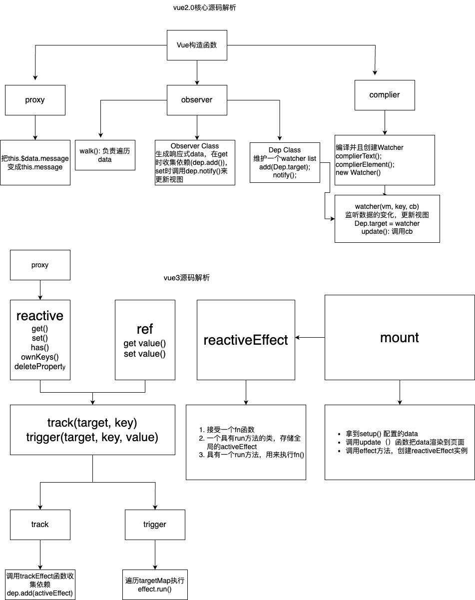

# vue-源码解析
## 事件设计 - 为何vue把事件写在模板上，而不是js中
  - 模板定位事件触发源 + 触发源寻找触发事件逻辑 —— 更方便定位问题
  - js与事件本身解耦 —— 更便于测试隔离
  - viewModel销毁，自动解绑事件 —— 更便于回收
## vue-响应式实现原理

## vue-diff算法
  - vue2 遍历
  - vue3 最大递升子序列
## keep-alive
### keep-alive组件生命周期
  * created: 组件被创建，但此时尚未进入缓存。
  * beforeMount: 组件开始挂载，但在挂载之前，它可能被缓存组件替代。
  * mounted: 组件被挂载，但只会触发一次。
  * activated: 缓存组件激活时触发，即组件从缓存中取出并显示。
  * deactivated: 缓存组件失活时触发，即组件被放回缓存中并不再显示。
  * beforeDestroy: 组件开始销毁，但在销毁之前，它可能被缓存组件替代。
### keep-alive组件具体流程  
  * 当一个组件被包裹在 keep-alive 标签中时，它首先会触发 created 钩子。
  * 当组件第一次渲染时，它会触发 beforeMount 和 mounted 钩子。
  * 当组件切换到其他路由或被 v-if 等条件隐藏时，它会触发 deactivated 钩子，此时组件会被缓存。
  * 当再次进入缓存的组件时，它会触发 activated 钩子，此时组件会从缓存中取出，并触发 beforeMount 和 mounted 钩子。
  * 如果缓存的组件被销毁，它会触发 beforeDestroy 钩子。
### 使用keep-alive的优缺点
  * 好处：可以有效的减少组件的销毁和创建，提高性能
  * 缺点：因为组件一直被缓存在内存中，可能会提高内存的占用  

## vue-router 
### 什么是vue-router,router的发展历程
  router是vue的一个路由管理，是基于spa的产物,spa之前都是由服务端来控制的；只有一个html，前端可以控制路由

  通过监听hash，go,back,foward等行为来控制路由

  后端路由是通过url访问对应的controller，进行数据和模版引擎的拼接，返回给前端

  前端路由是通过js根据url加载对应的组件

  所以前端路由包括两部分：处理url， 加载对应的组件

### 路由有哪几种
  hash route; history route(go | back | forward | push | replace ); memory 路由；

#### hash route 和 history route的区别
  * hash 路由 ⼀般会携带 ⼀个 # 号，不够美观； history 路由不存在这个问题； 
  * 默认 hash 路由是不会像浏览器发出请求的，主要是⼀般⽤于锚点；history 中 go / back / forward 以及浏览器的前进、后退按钮⼀般都会像服务端发起请求；history 的所有 url 内容，服 务端都可以获取到 
  * 基于此，hash 模式，是不⽀持SSR的，但是 history 模式可以做 SSR 
  * history 在部署的时候，如 nginx， 需要只渲染⾸⻚，让⾸⻚根据路径重新跳转。
  ```
    # 单个的服务器部署
    location / {
      try_files uri $uri /xxx/main/index.html
    }
    # 存在代理的情况
    location / {
      rewrite ^ /file/index.html break; # 这⾥代表的是xxx.cdn 的资源路径
      proxy_pass https://www.xxx.cdn.com;
    } 
  ```

### 异步组件
  通过import(); react.lazy() 对代码进行动态拆分的技术, 等需要时再进行加载

### 路由守卫
  - 全局：beforeEach afterEach
  - 组件：beforeRouteEnter beforeRouteUpdate beforeRouteLeave

### 路由守卫的流程
  - 导航被触发。
  - 在失活的组件里调用 beforeRouteLeave 守卫。
  - 调用全局的 beforeEach 守卫。
  - 在重用的组件里调用 beforeRouteUpdate 守卫(2.2+)。
  - 在路由配置里调用 beforeEnter。
  - 解析异步路由组件。
  - 在被激活的组件里调用 beforeRouteEnter。
  - 调用全局的 beforeResolve 守卫(2.5+)。
  - 导航被确认。
  - 调用全局的 afterEach 钩子。
  - 触发 DOM 更新。
  - 调用 beforeRouteEnter 守卫中传给 next 的回调函数，创建好的组件实例会作为回调函数的参数传入。

### vue router实现原理
1. createWebHistory()
  - 包含当前路径 ====> 根据location.path, search, hash 进行拼接
  - 状态 ====> 通过window.location.state来获取浏览器的状态
    1. 有时候是无状态的，需要维护一个自己的状态 buildstate (比如 go, forward, push, replace, 第一次刷新界面时)
    2. 同步状态给location 和historystate
    ```
      function changeLocation(to, state, replace) {
        window.history[replace?'replace':'pushState'](state, null, to);
        historyState.value = state;
      } 
    ```
  - push, replace等方法 (利用useHistoryNavigation() 方法实现push和state，实际上记录的是push和replace时的state的信息)
  - 监听器，监听popstate，执行listener，listener里面存储的是state的信息{to,from,isBack}

## vue-cli  
### cli工具地址：
  - https://github.com/sindresorhus/ora
  - https://github.com/tj/commander.js
  - https://www.npmjs.com/package/inquirer

  1. download-git-repo: 下载模版
  2. commander: 命令行工具
  3. path: mode模块
  4. ora: node模块-node的命令行界面增强工具，可以在命令行中增加提示，只依赖于node.js中的process模块
  5. chalk: node.js 中的一个模块，用于在控制台输出彩色的文字，提升文本可读性    
  6. inquirer: 命令行与开发者交流工具

### vue-cli 是用来做什么的
  用于快速搭建一个项目

  下载模版, metadata配置，渲染生成

  利用download-git-repo下载模版，利用commander构建命令行工具，inquirer构建可交互的命令行界面，ora增加提示

  根据git config --get user.name, git config --get user.email 获取用户的git名称以及邮件

  核心逻辑：
  1. 判断是local-template 或者是remote-template
  2. 如果是local-template, 判断项目目录，如果存在 => 构建项目
  3. 如果是remote-template, 检查版本号 => 是否是官方模版（加载官方或者第三方模版）=> 构建项目
  4. 生成过程

      -- 获取模版配置

      -- 初始化metalsmith

      -- 模版的注册 => before执行 => 问询 & 主流程 => after执行 => complete => 打印message

## vuex
### vuex 有哪几种属性

  一共有五种，分别是 State、Getter、Mutation、Action、Module

  state: 基本数据（数据源存放）
  
  getters: 从基本数据派生出来的数据。

  mutations: 提交更改数据的方法，同步

  actions: 像一个装饰器，包裹 mutations，使之可以异步。

  modules: 模块化 vuex

### vuex 和单纯的全局对象有什么区别。

  Vuex 的状态存储是响应式的。当 Vue 组件从 store 中读取状态的时候，若 store 中的状态发生变化，那么相应的组件也会相应地得到高效更新。 
  
  不能直接改变 store 中的状态。改变 store 中的状态的唯一途径就是显式地提交 (commit) mutation。这样可以方便地跟踪每一个状态的变化，从而能够实现一些工具帮助更好地了解我们的应用

### 为什么 Vuex 的 mutation 中不能做异步操作？

  Vuex 中所有的状态更新的唯一途径都是 mutation，异步操作通过 Action 来提交 mutation 实现，这样可以方便地跟踪每一个状态的变化，从而能够实现一些工具帮助更好地了解我们的应用。 
  
  每个 mutation 执行完成后都会对应到一个新的状态变更，这样 devtools 就可以打个快照存下来，然后就可以实现 time-travel 了。
  
  如果mutation 支持异步操作，就没有办法知道状态是何时更新的， 无法很好的进行状态的追踪，给调试带来困难。

### vuex为什么要自己设置告警
  * 可以实现对告警级别的控制  
### vuex 和 localStorage 的区别
  1. 存储位置及方式：

    vuex 存储在内存中
    
    localStorage 以文件的形式存储在本地。而且只能存储字符串类型的数据，存储对象需要 JSON.string 和 parse 方法进行处理。读取内存比读取硬盘速度要快。

  2. 应用场景：

     vuex 是一个专门为 vue 应用程序开发的状态管理模式。它采用集中式存储管理应用的所有组件的状态，并以相应的规则保证状态以一种可预测的方式发生变化。vuex 用于组件之间的传值。

     localStorage 是本地存储，是将数据存储到浏览器的方法，一般是在跨页面传递数据时使用。

      vuex 能做到数据的响应式，localStorage 不能。

  3. 永久性

    刷新页面时 vuex 存储的值会丢失，localStorage 不会。

    对于不变的数据确实可以使用 localStorage 代替 vuex，但是当两个组件公用一个数据源（对象或者数组时），如果其中一个组件改变了数据源，希望另一个组件响应变化时，localStorage 无法做到，原因就是区别1.

## 面试题：
### vue2的响应式原理
  * proxy(): 实现this.$data.message => this.message
  * observer();
    1. 调用walk函数遍历data
    2. 利用Object.defineProperty(obj, key, {})对属性拦截
      * 在get时调用dep.add(Dep.target)添加依赖
      * 在set时调用dep.notify()来更新视图 => 调用watcher.update();
    3. Dep类存储的是一个watcherList
    4. Watcher类: 用来监听数据的变化，更新视图 new Watcher(vm, 'num', () => {更新视图})
       设置Dep.target = Watcher, 设置update方法用来更新函数，并且触发 getter 函数，把依赖添加进去（因为Watcher 里面有 this.__old = vm[key], 这句话会触发 getter 函数）
  * complier(): 对模版的编译，创建watcher实例

### vue3的响应式原理
  * 全局的targetMap, activeEffect
  * reactive(), ref();
    1. 利用proxy实现代理, reactive => get(), set(), has(), ownKeys(), deleteProperty(); ref() => get value(), set value(),挂载在value上
    2. get操作时进行track, set时进行trigger
    3. track => 调用dep.add(activeEffect),依赖项实际上为ReactiveEffect; trigger => 遍历deps并执行effect.run()
    4. ReactiveEffect(fn): 设置全局activeEffect(实际上为ReactiveEffect实例)，具有一个run方法，用来执行传入进来的fn
  * mount(): 获取setup上导出的data，实例化 ReactiveEffect(),调用instance.render()方法把页面渲染出来

### 总结-双向数据绑定原理
  vue 是采用数据劫持结合发布-订阅模式的方式，通过 Object.defineProperty() 来劫持各个属性的 getter， setter， 在数据变动时发布消息给订阅者，触发相应的监听回调。

  主要步骤为：

  1. 需要 observer 对数据对象进行递归遍历，包括子属性对象的属性，都加上 getter 和 setter， 这样给对象的某个值赋值，就会触发 setter， 就能监听到数据的变化

  2. compile 解析模板指令，将模板中的变量替换成数据，然后初始化渲染页面视图，并将每个指令对应的节点绑定更新函数，添加监听数据的订阅者，一旦数据有变化，收到通知，更新视图。

  3. Watcher 订阅者是 Observer 和 compile 之间通信的桥梁，主要做的事情是：

    1. 在自身实例化时往属性订阅器（dep）里面添加自己

    2. 自身必须有一个 update() 方法
    
    3. 等待属性变动 dep.notify() 通知时，能调用自身的 update 方法，并触发 Compile 中绑定的回调

  4. MVVM 作为数据绑定的入口，整合了 Observer、Compile 和 Watcher 三者，通过 Observer 来监听自己的 model 数据变化， 通过 Compile 来解析编译模版指令，最终利用 Watcher 搭起 Observer 和 Compile 之间的通信桥梁，达到数据变化 -> 视图更新；视图交互变化（input）-> 数据 model变更 的双向绑定效果。

### proxy()和Object.defineProperty()的区别
共同点：都可以用来实现对对象的监听和代理

不同点：
  * 语法不同: new Proxy(target, handler) Object.defineProperty(obj, key, descriptor);
  * proxy是创建一个代理对象，是对代理对象的监听，Object.defineProperty是对当前对象定义属性或者修改属性的拦截
  * proxy可以实现对多种功能的拦截，get, set, has, deleteProperty,ownKeys, apply等,Object.defineProperty只对对象属性的书写或者修改做拦截
  * 性能：proxy因为要动态代理代理对象，所以性能相对较低，如果不需要多种拦截器的时候，建议使用Object.defineProperty
  * 兼容性不同：proxy是es6中的新增功能，Object.defineProperty是早期版本就有的功能，可以在所有浏览器以及node环境中使用

### vue3 diff算法
- 采用最大递增子序列
  如果 e1 < i1, 说明第一个已经跑完，那么i2到e2为新增节点
  // a, b, c, e, f
           e1 i1
  // a, b, c, h, d, e, f
              i2 e2

  反之，则说明是删除节点
  // a, b, c, h, d, e, f
              i1 e1  
  // a, b, c, e, f
           e2 i2  
  其他情况，掐头去尾，中间最小移动（最大上升子序列）  
  
### Vue2.x 和 Vue3.x 的对比
- Vue 3.x 中使用了 Proxy 作为响应式，天生的代理，不用考虑属性重写、数组这些2.x 中hack的情况；
- diff, 增加了最大递增子序列的算法，让我移动节点，更高效；
- 架构采用 monorepo 的方式，分层清晰，同时把编译部分也进行了一些拆解；
- vue3 对编译的内容，进行了重写，template -- render 函数。
    - vue2 正则， vue3 状态机; -- [ast 编译原理]
    - patchFlag, 标记哪些元素包含哪些属性
    - 静态提升
- vue3 使用 blockTree, 对比需要改变的，优化性能，如果你要用 jsx 的写法，就不会优化，但是可以自己去标记。
- ts 重构。
- compiler 拆成了四个包。方便你去重写。
- vue2 options API -- vue3 composition API
- vue3，使用了 rollup 打包，支持 treeshaking。
- 实例化方式也有区别；

## 常见问题
### $nextTick 原理及作用
  Vue 的 nextTick 其本质是对 JavaScript 执行原理 EventLoop 的一种应用。

  nextTick 的核心是利用了如 Promise、MutationObeserver、SetImmediate、SetTimeout 的原生 JS 方法来模拟对应的微/宏任务的视线，本质是为了利用 JS 的这些异步回调任务队列来实现 Vue 框架中自己的异步回调队列

  nextTick 不仅是 Vue 内部的异步队列的调用方法，同时也允许开发者在实际项目中使用这个方法来满足实际应用中对  DOM 更新数据时机的后续逻辑处理。

  **nextTick 是典型的将底层 JS 执行原理应用到具体案例中的实例，引入异步更新队列机制的原因：**
  
  - 如果是同步更新，则多次对一个或者多个属性赋值，会频繁触发 UI/DOM 的渲染，可以减少一些无用渲染

  - 同时由于 VDOM 的引入，每一次状态发生变化后，状态变化的信号会发送给组件，组件内部使用 VDOM 进行计算得出需要更新的 DOM 节点，然后对 DOM 进行更新操作，每次更新状态后的渲染过程需要更所的计算，而这种无用功也将浪费更多的性能，所以异步渲染变得更加直观重要。

  - Vue 采用了数据驱动视图的思想，但是在一些情况下，仍然需要操作 DOM. 有时候可能遇到这样的情况, DOM1 的数据发生了变化，而 DOM2 需要从 DOM1中获取数据，那这时就会发现 DOM2 的视图并没有更新，这时就需要使用 nextTick 了。

  **使用到 nextTick 的场景：**

  - 在数据变化后执行某个操作，而这个操作需要使用随数据变化而变化的 DOM 结构的时候，这个操作就需要方法在 nextTick() 的回调函数中

  - 在 vue 生命周期中，如果在 created() 钩子进行 DOM 操作，也一定要放在 nextTick() 回调函数中

    因为在 created() 钩子函数中，页面 DOM 还未渲染，这时候也没办法操作 DOM, 所以，此时如果想要操作 DOM, 必须将操作的代码放在 nextTick() 的回调函数中。

### 对 React 和 Vue 的理解以及它们的异同
#### 同：
  - 都将注意力集中保持在核心库，而将其他功能如路由和全局状态管理交给相关的库；
  - 都有自己的构建工具，能让你得到一个根据最佳实践设置的项目模板；
  - 都使用了 Virtual DOM（虚拟 DOM）提高重绘性能；
  - 都有 props 的概念，允许组件间的数据传递； 
  - 都鼓励组件化应用，将应用分拆成一个个功能明确的模块，提高复用性   
#### 异：
  - 数据流：vue 双向，react 单向
  - 虚拟 DOM 具体实现细节不同：
  - 组件化：不同的模版编写方式
  - 监听数据变化方式不同：Vue是对数据进行拦截（defineProperty，proxy）结合发布订阅模式，React默认通过比较引用的方式进行的，如果不优化（pureComponent/shouldComponentUpdate）可能会导致大量不必要的 VDOM 的重新渲染。这是因为 Vue 使用的是可变数据，React 更强调数据的不可变性。
  - 高阶组件：Vue 通过 mixins 等来扩展，React 通过 HOC 来扩展
  - 构建工具：Vue --> vue-cli; React --> Create React App
  - 跨平台： Vue --> Weex; React --> React Native


