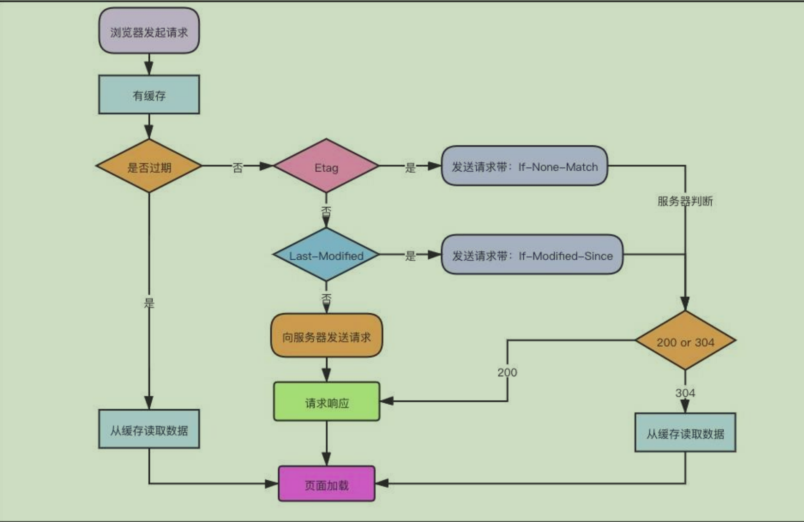

# js-浏览器缓存和存储
## 缓存分类
  - Memory Cache
  - Service Worker Cache
  - HTTP Cache(也叫做Disk Cache)
  - Push Cache

### Memory Cache
  缓存在内存中。
  从优先级上讲，是浏览器最先尝试去命中的一种缓存。
  从效率上讲，它是响应速度最快的一种缓存。

#### 特性
  和渲染进程"生死相依"，进程结束之后，也就是tab关闭以后，内存中的数据就不复存在了。

#### 哪些文件会被放在内存中
  - 几乎所有的base64图片
  - 较小的js、css文件

### Service Worker Cache
  Service Worker 是一种独立于主线程之外的js线程。脱离于浏览器窗口，无法访问DOM。所以 Service Worker无法干预页面的性能。可以用来实现离线缓存、消息推送、网络代理等功能。

  Service Worker 包括三个阶段： install、active、working 三个阶段。

  Service Worker 必须以https协议作为前提。

### HTTP Cache（Disk Cache）
  存储在硬盘中，读取的速度稍微慢点。相比Memory Cache胜在容量和存储时效上。

  它是持久存储的，是实际存在于文件系统中的。而且它允许相同的资源在跨会话，甚至跨站点的情况下使用，例如两个站点都使用了同一张图片。

  在所有浏览器缓存中，Disk Cache的覆盖面是最大的。它会根据HTTP Header中的字段判断哪些资源需要缓存，哪些资源不请求可以直接使用，哪些资源已经过期需要重新请求。
  

#### 哪些资源会被放到硬盘中
  - 大文件
  - 系统内存使用率高的话，文件优先存储进硬盘。
#### 分类  
  - 强制缓存
    * 第三方库和基础模块
    * 图片、字体等静态资源
  - 协商缓存
    * HTML、JS、CSS等文本文件
    * 动态生成的内容或者接口结果
#### 强制缓存
  cache-control: max-age=xxx; s-max-age=xxx;

  缓存请求指令：
  - no-cache
  - no-store
  - no-transform
  - only-if-cached：表明客户端只接受已缓存的响应，并且不要向原始服务器检查是否有更新的拷贝。
  - ```max-age=<seconds>```
  - ```max-stale=[<seconds>]```：客户端愿意接受一个已经过期的资源。
  - ```min-fresh=<seconds>```：客户端希望获取一个能在指定秒数内保持其最新状态的响应。

缓存响应指令：
  - must-revalidate：一旦资源过期（比如已经超过max-age），在成功向原始服务器验证之前，缓存不能用该资源响应后续请求。
  - no-cache：在发布缓存副本之前，强制要求缓存把请求数据提交给原始服务器进行验证（**协商缓存验证**）
  - no-store：缓存不应存储有关客户端请求或者服务器响应的任何内容，**即不使用任何缓存**
  - no-transform：不得对资源进行转换或转变。Content-Encoding、Content-Range、Content-Type等 HTTP 头不能由代理修改。
  - public: 可以被任何对象缓存（包括：发送客户端、代理服务器等等）
  - private：只能被单个用户缓存
  - proxy-revalidate：与 must-revalidate 作用相同，但它仅适用于共享缓存（例如代理），并被私有缓存忽略。
  - ```max-age=<seconds>```：缓存的最大周期
  - ```s-maxage=<seconds>```：仅适用于共享缓存，私有缓存会忽略它。会覆盖 max-age 和 Expires 头

#### 协商缓存
  if-none-match/E-tag;

  if-modified-since/last-modified

### Push Cache
  HTTP2 在server push阶段存在的缓存。

#### 特性
  - Push Cache 是缓存的最后一道防线。浏览器只有在 Memory Cache、HTTP Cache 和 Service Worker Cache 均未命中的情况下才会去询问 Push Cache。
  - Push Cache 是一种存在于会话阶段的缓存，当 session 终止时，缓存也随之释放。
  - 不同的页面只要共享了同一个 HTTP2 连接，那么它们就可以共享同一个 Push Cache。

## 缓存应用场景
### 频繁变动的资源
  ```
    Cache-Control: no-cache
  ```
  对于频繁变动的资源，首先需要使用Cache-Control: no-cache 使浏览器每次都请求服务器，然后配合 ETag 或者 Last-Modified 来验证资源是否有效。这样的做法虽然不能节省请求数量，但是能显著减少响应数据大小。

### 不常变动的资源
```
  Cache-Control: max-age=31536000
```
  通常在处理这类资源时，给它们的 Cache-Control 配置一个很大的 max-age=31536000 (一年)，这样浏览器之后请求相同的 URL 会命中强制缓存。而为了解决更新的问题，就需要在文件名(或者路径)中添加 hash， 版本号等动态字符，之后更改动态字符，从而达到更改引用 URL 的目的，让之前的强制缓存失效 (其实并未立即失效，只是不再使用了而已)。

  在线提供的类库 (如 jquery-3.3.1.min.js, lodash.min.js 等) 均采用这个模式。

## 用户行为对浏览器缓存的影响
  所谓用户行为对浏览器缓存的影响，指的就是用户在浏览器如何操作时，会触发怎样的缓存策略。主要有 3 种：

  - 打开网页，地址栏输入地址： 查找 disk cache 中是否有匹配。如有则使用；如没有则发送网络请求。disk cache 会先走强制缓存，再走协商缓存，最后返回内容。
  - 普通刷新 (F5)：因为 TAB 并没有关闭，因此 memory cache 是可用的，会被优先使用(如果匹配的话)。其次才是 disk cache。disk cache流程中，浏览器会直接对本地缓存资源过期，请求头会带上 If-Modified-Since，If-None-Match, 这意味着服务器会检查文件新鲜度，返回结果可能是304，也可能是200.
  - 强制刷新 (Ctrl + F5)：浏览器不使用缓存，因此发送的请求头部均带有 Cache-control: no-cache(为了兼容，还带了 Pragma: no-cache),服务器直接返回 200 和最新内容。浏览器不仅会对本地文件过期，而且不会携带 If-Modified-Since，If-None-Match, 相当于之前从未请求过，返回结果为200.

## 缓存面试题
### 强制缓存和协商缓存的使用场景。
[见链接](#缓存应用场景)
### 浏览器的缓存策略？max-age,no-cache, no-store区别？
  指定 ```no-cache``` 或 ```max-age=0, must-revalidate``` 表示客户端可以缓存资源，每次使用缓存资源前都必须重新验证其有效性。这意味着每次都会发起 HTTP 请求，但当缓存内容仍有效时可以跳过 HTTP 响应体的下载。
  ```HTTP
    Cache-control: no-cache
  ```
  等同于
  ```HTTP
    Cache-control: max-age:0, must-revalidate
  ```
  
  如果服务器关闭或者失去连接，下面的指令可能会造成使用缓存

  ```HTTP
    Cache-control: max-age=0;
  ```

### html，css, js 分别设置什么缓存
  协商缓存：html，css，js

  强制缓存：第三方库，图片，字体

### 对浏览器缓存机制的理解
  浏览器的缓存分为 Memory Cache，HTTP Cache， Service Worker Cache， Push Cache。

  其中最常用的是 HTTP Cache.

  HTTP Cache 分为强制缓存和协商缓存

  缓存的全过程为：
  
  - 第一次加载：请求资源，服务器返回200，浏览器从服务器下载资源文件，并缓存资源文件与 response header, 以供下次下载对比使用
  - 下一次加载：
    * 先比较强制缓存：
      1. 比较当前时间和上次返回200时的时间差，如果没有超过 Cache-Control 设置的 max-age, 则没有过期，并命中强制缓存，直接从本地读取资源。如果浏览器不支持HTTP1.1，则使用 Expires 头判断是否过期。
      2. 如果资源已经过期，则表明强制缓存没有被命中，则开始协商缓存。
    * 协商缓存：
      1. 向服务器发送带有 If-None-Match 和 If-Modified-Since 的请求。
      2. 服务器接收到请求后，优先根据 Etag 值判断请求的文件是否有做更改，Etag值一致，表明没有修改，则命中协商缓存，返回304；如果不一致，则有改动，直接返回新的资源文件，带上新的 Etag 值，并返回200
      3. 如果服务器收到的请求没有 Etag 值， 则将 If-Modified-Since 和 被请求文件的最后修改时间做对比，一致则命中协商缓存，返回304；不一致，则返回新的 Last-Modified 和文件并返回200

      

  **很多网站的资源后面都添加了版本号或者hash，这样做的目的是：每次升级了 JS 或 CSS 文件之后，为了防止浏览器进行缓存，轻质改变版本号，客户端浏览器就会重新下载新的 JS 或 CSS 文件，以保证用户能够及时获得网站的最新更新。**    

### 强缓存和协商缓存的区别
#### 强缓存
  使用强缓存策略时，如果缓存的资源有效，则直接使用缓存资源，不必再向服务端发起请求。

  强缓存通过两种方式来设置，HTTP 头信息中的 Expires 和 Cache-Control 属性。  

  **Expires:**
  
  - 指定资源的过期时间。在过期时间以内，可以使用缓存资源，不必向服务端发起请求。**这个时间是一个绝对时间，是服务器时间，因此可能存在客户端时间和服务端时间不一致或者用户对客户端时间进行修改的情况，这样就可能影响缓存命中的结果。**

  **Cache-Control**
  
  - public: 可以被任何对象缓存（包括：发送请求的客户端、代理服务器等等）
  - private: 只能被用户浏览器缓存，不能被任何代理服务器缓存
  - no-cache: 需要和服务端确认返回的资源是否发生了变化，如果未发生变化，则使用缓存好的资源（也就是要走协商缓存）
  - no-store: 禁止任何缓存，每次都会向服务端发起请求，拉取最新的资源。
  - max-age: 设置缓存的最大有效期
  - s-max-age: 优先级高于max-age,仅适用于共享缓存（CDN）
  - max-stale: 客户端愿意接受已经过期的资源，但是不能超过给定的时间。

  一般来说，只需要设置其中的一种方式就可以实现强制缓存，当两个一起使用时，cache-control 的优先级高于 expires

  **no-cache 和 no-store 的区别**

  - no-cache 需要和服务端确认是否有资源更新，也就是说没有强缓存，但是有协商缓存
  
  - no-store 是指不使用任何缓存，每次都会从服务器拉取资源。

#### 协商缓存

  如果命中强制缓存，无需发起新的请求，直接使用缓存内容，如果没有命中强制缓存，如果设置了协商缓存，这个时候协商缓存就会发挥作用。

  **命中协商缓存的两个条件**

  - max-age 过期了
  - 值为 no-cache

  使用协商缓存时，会先向服务器发起一个请求，如果资源没有发生变化，则返回304，让浏览器使用本地缓存。如果资源发生了变化，则返回新的资源，状态码为200.

  **协商缓存的设置方式**

  - HTTP 头信息中的 Etag
  - HTTP 头信息中的 Last-Modified

  **详细步骤**

  - 一种方式是：服务器在响应头添加 Last-Modified 属性指出资源最后一次的修改时间，当浏览器下一次发起请求时，会在请求头添加 If-Modified-Since 的字段，属性值为上一次返回的 Last-Modified值。服务器收到请求后，会通过这个属性和最后一次修改时间比较，依次来判断资源是否更改，如果更改返回新的资源，否则返回 304.

    **这个方法的缺点是：Last-Modified 标注的最后修改时间只能精确到秒级，如果某些文件再 1 秒内更新多次，那么 Last-Modified 值是不会变化的，这样会造成缓存命中不准确。**
  
  - 另一种方式是：服务器在响应头中添加 Etag 属性，这个属性是资源的唯一标识符，资源发生变化时，这个值也会发生变化。下一次请求时，在请求头中添加 If-None-Match 字段，这个属性值为上次返回的 Etag 值。服务器接收到请求后，会根据这个值和当前资源的 Etag 值进行比较，以此判断资源是否发生变化。

    **Etag 的优先级比 Last-Modified 高。使用协商缓存的时候，需要考虑负载均衡的问题，因此多个服务器上的资源 Last-Modified 应该保持一致，因为每个服务器上的 Etag 值都不一样，因此在考虑负载均衡时，最好不要设置 Etag 属性。**

#### 总结：

  强制缓存和协商缓存在缓存命中时，都会直接使用本地缓存的资源副本，区别在于协商缓存会向服务器端发送一次请求。

  它们未命中缓存时，都会向服务器发送请求获取资源。

  在实际的缓存机制中，强缓存策略和协商缓存策略是一起合作使用的。浏览器首先会根据请求的信息，判断是否命中强制缓存，如果命中则直接使用资源。如果未命中，则根据头信息向服务器发起钱够，使用协商缓存，如果协商缓存命中的话，则服务器不返回资源，浏览器直接使用本地资源的副本，如果协商缓存未命中，则浏览器返回最新的资源给浏览器。

### 点击刷新按钮，强制刷新，地址栏回车缓存策略的区别
[见链接](#用户行为对浏览器缓存的影响)

## 缓存-参考链接
  https://github.com/Advanced-Frontend/Daily-Interview-Question/issues/53

  https://github.com/Adamwu1992/adamwu1992.github.io/issues/12

  https://www.jianshu.com/p/54cc04190252

## 本地存储分类
  - Cookie
  - webStorage
  - IndexedDB

### Cookie
  用于存储客户端的会话信息。
  
  这个规范要求服务器在相应HTTP请求时，通过发送 Set-Cookie HTTP响应头部包含会话信息。

  浏览器会存储这些会话信息，并在之后的每个请求中都会通过 HTTP 请求头部 cookie 再将这些信息发送给服务端。

#### 特性
  - 每次请求都会携带
  - 有限制条件：
    * 不超过 300 个cookie
    * 每个 cookie 不超过 4kb
    * 每个域不超过 20 个cookie
    * 每个域的cookie 不超过 80kb
    * 不同浏览器对于每个域能设置的 cookie 总数的限制是不一样的。 safari和chrome对每个域的 cookie数没有硬性要求
    * 浏览器也会限制 cookie 的大小。大多数浏览器对 cookie 的限制是不超过 4096 字节，上下可以有一个字节的误差。为跨浏览器兼容，最好保证 cookie 的大小不超过 4095 字节。**这个大小限制适用于一个域的所有 cookie，而不是单个 cookie。**
    * 如果 cookie 总数超过了单个域的上限，浏览器会删除之前设置的cookie
    * 如果创建的 cookie 超过最大限制，则该 cookie 会被静默删除
  - 操作较为复杂
  - 是与特定的域绑定的，不允许跨域

#### 使用方法
  ```js
    document.cookie

    //  因为所有名和值都是URL编码的，因此必须使用DecodeURIComponent() 解码

  ```
#### HttpOnly
  有一种叫做HttpOnly的cookie。HttpOnly 可以在浏览器设置，也可以在服务器设置，但只能在服务器上读取，因为js无法获取这种cookie的值。

  HttpOnly的cookie，无法通过```document.cookie```访问，它仅发送到服务器。

#### Secure
  具有 secure 属性的 cookie 仅通过 HTTPS 协议通过加密请求发送到服务器。它永远不会使用不安全的 HTTP 发送（本地机器除外），这意味着中间攻击人无法轻松访问它

### Web Storage
  Web Storage 的目的是解决通过客户端存储不需要频繁发送回服务端的数据时使用cookie的问题。
  
  只能存储字符串。

  不受页面刷新影响。

  所有现代浏览器在实现存储写入时都使用了同步阻塞的方式，因此数据会被立即提交到存储。**通过Web Storage 写入的任何数据都可以立即被读取。**

#### 目的
  - 提供在 cookie 之外的存储会话数据的途径。
  - 提供跨会话持久化存储大量数据的机制。

#### 特性
  * 使用key-value形式存储；使用方便
  * 大小有5MB
  * key 和 value以字符串的形式存储

#### 使用方法：
  - clear()
  - getItem(name)
  - key(index)
  - removeItem(name)
  - setItem(name)

#### webStorage分类
  - localStorage: 永久存储机制
    * 不受页面刷新影响
    * 要访问同一个localStorage对象，页面必须来自同一个域（子域不可以），在相同的端口上使用相同的协议。
  - sessionStorage: 跨会话存储机制
    * 会话窗口关闭后，会删除数据。
    * 不受页面刷新影响，可以在浏览器崩溃重启后恢复。
    * 不能在所有同源窗口中共享，是会话级别的存储方式。

  对于 sessionStorage 和 localStorage 上的任何更改都会触发 storage 事件，但 storage 事件不会区分这两者。

  事件对象有4个属性：
  - domain
  - key
  - newValue
  - oldValue

  ```js
    window.addEventListener("storage", (event) => alert("storage changed for ${event.domain}"))
  ```
#### 限制
  - 客户端数据的大小限制是按照每个源（协议、域和端口）来设置的，因此每个源有固定大小的数据存储空间。
  - 不同浏览器给 localStorage 和 sessionStorage 设置了不同的空间限制，但大多数会限制为每个源 5MB。

### IndexedDB
  是浏览器存储结构化数据的一种方案。

#### 目的
  创建一套API，方便js对象的存储和获取，同时也支持查询和搜索。

#### 特性
  - 使用对象存储存储数据
  - 异步API
  - 存储量没有上限（chrome的存储空间定义是：硬盘可用空间的三分之一）
  - 所有的操作都是异步的，相比 localStorage 同步操作性能更高，尤其是数据量比较大时
  - 原生支持存储js对象
  - 功能强大，数据库能做的事情都能做

#### 使用方法
  - 打开要打开的数据库：indexedDB.open()
  ```js
    let db, 
    request, 
    version = 1; //注意版本号不要使用小数，而要使用整数

    request = indexedDB.open("admin", version); 

    request.onerror = (event) => 
      alert(`Failed to open: ${event.target.errorCode}`); 
    request.onsuccess = (event) => { 
      db = event.target.result; 
    };
  ```
  - 存储对象
  - 操作事务：transaction()
  - 插入对象：add()、put()
  - 查询方法：openCursor()
  - 键范围：IDBKeyRange

#### 限制：
  - 同源，信息不能跨域共享。
  - 每个源都有可以存储的空间限制。（chrome是5MB）

## Storage小结
  Web Storage 定义了两个对象用于存储数据：sessionStorage 和 localStorage。前者用于严格保存浏览器一次会话期间的数据，因为数据会在浏览器关闭时被删除。后者用于会话之外持久保存数据。

  IndexedDB 是类似于 SQL 数据库的结构化数据存储机制。不同的是，IndexedDB 存储的是对象，而不是数据表。对象存储是通过定义键然后添加数据来创建的。游标用于查询对象存储中的特定数据，而索引可以针对特定属性实现更快的查询。

  有了这些存储手段，就可以在客户端通过使用 JavaScript 存储可观的数据。因为这些数据没有加密，所以要注意不能使用它们存储敏感信息。

## Storage面试题
### localStorage如何设置过期时间
  - 手动管理过期时间： 
    * 存储时，存储一个时间戳，表示数据的过期时间。
    * 读取时，检查时间戳是否已经过期，如果过期则删除该数据。
  - 使用第三方库
    * store.js
    * localForage.js   
### 前端的存储方式有哪些
  - Cookie
  - WebStorage: localStorage, sessionStorage
  - IndexedDB