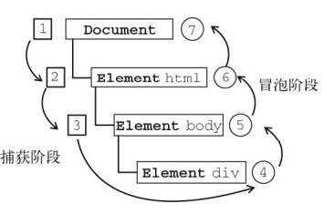

# js-浏览器基础
## 浏览器对象详解
### 浏览器对象模型
  BOM ：Browser Object Model（浏览器对象模型）,浏览器模型提供了独立于内容的、可以与浏览器窗口进行滑动的对象结构，就是浏览器提供的 API

  其主要对象有：

  1. window 对象——BOM 的核心，是 js 访问浏览器的接口，也是 ES 规定的 Global 对象
  2. location 对象：提供当前窗口中的加载的文档有关的信息和一些导航功能。既是 window 对象属 性，也是 document 的对象属性
  3. navigation 对象：获取浏览器的系统信息
  4. screen 对象：用来表示浏览器窗口外部的显示器的信息等
  5. history 对象：保存用户上网的历史信息
  
  [具体可参考链接](https://segmentfault.com/a/1190000014212576)

## 浏览器事件
### 事件模型
  事件模型分为三个阶段：捕获阶段、目标阶段、冒泡阶段
  
  * 事件捕获阶段：事件从document一直向下传播到目标元素, 依次检查经过的节点是否绑定了事件监听函数，如果有则执行
  * 事件处理阶段：事件到达目标元素, 触发目标元素的监听函数
  * 事件冒泡阶段：事件从目标元素冒泡到document, 依次检查经过的节点是否绑定了事件监听函数，如果有则执行
#### 事件委托
  - **什么是事件委托**

    事件委托是利用**事件冒泡的机制**，只指定一个事件处理程序，就可以处理某一个类型的所有事件。

    通常我们可以将事件处理程序绑定在父级元素上，从而对一组类似功能的子元素事件进行处理。这样就不用为每个子元素添加处理程序，而是通过父元素捕获事件并委托处理
  
  - **事件委托的好处**
    * **减少事件处理程序的数量**：事件处理程序绑定在父级元素上，相比绑定在子元素上会少很多
    * **实现动态绑定**：对于动态添加的子元素，无需再进行事件绑定
    * **节省内存空间**：减少事件处理程序的数量，可以节省内存，提高页面性能
    * **简化代码**：通过事件委托，把事件处理程序逻辑集中在一个地方，简化了代码的结构，提高了代码的可读性
  
  - **事件委托应用场景**
    * 简化事件绑定：多个子元素具有类似的事件处理程序或者动态添加的子元素都需要绑定事件处理程序
    * 标记中的行为：比如一个菜单有三个按钮（保存、编辑和搜索）。可以为整个菜单添加一个处理程序，并为具有方法调用的按钮添加```data-action``` 特性。
    * 行为模式：使用事件委托将行为以声明方式添加到具有特殊特性和类的元素中。

      行为模式分为两部分：
      * 我们将自定义特性添加到描述其行为的元素。
      * 用文档范围级的处理程序追踪事件，如果事件发生在具有特定特性的元素上 —— 则执行行为（action）

    [参考链接](https://zh.javascript.info/event-delegation) 

  - **事件委托-例子**
    1. 假设有一个ul，有多个子元素
    2. 给ul绑定事件监听，
    3. 当子元素的点击事件冒泡到父级元素时，**通过e.target获取到真正点击的元素**
    4. 做相应的处理
    ```html
    <ul id="parent-list">
      <li id="post-1">Item 1</li>
      <li id="post-2">Item 2</li>
      <li id="post-3">Item 3</li>
      <li id="post-4">Item 4</li>
      <li id="post-5">Item 5</li>
      <li id="post-6">Item 6</li>
    </ul>
    ```
    ```js
      // 找到父级元素
      const ul = document.getElementById("parent-list");
      // 为父级元素添加事件监听
      ul.addEventListener("click", function(e){
        // 通过e.target 找到当前被点击的元素
        if (e.target && e.target.tagName === "li") {
          console.log(e.target.id)
        }
      })
    ```
#### 事件绑定器
  * addEventListener() 
  * 语法：
    ```js
      /**
        * type: 事件类型
        * listener：当所监听的事件类型触发时，会接收到一个时间通知对象。listener必须是一个实现了 ```EventListener```接口的对象，或者是一个函数
        * options: 可选。一个指定listener属性的可选参数对象。
          {
            capture?: true | false,  为true时，表示listener会在捕获阶段触发
            once?: true | false, 表示listener是否只调用一次
            passive? true | false, 设置为true时，表示listener永远不会调用```preventDefault()```
            signal?: AbortSignal,  该 AbortSignal 的 abort() 方法被调用时，监听器会被移除
          } 
        * useCapture: 可选。一个布尔值，默认值为false。 为true时表示在事件捕获阶段处理事件  
       **/
      addEventListener(type, listener)
      addEventListener(type, listener, options)
      addEventListener(type, listener, useCapture)
    ```   
  * **注意：addEventListener的第三个参数, 如果为true，就是代表在捕获阶段执行。如果为false，就是在冒泡阶段进行**  
  * 兼容性
    attachEvent——兼容：IE7、IE8； 不支持第三个参数来控制在哪个阶段发生，默认是绑定在冒泡阶段

    addEventListener——兼容：firefox、chrome、IE、safari、opera；

#### 阻止事件传播
  - ```event.stopPropagation()``` : 
  
  阻止捕获和冒泡阶段中当前事件的进一步传播。

  **注意：这个方法不仅可以阻止冒泡阶段事件的传播，还可以阻止捕获阶段事件的传播** 

  - ```event.stopImmediatePropagation()```
    
    阻止监听同一事件的其他事件监听器被调用

   **如果多个事件监听器被附加到相同元素的相同事件类型上，当此事件触发时，它们会按其被添加的顺序被调用。如果在其中一个事件监听器中执行 stopImmediatePropagation() ，那么剩下的事件监听器都不会被调用。**
#### 阻止事件默认行为
  ```e.preventDefault()```可以阻止事件的默认行为发生。
  
  默认行为是指：点击a标签就转跳到其他页面、拖拽一个图片到浏览器会自动打开、点击表单的提交按钮会提交表单等等，因为有的时候我们并不希望发生这些事情，所以需要阻止默认行为
#### ```e.target``` 和 ```e.currentTarget```
  - **e.target**

    只读属性，是对事件分派到的对象的引用。

    当事件处理器在事件的冒泡或者捕获阶段被调用时，它与 ```event.currentTarget``` 不同
  
  - **e.currentTarget**

    只读属性，标识的是当事件沿着DOM触发时事件的当前目标。

    它总是指向事件绑定的元素，而 ```event.target``` 则是事件触发的元素。

### 事件模型面试题
#### 什么是事件委托？事件委托是如何实现的？事件委托中如何找到真正被点击的元素？
  [答案见链接内容](#事件委托) 
#### 如何阻止事件默认行为？
  [详细见链接](#阻止事件默认行为)

  ```js
    e.perventDefault()       
  ```
#### 如何阻止事件冒泡？如何阻止事件捕获？
  ```event.stopPropagation()```方法阻止捕获和冒泡阶段中当前事件的进一步传播。

  **注意：这个方法不仅可以阻止冒泡阶段事件的传播，还可以阻止捕获阶段事件的传播**

  [详细见链接](#阻止事件传播)

  ```js
    e.stopPropagation();
  ```
#### 事件委托中怎么获取到真正点击的是哪个元素
  ```js
    e.target
  ```  
#### e.target 和 e.currentTarget 的区别
  [详细见链接](#etarget-和-ecurrenttarget)  

## 浏览器请求相关
### ajax  及 fetch API 详解

  1. XMLHTTPRequest

  2. fetch
  - 默认不带cookie
  - 错误不会reject
  - 不支持超时设置
  - 需要借用AbortController中止fetch

### 常见的浏览器请求/响应头/错误码解析
#### request header

  ```
    :method: GET
    :path: /solar-comment/api/comment/tutor-primary-activity/senior-recommend/users/self?tagSource=&_productId=351&_appId=0
    :scheme: https
    accept: application/json, text/plain, */*
    accept-encoding: gzip, deflate, br
    cache-control: no-cache
    cookie: deviceId=c122305d338525616baea870cc76dd5b; abSeed=843447469b71b0978db580220c952c10; userid=172270653; persistent=3411agNdImBJd8GjTW6bWT9Vg0U2yoaka3Lp8sSCiv9B6MDvr27fL4o50ha+Pfuhi1y4/Gg8aRN3FEP+VV4jWA==; sid=5530384168693043754; sess=QvrAQ0Cq+EcDQQPTer2XHlv4fhIRaW/YCb/e4pz/I+vzKp85mI2ukPUBIuGweXj5sq8HhuYQtf03DxK4dphwkOyBKovyUyC5I8t9exQw6Aw=
    origin: https://m.yuanfudao.biz
    referer: https://m.yuanfudao.biz/primary/market/senior-recommend/reserve
    user-agent: Mozilla/5.0 (iPhone; CPU iPhone OS 13_2_3 like Mac OS X) AppleWebKit/605.1.15 (KHTML, like Gecko) Version/13.0.3 Mobile/15E148 Safari/604.1
  ```
  

#### response header

  ```
    access-control-allow-credentials: true
    access-control-allow-origin: https://m.yuanfudao.biz
    content-encoding: gzip
    content-type: application/json;charset=UTF-8
    date: Thu, 06 Aug 2020 08:15:05 GMT
    set-cookie: sess=QvrAQ0Cq+EcDQQPTer2XHlv4fhIRaW/YCb/e4pz/I+uSfZtum4dPp9q4HJL5o+GWuDXHXQLQF2JrIgwzZPaZHWal4qYZy/cfW0Sle/fyB/w=;domain=.yuanfudao.biz;path=/;HttpOnly
    set-cookie: userid=172270653;domain=.yuanfudao.biz;path=/;HttpOnly
    status: 200
  ```
 
#### status

  ```
    1xx 信息响应
    200 get 成功
    201 post 成功
    301 永久重定向
    302 临时重定向
    304 协商缓存 服务器文件未修改
    400 客户端请求有语法错误，不能被服务器识别
    403 服务器受到请求，但是拒绝提供服务，可能是跨域
    404 请求的资源不存在
    405 请求的method不允许
    500 服务器发生不可预期的错误
  ```

## 常见问题
### 僵尸进程和孤儿进程是什么？
#### 僵尸进程

  子进程比父进程先结束，而父进程又没有释放子进程占用的资源，那么子进程的进程描述符仍然保存在系统中，这种进程称为僵尸进程。

#### 孤儿进程
  
  父进程退出了，而它的一个或多个子进程还在运行，这些子进程都会成为孤儿进程。孤儿进程将被 init 进程（进程号为1）所收养，并由 init 进程对它们完成状态收集工作。

### 如何实现浏览器内多个标签页之间的通信？
  
  **实现多个标签页之间的通信，本质上都是通过中介者模式来实现的。**因为标签页之间没有办法直接通信，因此我们可以找一个中介者，让标签页和中介者之间进行通信，然后让这个中介者来进行消息的转发。

  通常有四种方式：
  
  1. **使用 websocket 协议：** websocket 协议可以实现服务器推送，所以服务器可以用来当做这个中介者。

    标签页通过向服务器发送数据，然后由服务器向其他标签页推送。

    websocket 是受同源策略限制的，即 WebSocket 连接必须建立在与当前页面具有相同协议、域名和端口的服务器上。

    然而，WebSocket 提供了一种跨域访问的机制，即通过 CORS（跨源资源共享）来实现。服务器可以在响应中设置适当的 CORS 头信息，允许特定域名的页面进行跨域 WebSocket 连接。通过在服务器的响应中包含 Access-Control-Allow-Origin 头，指定允许连接的来源域名，可以实现跨域 WebSocket 连接。

    例如，服务器可以设置以下响应头来允许来自 example.com 域名的跨域连接：

    ```js
      Access-Control-Allow-Origin: http://example.com
    ```

  2. **使用 shareWorker的方式：**shareWorker 会在页面存在的生命周期内创建一个唯一的线程，并且开启多个页面也只会使用同一个线程。这个时候共享线程就可以充当中介者的角色。

    标签页通过共享一个线程，然后通过这个共享的线程来实现数据的交换。

    haredWorker 可以在跨域的情况下使用，但需要遵循一些限制和注意事项。

    SharedWorker 是一种可以由多个浏览器上下文（例如不同标签页或不同的窗口）共享的 Web Worker。它可以在多个标签页或窗口之间进行通信，并共享数据和资源。

    在跨域场景下，SharedWorker 遵循以下限制和注意事项：

      - 同源策略：SharedWorker 需要与页面的源（域名、协议和端口）保持一致，也就是说，它必须位于与页面相同的源下。这意味着在跨域的情况下，无法直接使用 SharedWorker。

      - 共享 Worker 脚本文件：要在跨域的页面中使用 SharedWorker，需要将 Worker 脚本文件放置在可以通过 CORS（跨源资源共享）访问的位置上。服务器应该配置适当的 CORS 头信息，允许跨域访问共享 Worker 脚本文件。

      - 共享数据通信：SharedWorker 可以通过 postMessage() 方法进行跨源通信。消息传递必须遵循跨域通信的规则，包括使用 MessageEvent 的 origin 属性进行源验证。

      需要注意的是，SharedWorker 的跨域访问需要遵循同源策略并配置适当的 CORS 头信息。如果无法满足这些要求，就无法在跨域的页面中使用 SharedWorker。

      另外，SharedWorker 的兼容性可能受到不同浏览器的支持程度和版本的限制。在使用 SharedWorker 时，建议检查浏览器的兼容性支持情况，并确保在目标浏览器上进行测试和验证。

  3. **使用 localStorage 的方式：**可以在一个标签页对 localStorage 的变化事件进行监听，然后当一个标签页修改数据的时候，我们就可以通过这个监听事件来获取数据。这个时候，localStorage 对象就是充当的中介者角色。

  localstorage 是基于同源策略的，只能在同源的页面之间共享数据。

  4. **使用 postMessage 方法：** 如果能够获得对应标签页的引用，就可以使用 postMessage 方法，进行通信。

  postMessage 是跨窗口通信机制，它可以在不同窗口（包括跨域窗口）之间安全地传递信息。