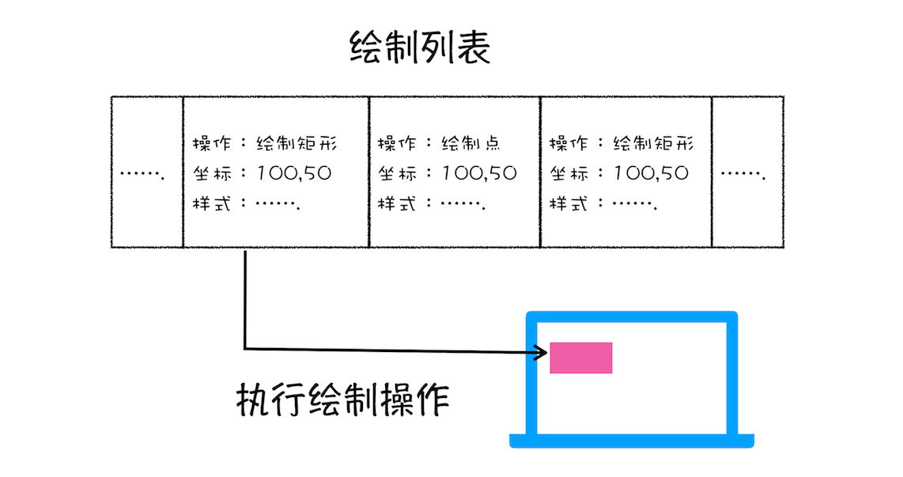
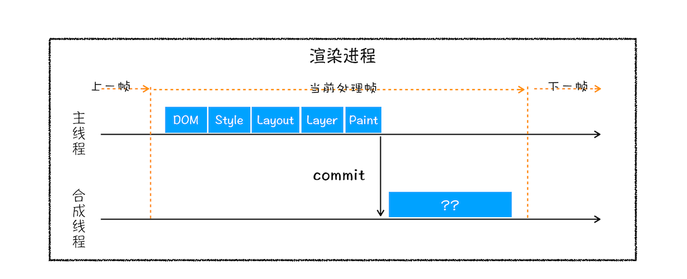
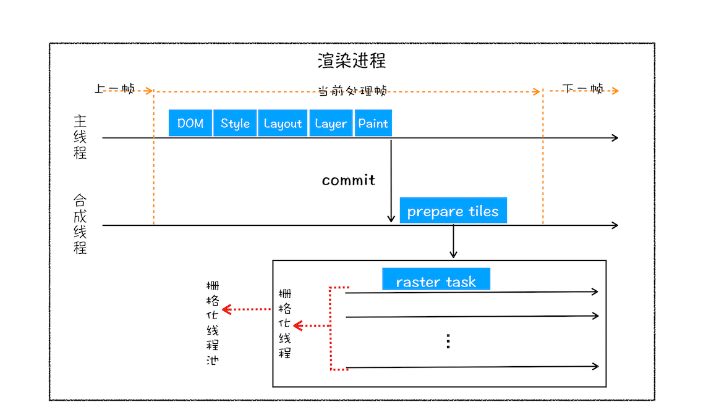
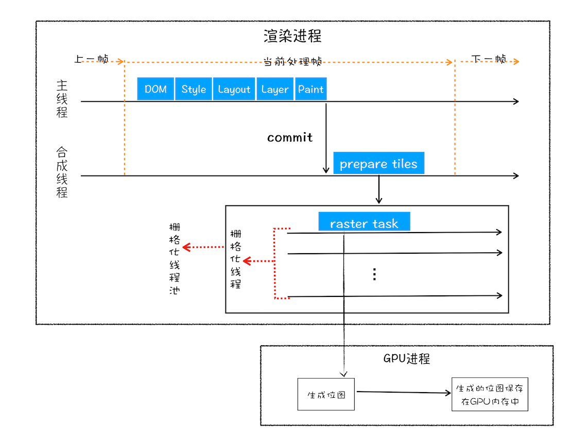
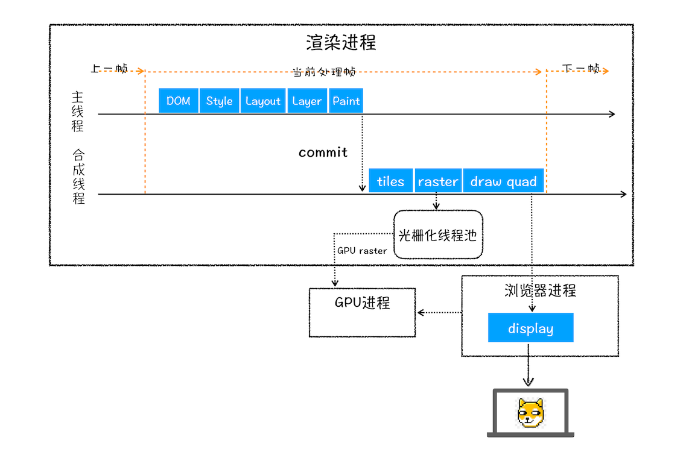
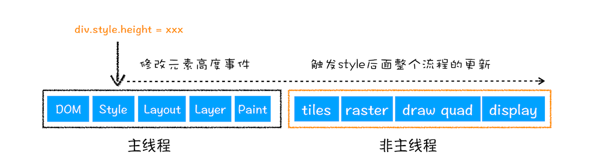
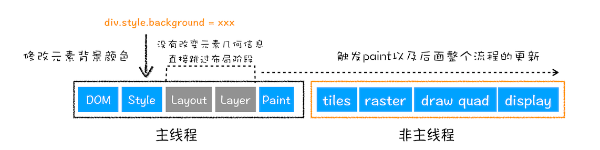
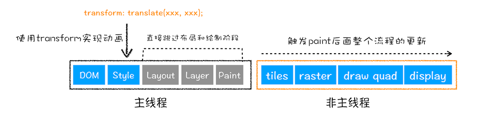
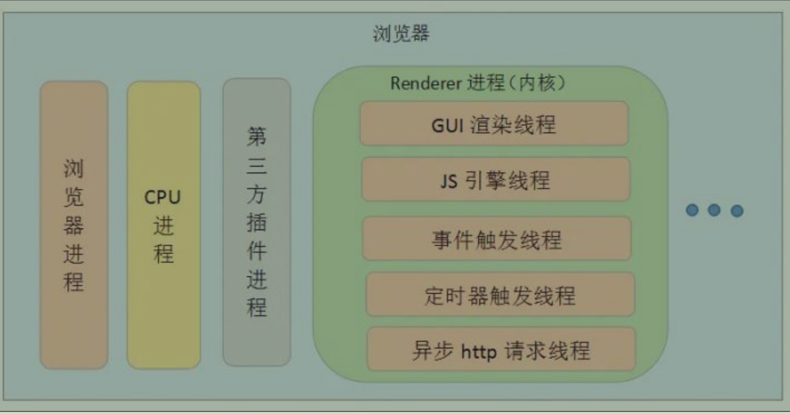

# js-浏览器-渲染
  相关资料：https://time.geekbang.org/column/article/116572
## 渲染流程
### 构建 DOM 树
  因为浏览器无法直接理解和使用 HTML，所以需要将 HTML 转换为浏览器能够理解的结构 - DOM 树

### 样式计算
  步骤：
  1. 把 CSS 转换为浏览器可以理解的结构（通过link引入的、style标签内部的、元素的 style 属性内嵌的css）。可以通过 ```document.styleSheets```来查看其结构。
  2. 转换样式表中的属性值，使其标准化（比如em会被转换为px，color值会被转换为rgb值，bold会被转换为700）
  3. 计算 DOM 树中每个节点的具体样式（可以通过开发者工具样式中的Computed子标签来查看）
    
    涉及到 CSS 样式继承以及层叠规则。

### 布局阶段
  计算出 DOM 树中可见元素的几何位置。

  步骤：
  1. 创建布局树：遍历 DOM 树中的所有可见节点，构建一个只包含可见元素的布局树
  2. 布局计算：计算布局树节点的坐标位置。

### 分层
  由于页面中会有很多复杂的效果，比如一些复杂的 3D 转换，页面滚动，或者使用z-index 做 Z 轴排序等，为了方便实现这些效果，**渲染引擎需要为特定的节点生成专用的图层，并生成一棵对应的图层树。**

  可以通过开发者工具的 Layers 标签，看到页面的分层情况。

  **浏览器的页面实际上被分层了很多图层，这些图层叠加后合成了最终的页面。**

  **并不是布局树中的每个节点都包含一个图层，如果一个节点没有对应的层，那么这个节点就会从属于父节点的图层。**

  #### 哪些节点会创建新的图层
  满足以下两点中的任意一点就会被提升为一个图层
  - 用用层叠上下文属性的元素会被单独提升为一个图层

   [参考链接](https://developer.mozilla.org/zh-CN/docs/Web/CSS/CSS_positioned_layout/Understanding_z-index/Stacking_context)

  - 需要剪裁（clip）的地方会被创建为图层。

    比如div大小为200*200,而div内部文字内容比较多，文字内容超出显示区域，这个时候就产生了剪裁。**渲染引擎会为文字部分单独创建一个层，如果出现滚动条，滚动条也会被提升为单独的层。**

### 绘制
  对图层进行绘制

  渲染引擎会把一个图层的绘制，拆分成很多小的绘制指令，然后把这些指令按照顺序组成一个待绘制列表。**在图层阶段，输出的就是这些待绘制列表。**

  可以通过开发者工具Layers标签，选择 document层，来实际体验绘制列表。

  

### 分块、光栅化、合成
绘制列表只能用来记录绘制顺序和绘制指令的列表，而实际绘制操作是由渲染引擎中的合成线程来完成的。

  渲染主线程和合成线程之间的关系：
  
  1. 当图层的绘制列表准备好之后，主线程会把绘制列表提交给合成线程。

  

  2. **合成线程会将图层划分为图块，这些图块通常会是256*256 或者 512*512**

  3. 合成线程会按照视口附近的图块优先生成位图，实际生成位图的操作是由栅格化来执行的。所谓的栅格化是将图块转换为位图。
  
  4. 一旦所有图块都被光栅化，合成线程就会生成一个绘制图块的命令--“DrawQuad”，然后将该命令提交给浏览器进程。

  5. 浏览器进程里面一个叫 viz 的组件，用来接收合成线程发过来的 DrawQuad 命令，让后根据 DrawQuad命令，将页面内容绘制在内存中，最后通过内存显示在屏幕上。

#### 分块
  将图层进行分块
#### 光栅化
  将图块转换为位图。图块是栅格化执行的最小单位。

  渲染进程维护了一个栅格化的线程池，所有的图块的栅格化都是在线程池中完成的。

  

  栅格化会使用 GPU 来加速生成，使用 GPU 生成位图的过程叫快速栅格化，或者 GPU 栅格化，生成的位图保存在 GPU 内存中。

  如果 栅格化使用了 GPU, 那么最终生成的位图是在 GPU 中完成的，这就涉及到了跨进程操作。渲染进程将生成图块的指令发送给 GPU， 然后在 GPU 中生成图块的位图，并且保存在 GPU 中。

  

#### 合成
  等待所有图块光栅化，生成绘制图块指令，将页面内容绘制到内存中，最后再将内存显示在屏幕上。

## 渲染流程图
  

## 相关概念
### 重排
  **更新了元素的几何位置**

  如果通过 JavaScript 或者 CSS 修改元素的几何位置信息，比如修改元素的宽度、高度等，那么浏览器会触发重新布局，解析之后的一系列子阶段，这个过程叫做重排。
  **重排需要更新完整的渲染流水线，所以开销也是最大的。**

  
### 重绘
  **更新元素的绘制属性**

  如果更改了元素的背景颜色，布局阶段不会被执行，因为并没有引起几何位置的变换，所以直接进入了绘制阶段，然后执行一系列子阶段，这个过程叫做重绘。
  **相较于重排操作，重绘省去了布局和分层阶段，所以执行效率会比重排操作要高一点。**

  
### 合成

  如果更改一个既不需要布局，也不需要绘制的属性，渲染引擎会跳过布局和绘制，只执行后续的合成操作，这个过程叫做合成。

  比如 CSS 的transform实现动画效果，避开重排和重绘阶段，直接在非主线程上执行合成动画操作。这样的效率是最高的，因为在非主线程上合成，并没有占用主线程的资源，另外避开了布局和绘制两个子阶段，多以相对于重绘和重排，合成能大大提升绘制效率。

  

## 常见问题
### 浏览器渲染进程的线程有哪些

  - GUI 渲染线程

    负责渲染浏览器页面，解析HTML、CSS，构建dom树，计算样式，布局，分层，绘制。

    **GUI线程和JS线程是互斥的，当JS引擎执行时，GUI线程会被挂起，GUI更新会保存在一个队列中，等到JS引擎空闲时立即被执行。**

  - JS 引擎线程

    负责处理 JavaScript 脚本程序，解析 JavaScript 脚本，运行代码。JS 引擎线程一直等待着任务队列中任务的到来，然后加以处理，一个 Tab 页中无论什么时候都只有一个 JS 引擎线程在运行 JS 程序。

    **GUI线程和JS线程是互斥的，如果JS执行时间过长，会造成页面的渲染不连贯，导致页面渲染加载阻塞。**

  - 事件触发线程
    
    事件触发线程属于浏览器不属于JS引擎，用来控制事件循环。

    当 JS 引擎执行代码块，如 setTimeout 时（或者鼠标点击，异步请求等），会将对应的任务添加到事件触发线程中；当对应的事件符合触发条件被触发时，该线程会把事件添加到待处理队列的队尾，等待 JS 引擎的处理。

    **由于 JS 的单线程关系，所以这些待处理队列中的事件都得排队等待 JS 引擎处理，当 JS  引擎空闲时才会去执行。**

  - 定时器触发线程
    
    它是setTimeout 与 setInterval等所在的线程。

    使用单独的线程来计时并触发定时器，计时完毕后，添加到事件队列中，等待 JS 引擎空闲后执行，所以定时器中的任务在设定的时间点不一定能准时执行，定时器知识在指定的时间点将任务添加到事件队列中。

    **W3C 规定，定时器的定时时间不能小于4ms,如果小于4ms，则默认是4ms**

  - 异步 HTTP 请求线程

    XMLHttpRequest 连接后通过浏览器新开一个线程请求；

    检测到状态变更时，如果设置有回调函数，异步线程就会产生状态变更事件，将毁掉函数放入到事件队列中，等待 JS 引擎空闲后执行。

### 如果下载CSS文件阻塞了，会阻塞DOM树的合成吗？会阻塞页面的显示吗？
  JS和CSS都可能会阻塞DOM树的合成，会阻塞页面的显示。

  解析流程：
  - 当从服务器接收到 HTML 页面的第一批数据时，DOM 解析工作就开始了，在解析的过程中，如果遇到了JS脚本，会先执行JS脚本，执行完成之后，再解析。
  - 如果是JS外部文件，当解析到JS脚本的时候，会暂停DOM解析，下载外部脚本文件，下载完成之后执行该JS文件，然后再继续解析DOM。
  - 当在JS中访问了某个元素的样式，那么这个时候就需要等待这个样式被下载完成才能继续往下执行，所以在这种情况下，CSS会阻塞DOM的解析。
  - script设置了async属性，普通脚本会被要求并行下载，并尽快解析和执行。模块脚本及其所有依赖都会在延缓队列中执行，因此它们会被并行请求，并尽快解析和执行。不会阻塞DOM树的合成
  - script设置了defer属性，要求浏览器立即下载脚本（可以并行执行），并且在DomContentLoaded事件之前执行脚本，不会阻止DOM树合成。

### 为什么较少重绘、重排能优化Web性能？有哪些方法能够减少重绘、重排？
  减少重绘、重排能够减少很多的计算和操作，加快web页面的展示。
  方法：
  - 触发重排和重绘的操作尽量放在一起，避免引发多次重排、重绘
  - 使用class操作样式，而不是频繁操作style
  - 避免使用table布局
  - 批量 dom操作，例如 createDocumentFragment, 或者使用框架，比如React
  - Debounce window resize 事件
  - 对 dom 属性的读写要分离
  - will-change:transform做优化。