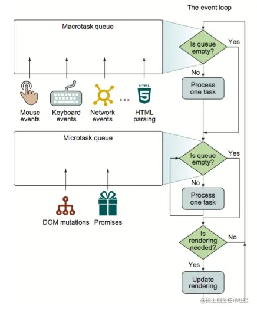
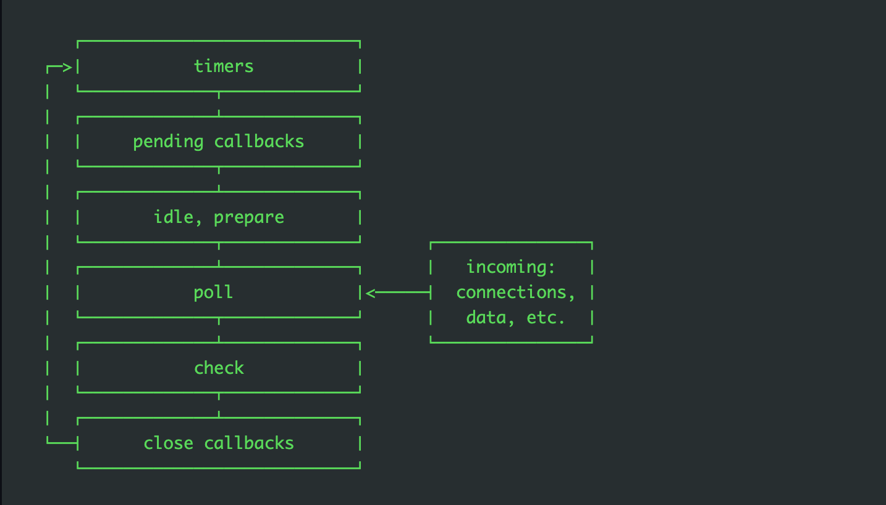

# 事件循环机制
## js中的EventLoop
### js中的任务
  js是单线程的，任务会被分为同步任务和异步任务
### 任务队列
  * 同步任务：所有同步任务都在主线程上执行，形成一个执行栈（execution context stack）。只有前一个任务执行完毕，才能执行后一个任务
  * 异步任务：js中的异步任务会被放到任务队列里。

  （1）所有同步任务都在主线程上执行，形成一个执行栈（execution context stack）。

  （2）主线程之外，还存在一个"任务队列"（task queue）。```只要异步任务有了运行结果，就在"任务队列"之中放置一个事件。```

  （3）一旦"执行栈"中的所有同步任务执行完毕，系统就会读取"任务队列"，看看里面有哪些事件。那些对应的异步任务，于是结束等待状态，进入执行栈，开始执行。

  （4）主线程不断重复上面的第三步。
### 任务队列执行
  
### 事件循环
  由于主线程读取的过程是不断重复的，所以叫做事件循环  
### 微任务有哪些
  promise, mutationObserver
### 宏观任务有哪些
  点击事件，setTimeout，setInterval，requestAnimationFrame等  
## node中的EventLoop
  - 概念：
    * 事件循环是node处理非阻塞I/O的机制
  - 事件循环机制解析：
    * node.js启动 ---> 初始化事件循环 ---> 处理已经提供的输入脚本（可能调用异步的API，调度定时器，调用Process.nextTick()）---> 处理事件循环
  - 事件循环机制阶段：  
   
  - 阶段概述
    * timers: 此阶段执行由 setTimeout() 和 setInterval() 排序。
    * pending callbacks: 执行 I/O 回调推迟到下一个循环 迭代。
    * idle, prepare: 仅在内部使用。
    * poll: 检索新的 I/O 事件; 执行与 I/O 相关的几乎任何回调（由“计时器”或 “setImmediate()”所设的紧邻回调除外); node 将在适当时机在此处暂停。
    * check: setImmediate() 回调在此处被调用。
    * close callbacks：一些关闭的回调函数，如：socket.on('close', ...)。   