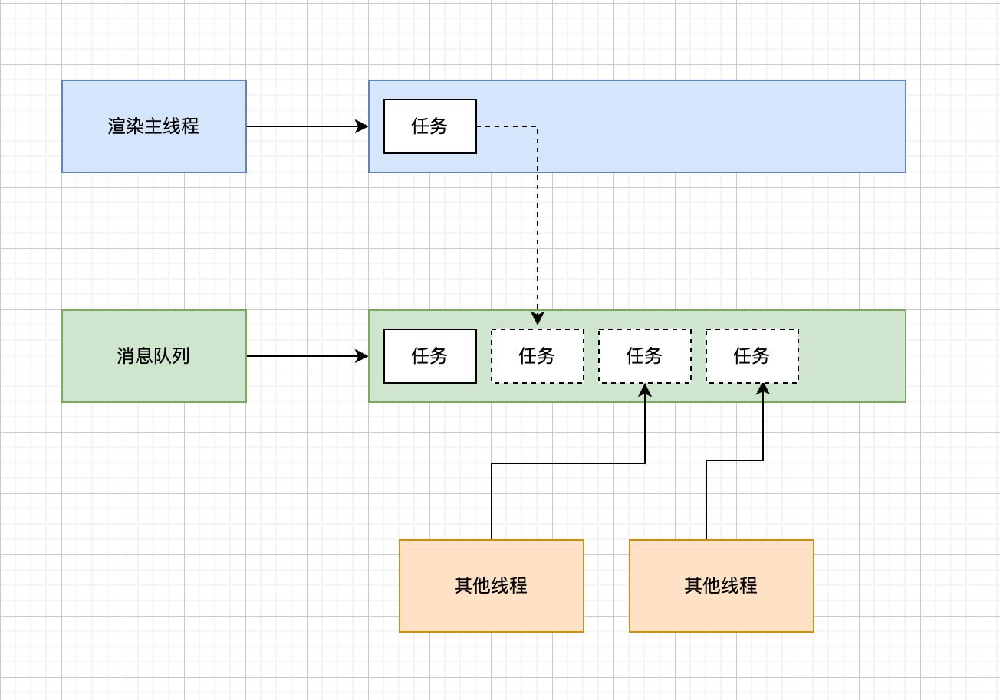
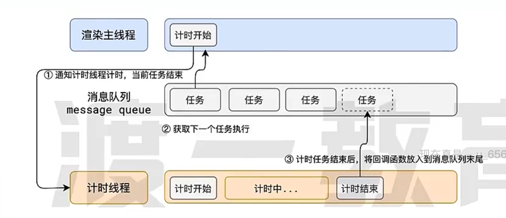

# js-事件循环机制
## 浏览器的进程模型
### 何为进程？
  程序运行需要有它自己专属的内存空间，可以把这块内存空间简单的理解为进程。

  每个应用至少有一个进程，进程之间相互独立，即使要通信，也需要双方同意。

### 何为线程？
  有了进程后，就可以运行程序的代码了。

  运行代码的人称之为线程。

  一个进程至少有一个现成，所以在进程开启后会自动创建一个现成来运行代码，该线程称为主线程。

  如果程序需要执行多块代码，主线程就会启动更多的线程来执行代码，所以一个进程中可以包含多个线程。

### 浏览器有哪些进程和线程？
  浏览器是一个多进程多线程的应用程序。

  浏览器内部工作极其复杂。为了避免相互影响，为了减少连环崩溃的几率，当启动浏览器时，它会启动多个进程。

  **可以在浏览器的任务管理器中查看浏览器进程**

  主要进程有：

  1. 浏览器进程

    主要负责界面展示，用户交互，子进程管理等。浏览器进程内部会启动多个线程处理不同的任务。

  2. 网络进程

    负责加载网络资源。网络进程需要多个线程来处理不同的网络任务。

   3. 渲染进程

    **渲染进程启动后，默认会开启一个渲染主线程，主线程负责执行 HTML、 CSS、 JS 代码。**

    默认情况下，浏览器会为每个标签页开启一个新的渲染进程，以保证不同的标签页之间不相互影响。

## 渲染主线程是如何工作的？
  渲染主线程是浏览器中最繁忙的县城，它需要处理的任务包括但不限于：
  - 解析 HTML
  - 解析 CSS
  - 计算样式
  - 布局
  - 处理图层
  - FPS
  - 执行全局 JS 代码
  - 执行事件处理函数
  - 执行计时器的回调函数
  - ......

### 主线程如何调度任务？
  **排队**

  

  1. 在最开始的时候，渲染主线程会进入一个无限循环

  2. 每一次循环都会检查消息队列中是否有任务存在。如果有，则取出第一个任务执行，执行完成后进入到下一次循环；如果没有，则进入到休眠状态。

  3. 其他所有线程（包括其他进程的线程）可以随时向消息队列添加任务。新任务会添加到消息队列的末尾。在添加新任务时，如果主线程是休眠状态，则会将其唤醒以继续循环拿取任务。

  这样一来就可以让每个任务有条不紊的持续下去了。

  整个过程，被称之为事件循环。

## 名词解释
### 何为异步？
  代码在执行过程中，遇到一些无法立即处理的任务，比如：
  - 计时完成后需要执行的任务 -- setTimeout, setInterval
  - 网络通信完成后需要执行的任务 -- XHR, Fetch
  - 用户操作后需要执行的任务 -- addEventListener

  如果让渲染主线程等待这些任务的时机达到，就会导致主线程长期处于**阻塞**的状态，从而导致浏览器卡死。

  

  **渲染主线程承担着极其重要的工作，无论如何都不能阻塞。**

  **因此浏览器选择异步来解决这个问题。**

  

  使用异步的方式，**渲染主线程永不阻塞。**

### 如何理解 JS 的异步？
  JS 是一门单线程的语言，这是因为它运行在浏览器的渲染主线程中，而渲染主线程只有一个。

  渲染主线程承担着诸多的工作，渲染页面，执行JS，都在其中执行。

  如果使用同步的方式，就极有可能导致主线程产生阻塞，从而导致消息队列中的很多其他任务无法得到执行。这样依赖，一方面会导致繁忙的主线程白白消耗时间，另一方面导致页面无法及时更新，给用户造成卡死的现象。

  所以浏览器采用异步的方式来避免。具体做法是当某些任务发生时，比如计时器，网络，事件监听，主线程将这些任务交由其他线程去处理，自身立即结束任务的执行，转而执行后续代码。当其他线程完成时，将事先传递的回调函数包装成任务，加入到消息队列的末尾排队，等待主线程调度执行。

  在这种异步的模式下，浏览器永不阻塞，从而最大限度的保证了单线程的流畅运行。

### JS 为何会阻塞页面渲染？
  因为 JS 和 渲染都在浏览器的渲染主线程上。

### 任务有优先级吗？

  任务没有优先级，在消息队列中先进先出

  但**消息队列是有优先级的**

  **根据 W3C 的最新解释：**

  - **每个任务都有一个任务类型，同一个类型的任务必须在一个队列，不同类型的任务可以分属于不同的队列。在一次事件循环中，浏览器可以根据实际情况从不同的队列中取出任务队列。**
  - **浏览器必须准备好一个微队列，微队列中的任务优先所有其他任务执行。**、

  随着浏览器的复杂度急剧提升， W3C 不再使用宏队列的说法。

  在目前 Chrome 的实现中，至少包含了下面的队列：
  
  - 延时队列：用于存放计时器到达后的回调任务，优先级--中
  - 交互队列：用于存放用户操作后产生的事件处理任务，优先级--高
  - 微队列：用户存放需要最快执行的任务，优先级--最高

  例如：
  ```js
    // 立即把一个函数添加到微队列
    Promise.resolve().then(函数)
  ```

  **添加任务到微队列的主要方式主要是使用Promise，MutationObserver**

### 阐述一下 JS 的事件循环
  事件循环又叫消息循环，是浏览器渲染主线程的工作方式。

  在 Chrome 的源码中，它开启一个不会结束的 for 循环，每次循环从消息队列中取出第一个任务执行，而其他线程只需要在合适的的时候将任务加入到队列末尾即可。

  过去把消息队列简单分为宏队列和微队列，这种说法目前已经无法复杂的浏览器环境，取而代之的是一种更加灵活多变的处理方式。

  根据 W3C 官方的解释，每个任务有不同的类型，同类型的任务必须在同一个队列，不同的任务可以属于不同的队列。不同任务队列有优先级，在一次事件循环中，由浏览器自行决定取哪一个队列的任务。但浏览器必须有一个微队列，微队列的任务一定具有最高的优先级，必须优先调度执行。


## JS中的EventLoop
### 背景
  js最初设计的是单线程的。这是因为它运行在浏览器的渲染主线程中，而浏览器的渲染主线程只有一个。

  自从定时器（setTimeout() 和 setInterval()）加入到 Web API 后，浏览器提供的 JavaScript 环境就已经逐渐发展到包含任务调度、多线程应用开发等强大的特性。

  **单线程是异步产生的原因，事件循环是异步的实现方式。**

### 简介
  **事件循环负责收集事件（包括用户事件以及其他非用户事件等）、对任务进行排队以便在合适的时候执行回调。然后它执行所有处于等待中的 JavaScript 任务，然后是微任务，然后在开始下一次循环之前执行一些必要的渲染和绘制操作。**

  网页或者 app 的代码和浏览器本身的用户界面程序运行在相同的线程中，共享相同的事件循环。该线程就是主线程，它除了运行网页本身的代码之外，还负责收集和派发用户和其他事件，以及渲染和绘制网页内容等。

  事件循环驱动着浏览器中发生的一切，因为它与用户的交互有关，但对于我们这里的目的来说，更重要的是它负责调度和执行在其线程中运行的每一段代码

  **js中的任务分为同步任务和异步任务，浏览器任务分为宏任务和微任务**

### 微任务有哪些
  promise, async/await, mutationObserver, QueueMicroTask()等
### 宏观任务有哪些
  点击事件，setTimeout，setInterval，requestAnimationFrame，I/O, UI rendering等
### 面试题
#### 面试题1
  ```js
    //请写出输出内容
    async function async1() {
      console.log('async1 start');
      await async2();
      console.log('async1 end');
    }
    async function async2() {
      console.log('async2');
    }

    console.log('script start');

    setTimeout(function() {
      console.log('setTimeout');
    }, 0)

    async1();

    new Promise(function(resolve) {
      console.log('promise1');
      resolve();
    }).then(function() {
      console.log('promise2');
    });
    console.log('script end');


    /*
    script start
    async1 start
    async2
    promise1
    script end
    async1 end
    promise2
    setTimeout
    */   
  ```  
#### 面试题2
  ```js
  async function async1() {
    console.log('async1 start');
    await async2();
    setTimeout(function() {
        console.log('setTimeout1')  // 这一部分代码会放入到 promise 的微任务队列中。
    },0)
  }
  async function async2() {
    setTimeout(function() {
        console.log('setTimeout2')
    },0)
  }
  console.log('script start');
  setTimeout(function() {
    console.log('setTimeout3');
  }, 0)
  async1();
  new Promise(function(resolve) {
    console.log('promise1');
    resolve();
  }).then(function() {
    console.log('promise2');
  });
  console.log('script end');
  /** script start,
   *  async1 start, 
   *  promise1, 
   *  script end, 
   *  promise2, 
   *  setTimeout3,  
   *  setTimeout2, 
   *  setTimeout1
   **/
  ```  
### 参考文档
  * https://developer.mozilla.org/zh-CN/docs/Learn/JavaScript/Asynchronous
  * https://zh.javascript.info/event-loop   
## node中的EventLoop
  - 概念：
    * 事件循环是node处理非阻塞I/O的机制
  - 事件循环机制解析：
    * node.js启动 ---> 初始化事件循环 ---> 处理已经提供的输入脚本（可能调用异步的API，调度定时器，调用Process.nextTick()）---> 处理事件循环
  - 事件循环机制阶段：  
   
  - 阶段概述
    * timers: 此阶段执行由 setTimeout() 和 setInterval() 排序。
    * pending callbacks: 执行 I/O 回调推迟到下一个循环 迭代。
    * idle, prepare: 仅在内部使用。
    * poll: 检索新的 I/O 事件; 执行与 I/O 相关的几乎任何回调（由“计时器”或 “setImmediate()”所设的紧邻回调除外); node 将在适当时机在此处暂停。
    * check: setImmediate() 回调在此处被调用。
    * close callbacks：一些关闭的回调函数，如：socket.on('close', ...)。   

## 面试题：
### 如何理解 JS 的异步？
  [如何理解JS的异步](#如何理解-js-的异步)

### 阐述一下 JS 的事件循环
  [阐述一下JS的事件循环](#阐述一下-js-的事件循环)

### JS 中的计时器能做到精确计时吗？为什么？
  不行，因为：

  1. 计算机硬件没有原子钟，无法做到精确计时。

  2. 操作系统的计时函数本身就有少量偏差，由于 JS 的计时器最终调用的是操作系统的函数，也就懈怠了这些偏差。

  3. 根据 W3C 的标准，浏览器实现计时器时，如果嵌套层级超过 5 层，则会带有 4 毫秒的最少时间，这样在计时时间少于 4 毫秒又带来了偏差。

  4. 受事件循环的影响，计时器的回调函数只能在主线程空闲时运行，因此又带来了偏差。