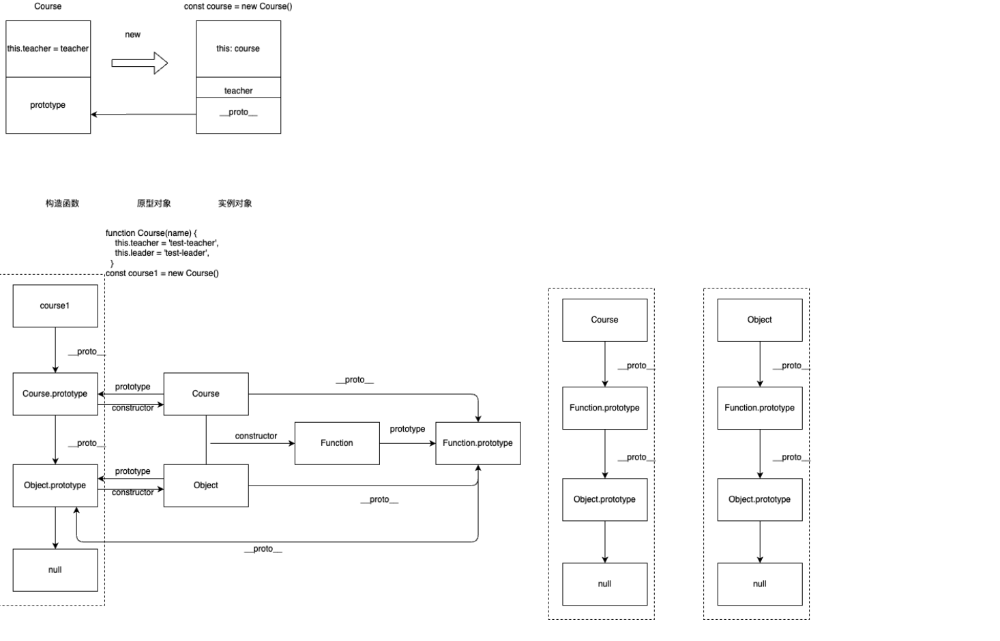
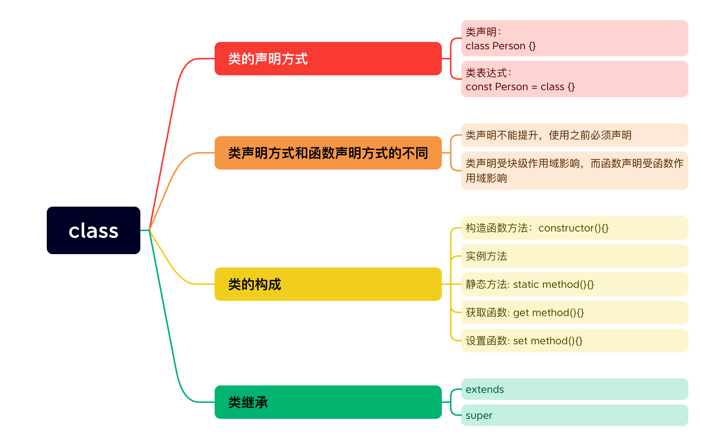

# js-继承与原型链
## js中如何创建一个对象
### 字面量
```js
  let person = {
    name: 'shirley',
    age: 18,
    sayName: function(){
      console.log(this.name)
    }
  }
```
### 使用Object构造函数
```js
  let person = new Object();
  person.name = "shirley";
  person.age = 18,
  person.sayName = function(){
    console.log(this.name)
  }
```
### 工厂模式
```js
  // 工厂函数
  function createPerson(name, age){
    let person = new Object();
    person.name = name;
    person.age = age;
    person.sayName = function(){
      console.log(this.name)
    }
    return person
  }
  // 使用
  const person1 = createPerson("shirley", 18);
  const person2 = createPerson("mike", 26);
```
### 构造函数
```js
  // 构造函数
  function Person(name,age){
    this.name = name;
    this.age = age;
    this.sayName = function(){
      console.log(this.name)
    }
  }
  // 使用
  const person1 = new Person("shirley", 18)
  const person2 = new Person("mike", 26)
```
### 原型模式
```js
  function Person(){};
  Person.prototype.name = "shirley";
  Person.prototype.age = 18;
  Person.prototype.sayName = function(){
    console.log(this.name)
  }
  // 使用
  const person1 = new Person();
  
```

上面的例子可以做如下优化

```js
  function Person(){};
  Person.prototype = {
    name: "shirley",
    age: "18",
    sayName: function(){
      console.log(this.name)
    }
  }
  // 设定constructor的值为Person，并且不可枚举
  Object.defineProperty(Person.prototype, "constructor", {
    enumerable: false,
    value: Person,
  })
  // 注意：
  // 重写构造函数上的原型之后再创建的实例才会引用新的原型。而在此之前创建的实例仍然会引用最初的原型
  // 但是在第一个例子中，创建实例对象后再修改原型对象，仍会反应在实例上
```


## 对象相关-面试题
### 调用new操作符发生了什么
  - (1) 在内存中创建一个新对象。
  - (2) 这个新对象内部的[[Prototype]]特性被赋值为构造函数的 prototype 属性。
  - (3) 构造函数内部的 this 被赋值为这个新对象（即 this 指向新对象）。
  - (4) 执行构造函数内部的代码（给新对象添加属性）。
  - (5) 如果构造函数返回非空对象，则返回该对象；否则，返回刚创建的新对象。
  
## 原型链
### 原型链例子


## js中的继承方式
### 原型链继承

  基本思路：更改子类的prototype为父类的实例

  ```js
    // 父类
    function SuperType(){
      this.property = true;
    }
    SuperType.prototype.getProperty = function(){
      console.log(this.property)
    }
    // 子类
    function SubType(){
      this.subProperty = true;
    }
    // 继承SuperType
    SubType.prototype = new SuperType();
    SubType.prototype.getSubProperty = function(){
      console.log(this.subProperty)
    }
    // 实例
    const instance1 = new SubType();
    console.log(instance1.getProperty())
  ```
#### 原型链继承的缺点：
  - 原型上所有的属性(原型中包含的引用值)在实例上都是共享的
    ```js
      function SuperType(){
        this.colors = ['red', 'green'],
      }
      function SubType(){}
      SubType.prototype = new SuperType();

      let instance1 = new SubType();
      instance1.colors.push("yellow");
      console.log(instance1.colors); //red, green, yellow

      const instance2 = new SubType();
      console.log(instance2.colors); //result: red, green, yellow; expect: red, green
    ```
  - 弱化了向构造函数传递参数的能力 

### 构造函数继承

  基本思路：盗用构造函数--在子类的构造函数中调用父类的构造函数。可以使用 call() 和 apply() 方法以新创建的对象为上下文执行构造函0数。

  解决的问题： 

  - 解决原型包含引用值导致的继承问题。
  - 子类也可以向父类的构造函数传递参数。

  ```js
    function SuperType() {
      this.colors = ["red", "green"];
    }
    function SubType() {
      // 继承SuperType
      SuperType.call(this);
    }

    let instance1 = new SubType();
    instance1.colors.push("yellow");
    console.log(instance1.colors); // red, green, yellow
    
    const instance2 = new SubType();
    console.log(instance2.colors); // red, green
  ```
#### 构造函数继承的缺点
  - 方法必须在构造函数中定义，因此函数不能重用
  - 子类不能访问父类原型上定义的方法，因此所有类型只能使用构造函数模式

### 组合继承
  组合继承综合原型链和盗用构造函数，将两者的优点结合起来。

  实现思路：使用原型链继承原型上的属性和方法，而通过盗用构造函数来继承实例属性。这样既可以把方法定义在原型上以实现重用，又可以让每个实例都有自己的属性。

  ```js
    // 父类
    function SuperType(name){
      this.name = name;
      this.colors = ["red", "green"];
    }
    SuperType.prototype.sayName = function() {
      console.log(this.name)
    }
    // 子类
    function SubType(name, age){
      // 继承父类
      SuperType.call(this, name);
      this.age = age;
    }

    SubType.prototype = new SuperType();
    SubType.prototype.sayAge = function(){
      console.log(this.age);
    }

    let instance1 = new SubType("shirley", 18);
    instance1.colors.push("yellow");
    console.log(instance1.colors); // red, green, yellow
    instance1.sayName(); // shirley
    instance1.sayAge();  // 18;

    let instance2 = new SubType("bob", 20);
    console.log(instance2.colors); //red, green
    instance2.sayName(); // bob
    instance2.sayAge(); // 20
  ```
#### 组合继承的优缺点
  优点：
  - 弥补了原型链和使用构造函数的不足。  
  - 保留了instanceof操作符和 isPrototypeOf() 方法识别合成对象的能力

  缺点：效率问题
  - 父类构造函数会被调用两次。一次是在创建子类原型式调用，另一次是在子类的构造函数中调用。

### 原型式继承
  出发点：即使不定义类型，也可以通过原型实现对象之间的信息共享。

  适用于：已经有一个对象，想在这个对象的基础上再创建一个对象。
  
  创建步骤：

  1. 使用object()函数创建一个临时构造函数，将传入的对象赋值给这个构造函数的原型，然后返回由临时构造函数创建的对象。**本质上，object()对传入的对象执行了一次浅复制**
    ```js
      function object(o){
        // 构造函数
        function F(){};
        F.prototype = o;
        return new F();
      }
    ```
  2. 创建实例对象，并改写属性等
    ```js
      let person = {
        name: "shirley",
        friends: ["Shelby"]
      }

      let person1 = object(person);
      person1.name = "Greg";
      person1.friends.push("Rob");
      console.log(person1.friends); // ["shelby", "Rob"]
      console.log(person.friends); // ["shelby", "Rob"]

      let person2 = object(person);
      person2.name = "Linda";
      person2.friends.push("Barbie");
      console.log(person2.friends); // ["shelby", "Rob", "Barbie"]
      console.log(person.friends); // ["shelby", "Rob", "Barbie"]
    ```  
    **es6中的Object.create()方法将原型式继承的概念进行了规范化**
#### 原型式继承的优/缺点
  - 优点：非常适合不需要单独创建构造函数，但仍然需要在对象间共享信息的场合
  - 缺点：和使用原型链模式一样，属性中包含的引用值会在相关对象间共享。

### 寄生式继承
  寄生式继承背后的思路类似于寄生构造函数和工厂模式：创建一个实现继承的函数，以某种方式增强对象，然后返回这个对象。

  **寄生式继承同样适合主要关注对象，而不在乎类型和构造函数的场景。**

  基本的寄生继承模式如下：

  ```js
    // 已经实现了继承的函数
    function object(origin){
      function F(){};
      F.prototype = origin;
      return new F();
    }

    // 创建对象并进行增强
    function createAnother(original) {
      // 调用函数创建一个对象
      let clone = object(origin);
      // 增强对象
      clone.sayHi = function(){
        console.log("hi");
      }
      // 返回该对象
      return clone;
    } 

    // 使用
    let person = {
      name: "shirley",
      friends: ["Shelby"]
    }

    let anotherPerson = createAnother(person);
    anotherPerson.sayHi(); //hi
  ```
#### 寄生式继承的优/缺点
  优点：适合只关注对象，而不在乎类型和构造函数的场景。**object()函数不是寄生式继承所必须的，任何返回新对象的函数都可以在这里使用**

  缺点：通过寄生式继承给对象添加函数会导致函数难以重用，与构造函数模式类似。

  寄生式组合继承的基本模式：
  - 创建父类原型的副本
  - 给返回的对象设置constructor属性，解决由于重写原型导致默认constructor丢失的问题
  - 将新创建的对象赋值给子类型的原型
  ```js
    function object(origin){
      function F(){};
      F.prototype = origin;
      return new F();
    }
    // 重点逻辑
    function inheritProperty(subType, superType) {
      // 创建对象
      let prototype = object(superType.protype);
      // 增强对象
      prototype.constructor = subType;
      // 赋值对象
      subType.prototype = prototype;
    }
  ```
  ```js
    function SuperType(name) {
      this.name = name;
      this.colors = ["red", "green"];
    }

    SuperType.prototype.sayName = function() {
      console.log(this.name)
    }

    function SubType(name, age) {
      SuperType.call(this, name);
      this.age = age;
    }

    // 调用继承函数
    inheritPrototype(SubType, SuperType);

    SubType.prototype.sayAge = function() {
      console.log(this.age);
    }

  ```
#### 寄生式组合继承的优/缺点
  优点：
  -  **这里只调用了一次SuperType构造函数，避免了SubType.prototype上不必要也用不到的属性，因此可以说这个例子更高效**
  -  **而且原型链仍然保持不变，因此instanceof操作符和isPrototypeOf()方法仍然正常有效**

### 寄生组合式继承（最成熟的方法，也是现在库实现的方法）
  **寄生式组合继承通过盗用构造函数继承属性，但使用混合式原型链继承方法。**

  **基本思路**：不通过调用父类构造函数给子类原型赋值，而是取得父类原型的一个副本。也就是使用寄生式继承来继承父类的原型，然后将返回的新对象赋值给子类原型。
### es6的class继承
  由于es5中的各种继承都有自己的问题，并且也有相应的妥协。正应为如此，实现继承的代码也显得非常冗长和混乱。
  
  为了解决这些问题，es6中引入了class关键字来定义类的能力。

  类继承：
  1. 继承基础：**使用extends关键字就可以继承任何具有[[construct]]和原型的对象。这意味着不仅可以继承一个类，也可以继承一个普通的构造函数。**

  ```js
    // 继承类
    class Vehicle {};

    class Bus extends Vehicle {}

    let bus = new Bus();
    console.log(bus instanceof Vehicle) // true;
    console.log(bus instanceof Bus) // true;

    // 继承普通函数
    function Person(){};

    class Enginner extends Person {}
    
    let person1 = new Enginner();
    console.log(person1 instanceof Person); // true;
    console.log(person1 instanceof Enginner); // true;
  ```
  2. 构造函数、HomeObject和super
  **派生类的方法可以通过super关键字来引用他们的原型。这个关键字只能在派生类中使用，而且仅限于类构造函数，实例方法，类静态方法中使用**
  
  **ES6 给类构造函数和静态方法添加了内部特性[[HomeObject]]，这个特性是一个指针，指向定义该方法的对象。这个指针是自动赋值的，只能在 JavaScript 引擎内部访问。super 始终会定义为[[HomeObject]]的原型。**

  - 在类构造函数中使用super()来调用父类的构造函数
  ```js
    // 父类
    class Vehicle {
      constructor() {
        this.hasEngine = true;
      }
    }
    // 子类
    class Bus extends Vehicle {
      constructor() {
        // 调用父类的构造函数；相当于super.constructor();
        super();
        console.log(this);
      }
    }

  ```
  - 在静态方法中可以通过super关键字来调用父类的静态方法
  ```js
    // 父类
    class Vehicle {
      static identity() {
        console.log("vehicle");
      }
    }
    
    // 子类
    class Bus extends Vehicle {
      static identity() {
        super.identity()
      }
    }

    Bus.identity(); // vehicle;
  ```
  3. 抽象基类

    当定义一个类供其他类继承，但是这个类并不会被实例化时，可以使用抽象基类。

    - 虽然 ECMAScript 没有专门支持这种类的语法 ，但通过 new.target 也很容易实现。**new.target 保存通过 new 关键字调用的类或函数。通过在实例化时检测 new.target 是不是抽象基类，可以阻止对抽象基类的实例化**

    ```js
      class Vehicle {
        constructor(){
          if (new.target === Vehicle) {
            throw new Error("Vehicle can not be directly instantiated")
          }
        }
      }

      class Bus extends Vehicle {};

      new Bus();
      new Vehicle(); // Vehicle can not be directly instantiated
    ```
  - 通过在抽象基类的构造函数中进行检查，可以要求派生类必须定义某个方法。因为原型方法在调用类构造函数之前就已经存在了，所以可以使用this关键字来检查相应的方法。
    ```js
      // 抽象基类
      class Vehicle {
        constructor(){
          if (new.target === Vehicle) {
            throw new Error("Vehicle can not be directly instantiated")
          }
          
          if (!this.foo){
            throw new Error('Inheriting class must define foo()');
          }
        }
      }

      //派生类Bus
      class Bus extends Vehicle {};

      // 派生类Van
      class Van extends Vehicle {
        foo(){}
      }

      new Van();
      new Bus(); //inheriting class must define foo()
      new Vehicle(); // Vehicle can not be directly instantiated
    ```
  4. 继承内置类型
    ES6 类为继承内置引用类型提供了顺畅的机制，开发者可以方便地扩展内置类型。
    ```js
      // 实现一个继承Array的类
      class SuperArray extends Array { 
        shuffle() { 
          // 洗牌算法
          for (let i = this.length - 1; i > 0; i--) { 
            const j = Math.floor(Math.random() * (i + 1)); 
            [this[i], this[j]] = [this[j], this[i]]; 
          } 
        } 
      } 

      let a = new SuperArray(1, 2, 3, 4, 5); 

      console.log(a instanceof Array); // true 
      console.log(a instanceof SuperArray); // true 
      console.log(a); // [1, 2, 3, 4, 5] 
      a.shuffle(); 
      console.log(a); // [3, 1, 4, 5, 2]
    ```  

    有些内置类型的方法会返回新实例。默认情况下，返回实例的类型与原始实例的类型是一致的：
    ```js
      class SuperArray extends Array {} 

      let a1 = new SuperArray(1, 2, 3, 4, 5); 
      let a2 = a1.filter(x => !!(x%2)) 

      console.log(a1); // [1, 2, 3, 4, 5] 
      console.log(a2); // [1, 3, 5] 
      console.log(a1 instanceof SuperArray); // true 
      console.log(a2 instanceof SuperArray); // true 
    ```

    如果想覆盖这个默认行为，则可以覆盖 Symbol.species 访问器，这个访问器决定在创建返回的实例时使用的类：
    ```js
      class SuperArray extends Array { 
        // 重点
        static get [Symbol.species]() { 
          return Array; 
        } 
      } 

      let a1 = new SuperArray(1, 2, 3, 4, 5); 
      let a2 = a1.filter(x => !!(x%2)) 

      console.log(a1); // [1, 2, 3, 4, 5] 
      console.log(a2); // [1, 3, 5] 
      console.log(a1 instanceof SuperArray); // true 
      console.log(a2 instanceof SuperArray); // false
    ```
  5. 类混入
    在javascript中，把多个类集中到一个类叫做类混入。虽然 ES6 没有显式支持多类继承，但通过现有特性可以轻松地模拟这种行为。

    - 单个混入：

    ```js
      class Vehicle {} 
      function getParentClass() { 
        console.log('evaluated expression'); 
        return Vehicle; 
      } 
      class Bus extends getParentClass() {}
    ```  

    - 嵌套混入模式：
      i. 一个策略是定义一组“可嵌套”的函数，每个函数分别接收一个超类作为参数，而将混入类定义为这个参数的子类，并返回这个类。这些组合函数可以连缀调用，最终组合成超类表达式：
      ```js
        class Vehicle {} 

        let FooMixin = (Superclass) => class extends Superclass { 
          foo() { 
            console.log('foo'); 
          } 
        }; 

        let BarMixin = (Superclass) => class extends Superclass { 
          bar() { 
            console.log('bar'); 
          } 
        }; 

        let BazMixin = (Superclass) => class extends Superclass { 
          baz() { 
            console.log('baz'); 
          } 
        };

        class Bus extends FooMixin(BarMixin(BazMixin(Vehicle))) {} 

        let b = new Bus(); 
        b.foo(); // foo 
        b.bar(); // bar 
        b.baz(); // baz
      ```
      ii. 定义一个辅助函数，可以把嵌套函数打开
      ```js
        class Vehicle {} 

        let FooMixin = (Superclass) => class extends Superclass { 
          foo() { 
            console.log('foo'); 
          } 
        }; 

        let BarMixin = (Superclass) => class extends Superclass { 
          bar() { 
            console.log('bar'); 
          } 
        }; 

        let BazMixin = (Superclass) => class extends Superclass { 
          baz() { 
            console.log('baz'); 
          } 
        };

        function mix(BaseClass, ...Mixins) { 
          return Mixins.reduce((accumulator, current) => current(accumulator), BaseClass); 
        } 

        class Bus extends mix(Vehicle, FooMixin, BarMixin, BazMixin) {} 

        let b = new Bus(); 
        b.foo(); // foo 
        b.bar(); // bar 
        b.baz(); // baz
      ```
#### 使用super时需要注意的问题
  - super只能在派生类构造函数和静态方法中使用
  - super关键字不能单独使用，使用它要么调用类的构造函数，要么调用类的静态方法
  - 调用```super()```会调用父类的构造方法，并把返回的实例赋值给this
  - super()的行为如同调用父类的构造函数，如需要给父类的构造函数传参，需要手动传入
  - 如果没有定义类的构造函数，在实例化派生类时会调用super()，并且把所有传递给派生类的参数传递给父类的构造函数
  - 在类的构造函数中，在调用super之前，不能使用this
  - 如果在派生类中显示定义了构造函数，则要么必须在其中调用super()，要么必须返回一个对象。

### 总结-继承
  JavaScript 的继承主要通过原型链来实现。原型链涉及把构造函数的原型赋值为另一个类型的实例。这样一来，子类就可以访问父类的所有属性和方法，就像基于类的继承那样。原型链的问题是所有继承的属性和方法都会在对象实例间共享，无法做到实例私有。盗用构造函数模式通过在子类构造函数中调用父类构造函数，可以避免这个问题。这样可以让每个实例继承的属性都是私有的，但要求类型只能通过构造函数模式来定义（因为子类不能访问父类原型上的方法）。目前最流行的继承模式是组合继承，即通过原型链继承共享的属性和方法，通过盗用构造函数继承实例属性。

  除上述模式之外，还有以下几种继承模式。

   原型式继承可以无须明确定义构造函数而实现继承，本质上是对给定对象执行浅复制。这种操
  作的结果之后还可以再进一步增强。

   与原型式继承紧密相关的是寄生式继承，即先基于一个对象创建一个新对象，然后再增强这个
  新对象，最后返回新对象。这个模式也被用在组合继承中，用于避免重复调用父类构造函数导
  致的浪费。

   寄生组合继承被认为是实现基于类型继承的最有效方式。

## 确认原型与实例关系的两种方式
  - instanceof
    ```js
      instance instanceof Object;
    ```
  - isPrototypeOf
  ```js
    Object.prototype.isPrototypeOf(instance);
  ```

## es5 与 es6中继承的区别
  - es5中的继承是基于prototype或者构造函数的，es6中的继承是基于class和super的
    * es5-基于prototype
    ```js
      function Parent();
      function Child();
      Child.prototype = new Parent();
      Child.constructor = Child
      const child = new Child();
      Child.__proto__ === Function.prototype
    ```
   * es5-基于构造函数
    ```js
      function Parent () {}
      function Child () {
        Parent.apply(this, arguments)
      }
      var child = new Child();
      Child.__proto__ === Function.prototype
    ``` 
   * es6-基于super
   ```js
    class Parent{}
    class Child extends Parent {
      constructor(){
        super();
      }
    }
    Child.__proto === Parent;
   ``` 
  - this的构造顺序是不一样的。
    * es5的继承是先构造子对象，再产生的父对象，然后将父对象里面的属性复制到子对象中
    * es6是先用 ```super``` 创建的父对象，然后再创建的子对象

    这种差异导致es6的继承可以继承内置对象，通过 ```Child.__proto__``` 可以找到父类（Parent）

## es6-类
### 类概览

### 类构造函数
  constructor 关键字用于在类定义块内部创建类的构造函数。**方法名constructor会告诉解释器在使用new操作符创建实例时，应该调用这个函数。** 构造函数的定义不是必须的，不定义构造函数相当于将构造函数定义为空函数。
### 类构造函数与普通构造函数的区别
  - 类构造函数必须使用new操作符。如果不使用new操作符调用，则会抛出错误。而普通构造函数如果不使用 new 调用，那么会以全局的this（通常是window）作为内部对象。    