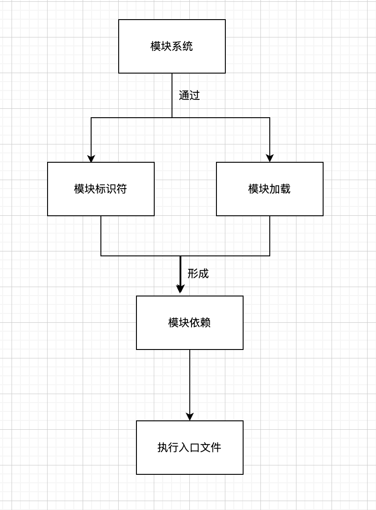

# js-模块化
  将代码拆分成独立的块，然后再把这些块连接起来可以通过模块模式来实现。

  模块化程序的独特之处在于，其含义来自于其组成部分的性质。这些部分都是可以重用的组件，并可以合并为一个系统整体或单独在其他系统中使用。这使代码更增加可读和可维护，同时使开发更高效。
  
## 模块模式
  
### 思想
  将逻辑分块，各自独立封装，相互独立，每个块自行决定对外暴露什么，同时自行决定引入哪些外部代码。

### 模块标识符
  **模块标识符是所有模块系统通用的概念。模块系统本质上是键/值实体，其中每个模块都有个可用于引用它的标识符。**这个标识符在模拟模块的系统中可能是个字符串，在原生实现的模块系统中可能是模块文件的实际路径。

  将模块标识符解析为实际模块的过程要根据模块系统对标识符的视线。原生浏览器模块标识符必须提供实际js文件的路径。除了文件路径，node.js还会搜索node_modules目录，用标识符去匹配包含index.js目录

### 模块依赖
  **模块系统的核心是管理依赖。** 指定依赖的模块与周围的环境会达成一种契约。本地模块向模块系统声明一组外部模块（依赖），这些外部模块对当前模块正常运行是必需的。模块系统检索这些依赖，进而保证这些外部模块能够被加载并在本地模块运行时初始化所有依赖。

  **每个模块都会与某个唯一的标识符关联，该标识符用于检索模块。**这些标识符通常是js文件的路径，但在某些模块系统中，这个标识符也可以是在模块本身内部声明的命名空间路径字符串。

### 模块的加载
  **加载模块的概念派生自依赖契约。当一个外部模块被指定依赖时，本地模块期望在执行它时，依赖已经准备好并已初始化。**    

  在浏览器中，加载模块涉及到的步骤：
  - 加载模块涉及执行其中的代码，但必须是在所有依赖都加载并执行之后。
  - 如果浏览器没有收到依赖模块的代码，则必须发送请求并等待网络返回。
  - 收到模块代码之后，浏览器必须确定刚收到的模块是否也有依赖。
  - 递归地评估并加载所有依赖，指导依赖模块都加载完成。
  - 只有整个依赖图都加载完成，才可以执行入口模块。

### 入口
  **相互依赖的模块必须指定一个模块作为入口，这也是代码执行的起点。**入口模块也可能依赖其他模块，其他模块同样可能有自己的依赖。**于是模块化JavaScript应用程序的所有模块会构成依赖图。**  

  可以通过有向图来表示应用程序中各模块的依赖关系。

  

### 异步依赖
  因为 JavaScript 可以异步执行，所以如果能够按需加载就好了。换句话说，可以让 JavaScript 通知模块系统在必要时加载新模块，并在模块加载完成后提供回调。

  在代码层面，可以通过下面的伪代码来实现：

  ```js
    // 在模块 A 里面
    load('moduleB').then(function(moduleB) { 
      moduleB.doStuff(); 
    });
  ```

### 动态依赖
  有些模块系统要求开发者在模块开始列出所有依赖，而有些模块系统则允许开发者在程序结构中动态添加依赖。**动态添加的依赖有别于模块开头列出的常规依赖，这些依赖必须在模块执行前加载完毕。**

  动态依赖加载的例子：
  ```js
    if (loadCondition) {
      require('/moduleA');
    }
  ```

  **动态依赖可以支持更复杂的依赖关系，但代价是增加了对模块进行静态分析的难度。**

### 静态分析
  **模块中包含的发送到浏览器的 JavaScript 代码经常会被静态分析，分析工具会检查代码结构并在不实际执行代码的情况下推断其行为。**对静态分析友好的模块系统可以让模块打包系统更容易将代码处理为较少的文件。它还支持在智能编辑器里智能自动完成。

  **更复杂的模块行为，例如动态依赖，会导致静态分析更困难。不同的模块系统和模块加载器具有不同层次的复杂度。至于模块的依赖，额外的复杂度会导致相关工具更难预测模块在执行时到底需要哪些依赖。**

### 循环依赖
  包括CommonJS、AMD 和 ES6 在内的所有模块系统都支持循环依赖。在包含循环依赖的应用程序中，模块加载顺序可能会出人意料。不过，只要恰当地封装模块，使它们没有副作用，加载顺序就应该不会影响应用程序的运行。    

## ES6之前的模块系统
  - IIFE
    ES6之前的模块有时候会使用函数作用域和立即调用函数表达式将模块定义封装在匿名闭包中。
  - 特性：
    * 通过把模块的返回值赋值给一个变量为模块创建了命名空间
    * 通过返回一个对象，其属性就是命名空间中的公共成员  
    * 为了让模块正确使用外部的值，可以将它们作为参数传递给IIFE
    * 模块可以在定义之后再扩展
  ```js
    // 为一个立即执行函数创建了命名空间 Foo
    var Foo = (function(){
      // 私有Foo模块的代码
      console.log("bar")

      // 返回对象，添加成员
      return {
        bar: 'baz',
        baz: function() {
          console.log(this.bar);
        }
      }
    })()

    console.log(Foo.bar) //'baz';
    Foo.baz();  // 'baz'
  ```  
  - 缺点：
    * 要手动管理依赖和排序
    * 添加异步加载和循环依赖非常困难
    * 静态分析很难

## ES6之前的模块加载器
  在 ES6 原生支持模块之前，使用模块的 JavaScript 代码本质上是希望使用默认没有的语言特性。因此，必须按照符合某种规范的模块语法来编写代码，另外还需要单独的模块工具把这些模块语法与 JavaScript 运行时连接起来。这里的模块语法和连接方式有不同的表现形式，通常需要在浏览器中额外加载库或者在构建时完成预处理。

  主要包括：
  - CommonJS
  - AMD
  - UMD

### CommonJS
  1. 定义：
    **概述了同步声明依赖模块的定义。这个规范主要用于在服务器端实现模块化代码组织，但也可以用于定义在浏览器中使用的模块依赖。CommonJS 模块语法在浏览器中直接运行。**

    所有 CommonJS 风格的实现共同之处是模块不会指定自己的标识符，它们的标识符由其在模块文件层级中的位置决定。

    **以服务器端为目标环境，能够一次性将所有模块加载到内存。**

  2. 使用：
  **通过 require() 指定依赖，通过 exports 对象定义自己的公共API。**
  
  * require(): 请求模块会加载对应的模块。调用require()意味着模块会原封不动地加载进来。

  ```js
    var moduleB = require('./moduleB');

    module.exports = {
      stuff: moduleB.doStuff();
    }
  ```  
  * module.exports用法：
    1. 导出字符串 
    ```js
      module.exports = 'foo'
    ```
    
    2. 导出多个值： 
    ```js
    module.exports = {
      a: 'A',
      b: 'B'
    }
    ```
    3. 托管类定义
    ```js
      class A {}

      module.exports = A;

      var A = require("./moduleA");

      var a = new A();

    ```
    4. 导出类实例
    ```js
      class A {}

      module.exports = new A();
    ```
    5. 动态依赖
    ```js
      if (condition) {
        var A = require("./moduleA")
      }
    ```
3. 特性：
  * **无论一个模块被require()多少次，模块永远是单例。这意味无论请求多少次，模块只会被加载一次。**
  * 模块第一次加载之后会被缓存，后续加载会取得缓存的模块。
  * 模块的加载顺序由依赖图决定。
  * 模块加载是模块系统执行的同步操作。
4. 小结：

  CommonJS 依赖几个全局属性如 require 和 module.exports。如果想在浏览器中使用 CommonJS模块，就需要与其非原生的模块语法之间构筑“桥梁”。模块级代码与浏览器运行时之间也需要某种“屏障”，因为没有封装的 CommonJS 代码在浏览器中执行会创建全局变量。这显然与模块模式的初衷相悖。

  常见的解决方案是提前把模块文件打包好，把全局属性转换为原生 JavaScript 结构，将模块代码封装在函数闭包中，最终只提供一个文件。为了以正确的顺序打包模块，需要事先生成全面的依赖图。

### AMD
  **以浏览器为目标执行环境**，所以需要考虑网络延迟的情况。AMD 的一般策略是让模块声明自己的依赖，而运行在浏览器中的模块系统会按需获取依赖，并在依赖加载完成之后立即执行依赖它们的模块。

  **AMD 模块实现的核心是用函数包装模块定义。**
  
  **包装模块的函数是全局define的参数，它是由AMD加载器库实现定义的。**

  使用函数包装模块定义的好处：

  - 这样可以防止声明全局变量，并允许加载器库控制何时加载模块。
  - 便于模块代码的移植。因为包装函数内部所有模块代码使用的都是原生js结构

  1. 特性：
  - AMD 模块可以使用字符串标识符指定自己的依赖，而 AMD 加载器会在所有依赖模块加载完毕后立即调用模块工厂函数。
  ```js
    // ID 为 moduleA 的模块定义，moduleA 依赖 moduleB，
    // moduleB会异步加载
    define("moduleA", ["moduleB"], function(moduleB) {
      return {
        staff: moduleB.stuff();
      }
    })
  ```
  **与 CommonJS 不同，AMD 支持可选地为模块指定字符串标识符。**
  - AMD 也支持 require 和 exports 对象，通过它们可以在 AMD 模块工厂函数内部定义 CommonJS风格的模块。这样可以像请求模块一样请求它们，但 AMD 加载器会将他们识别为原生 AMD 结构， 而不是模块定义：
  ```js
    define("moduleA", ["require", "exports"], fucntion(require, exports) {
      var moduleB = require("moduleB");
      
      exports.stuff = moduleB.doStaff();
    })
  ```
  - 动态依赖也支持 require 和 exports 对象
  ```js
    define("moduleA", ["require"], function(require) {
      if (condition) {
        var moduleB = require("moduleB")
      }
    })
  ```
### UMD
  为了统一 CommonJS 和 AMD 生态系统，通用模块定义（UMD）规范应运而生。

  **UMD 用于创建两个系统都可以使用的模块代码。**

  **本质上，UMD定义的模块会在启动时检测要使用哪个模块系统，然后进行适当配置，并把所有逻辑包装在一个立即调用的函数表达式（IIFE）中。**

  UMD 例子：
  ```js
    (function (root, factory) { 
      if (typeof define === 'function' && define.amd) { 
        // AMD。注册为匿名模块
        define(['moduleB'], factory); 
      } else if (typeof module === 'object' && module.exports) { 
        // Node。不支持严格 CommonJS 
        // 但可以在 Node 这样支持 module.exports 的
        // 类 CommonJS 环境下使用
        module.exports = factory(require(' moduleB ')); 
      } else { 
        // 浏览器全局上下文（root 是 window）
        root.returnExports = factory(root. moduleB); 
      } 
      }(this, function (moduleB) { 
        // 以某种方式使用 moduleB 
        // 将返回值作为模块的导出
        // 这个例子返回了一个对象
        // 但是模块也可以返回函数作为导出值
        return {}; 
    }));
  ```

  此模式有严格支持 CommonJS 和 浏览器全局上下文的变体。不应该期望手写这个包装函数，它应该由构件工具自动生成。开发者只需专注于模块的内容，而不必关心这些样板代码。

## ES6模块
  ES6引入了模块规范。这个规范全方位简化了之前出现的模块加载器，原生浏览器支持意味着加载器以及其他预处理都不在必要。

### 定义
  带有 ```type='module'```属性的 ```<script>``` 标签会告诉浏览器相关代码应该作为模块执行，而不是传统的脚本执行。

  **模块可以嵌入在网页中，也可以作为外部文件单独引入。**

  ```js
    <script type="module">
      
    </script>

    <script type="module" src="path/to/myModule.js"></script>

  ```

  所有模块都会像 ```<script defer>```加载的脚本一样按顺序执行。**解析到 ```<script type='module'>``` 标签后会立即下载模块文件，但执行会延迟到文档解析完成。无论对嵌入的模块代码，还是引入的外部模块文件，都是这样。**

  ```<script type='module'>``` 在页面中出现的位置就是它们执行的顺序。与 ```<script defer>``` 一样，需改模块标签的位置，无论在 ```<head>还是<body>```中，只会影响文件什么时候加载，而不会影响模块什么时候加载。

  如果模块添加了 async 属性。不仅模块执行顺序不再与 ```<script>``` 标签在页面中的顺序绑定，模块也不会等待文档完成解析才执行。不过入口模块仍必须等待其依赖加载完成。

  与```<script type="module">```标签关联的 ES6 模块被认为是模块图中的入口模块。一个页面上有多少个入口模块没有限制，重复加载同一个模块也没有限制。同一个模块无论在一个页面中被加载多少次，也不管它是如何加载的，实际上都只会加载一次

### 模块加载
#### 特点：
  - 既可以通过浏览器原生加载
  - 也可以与第三方加载器和构建工具一起加载
  - 完全支持 ES6 模块的浏览器可以从顶级模块加载整个依赖图，且是异步完成的。
#### 模块加载过程
  - 浏览器解析入口模块，确定依赖，并发送对依赖模块的请求
  - 通过网络返回文件，浏览器解析文件内容，确定它们的依赖
  - 如果这些二级依赖还没有加载，则会发送更多请求
  - 异步递归加载过程会持续到整个应用程序的依赖图都解析完成。
  - 解析完依赖图，正式加载模块。

### 模块行为
  借用 CommonJS 和 AMD 的优秀特性
  - 模块代码只在加载后执行
  - 模块只能加载一次
  - 模块是单例
  - 模块可以定义公共接口，其他模块可以基于这个公共接口观察和交互
  - 模块可以请求加载其他模块
  - 支持循环依赖
  增加的新特性
  - 模块默认在严格模式下执行
  - 模块不共享全局命名空间
  - 模块顶级 this 的值是undefined（常规脚本中是 window）
  - 模块中的 var 声明不会添加到 window 对象
  - 模块是异步加载和执行的

  与 ```<script type='module'>``` 关联或者通过 import 语句加载的 js 文件会被认定为模块。

### 模块导出和导入
#### 导出
  模块支持两种导出：
  - 命名导出
  - 默认导出

#### 导出特性
  - **导出语句必须在模块顶级**，不能嵌套在某个块中 
  - 导出值对内部js的执行没有影响，因此 **export 语句与导出值的相对位置或者 export 关键字在模块中出现的顺序没有限制。export语句甚至可以出现在它要到处的值之前。** 
  - 一个模块中可以声明多个命名导出。
  - 一个模块只能有一个默认导出。重复的默认导出会导致 syntaxError
  - 行内默认导出中不能出现变量声明
  - 只有标识符可以出现在 export 子句中
  - 别名只能在 export 子句中出现

#### 导入
  - import 关键字

#### 导入特性
  - import 关键字只能出现在模块顶级
  - import 语句与使用导入值的语句的相对位置并不重要
  - 模块标识符可以是相对于当前模块的相对位置，也可以是指向模块文件的绝对路径。**它必须是纯字符串，不能是动态计算的结果。**  
  - 如果在浏览器中通过标识符原生加载模块，则文件必须带有js扩展名，不然可能无法正确解析
  - 如果通过构建工具或者第三方模块加载器打包或者解析 ES6 模块，则可能不需要包含文件扩展名。
  - 不是必须通过导出的成员才能导入模块。如果不需要模块的特定导出，但仍想加载和执行模块以利用其副作用，可以只通过路径加载。
  - 命名导出可以使用 * 批量获取并赋值给保存导出结合的别名，而无需列出每个标识符
  - 指名导入，需要把标识符放在 import 子句中
  - 如果模块同时导出了命名导出和默认导出，则可以在 import 语句中同时取得它们。

## 问题
### ES6 某块与之前模块的区别
  - ES6 模块是基于文件的模块，一个文件是一个模块。
  - ES6 模块的API是静态的。所有的模块导出和导入必须在模块顶层完成。
  - ES6 模块是单例
  - 模块的公开 API 中暴露的属性和方法并不仅仅是普通的值或者引用的复制。它们是到内部模块定义中的标识符的实际绑定。

    **对于 ES6 来说，导出一个局部私有变量，即使当前它持有的是一个原生字符串或者数字，导出的都是对这个变量的绑定。如果模块修改了这个变量的值，外部导入绑定现在会决议到新的值**

  - 导入模块和静态请求加载（如果还没有加载的话）这个模块是一样的。

## 小结
  模块模式是管理复杂性的永恒工具。开发者可以通过它创建逻辑彼此独立的代码段，在这些代码段之间声明依赖，并将它们连接在一起。此外，这种模式也是经证明能够优雅扩展到任意复杂度且跨平台的方案。

  多年以来，CommonJS 和 AMD 这两个分别针对服务器端环境和受延迟限制的客户端环境的模块系统长期分裂。两个系统都获得了爆炸性增强，但为它们编写的代码则在很多方面不一致，经常也会带有冗余的样板代码。而且，这两个系统都没有在浏览器中实现。缺乏兼容导致出现了相关工具，从而让在浏览器中实现模块模式成为可能。

  ECMAScript 6 规范重新定义了浏览器模块，集之前两个系统之长于一身，并通过更简单的声明性语法暴露出来。浏览器对原生模块的支持越来越好，但也提供了稳健的工具以实现从不支持到支持 ES6 模块的过渡。


