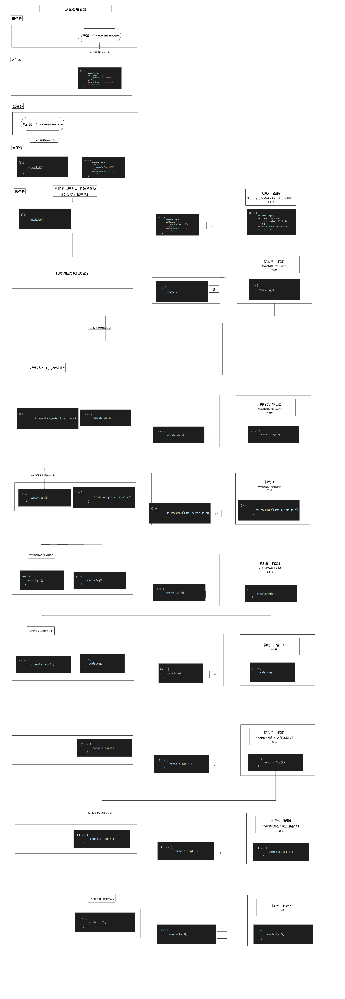

# Promise 原理及实践

## Promise

### Promise A+ 规范

https://promisesaplus.com/

https://tsejx.github.io/javascript-guidebook/standard-built-in-objects/control-abstraction-objects/promise-standard/

### 状态
- pending
- fulfilled
- rejected

状态的流转：

1. pending --> resolve() --> fulfilled
2. pending --> reject() --> rejected

### 实例的方法：
- then(onFulfilled, onRejected)
- catch(onFulfilled, onRejected)
- finally(onFulfilled, onRejected)

### 构造函数的方法
- Promise.resolve()
- Promise.reject()
- Promise.all()
- Promise.race();

#### Promise.resolve()

Promise.resolve()静态方法用来实例化一个解决的promise.

- 如果给定的值本身是一个 Promise,那么返回该 Promise
- 如果是一个 thenable 的对象，```Promise.resolve()``` 将调用其 `then()` 方法及其两个回调函数
- 否则，Promise 则会以该值兑现。

### 实现一个 Promise

```js
const PENDING = "pending";
const FULFILLED = "fulfilled";
const REJECTED = "rejected";

class MPromise {
  FULFILLED_CALLBACK_LIST = [];
  REJECTED_CALLBACK_LIST = [];
  _status = PENDING;
  constructor(fn) {
    // 初始状态为pending
    this.status = PENDING;
    this.value = null;
    this.reason = null;
    try {
      fn(this.resolve.bind(this), this.reject.bind(this));
    } catch (e) {
      this.reject(e);
    }
  }

  get status() {
    return this._status;
  }

  set status(newStatus) {
    this._status = newStatus;
    switch (newStatus) {
      case FULFILLED: {
        this.FULFILLED_CALLBACK_LIST.forEach((callback) => {
          callback(this.value);
        });
        break;
      }
      case REJECTED: {
        this.REJECTED_CALLBACK_LIST.forEach((callback) => {
          callback(this.reason);
        });
        break;
      }
    }
  }

  resolve(value) {
    if (this.status === PENDING) {
      this.value = value;
      this.status = FULFILLED;
    }
  }

  reject(reason) {
    if (this.status === PENDING) {
      this.reason = reason;
      this.status = REJECTED;
    }
  }

  then(onFulfilled, onRejected) {
    const realOnFulfilled = this.isFunction(onFulfilled)
      ? onFulfilled
      : (value) => {
          return value;
        };
    const realOnRejected = this.isFunction(onRejected)
      ? onRejected
      : (reason) => {
          throw reason;
        };
    const promise2 = new MPromise((resolve, reject) => {
      const fulfilledMicrotask = () => {
        queueMicrotask(() => {
          try {
            const x = realOnFulfilled(this.value);
            this.resolvePromise(promise2, x, resolve, reject);
          } catch (e) {
            reject(e);
          }
        });
      };
      const rejectedMicrotask = () => {
        queueMicrotask(() => {
          try {
            const x = realOnRejected(this.reason);
            this.resolvePromise(promise2, x, resolve, reject);
          } catch (e) {
            reject(e);
          }
        });
      };

      switch (this.status) {
        case FULFILLED: {
          fulfilledMicrotask();
          break;
        }
        case REJECTED: {
          rejectedMicrotask();
          break;
        }
        case PENDING: {
          this.FULFILLED_CALLBACK_LIST.push(fulfilledMicrotask);
          this.REJECTED_CALLBACK_LIST.push(rejectedMicrotask);
        }
      }
    });
    return promise2;
  }

  catch(onRejected) {
    return this.then(null, onRejected);
  }

  isFunction(param) {
    return typeof param === "function";
  }

  resolvePromise(promise2, x, resolve, reject) {
    // 如果 newPromise 和 x 指向同一对象，以 TypeError 为据因拒绝执行 newPromise
    // 这是为了防止死循环
    if (promise2 === x) {
      return reject(
        new TypeError("The promise and the return value are the same")
      );
    }

    if (x instanceof MPromise) {
      // 如果 x 为 Promise ，则使 newPromise 接受 x 的状态
      // 也就是继续执行x，如果执行的时候拿到一个y，还要继续解析y
      queueMicrotask(() => {
        x.then((y) => {
          this.resolvePromise(promise2, y, resolve, reject);
        }, reject);
      });
    } else if (typeof x === "object" || this.isFunction(x)) {
      // 如果 x 为对象或者函数
      if (x === null) {
        // null也会被判断为对象
        return resolve(x);
      }

      let then = null;

      try {
        // 把 x.then 赋值给 then
        then = x.then;
      } catch (error) {
        // 如果取 x.then 的值时抛出错误 e ，则以 e 为据因拒绝 promise
        return reject(error);
      }

      // 如果 then 是函数
      if (this.isFunction(then)) {
        let called = false;
        // 将 x 作为函数的作用域 this 调用
        // 传递两个回调函数作为参数，第一个参数叫做 resolvePromise ，第二个参数叫做 rejectPromise
        try {
          then.call(
            x,
            // 如果 resolvePromise 以值 y 为参数被调用，则运行 resolvePromise
            (y) => {
              // 需要有一个变量called来保证只调用一次.
              if (called) return;
              called = true;
              this.resolvePromise(promise2, y, resolve, reject);
            },
            // 如果 rejectPromise 以据因 r 为参数被调用，则以据因 r 拒绝 promise
            (r) => {
              if (called) return;
              called = true;
              reject(r);
            }
          );
        } catch (error) {
          // 如果调用 then 方法抛出了异常 e：
          if (called) return;

          // 否则以 e 为据因拒绝 promise
          reject(error);
        }
      } else {
        // 如果 then 不是函数，以 x 为参数执行 promise
        resolve(x);
      }
    } else {
      // 如果 x 不为对象或者函数，以 x 为参数执行 promise
      resolve(x);
    }
  }

  static resolve(value) {
    if (value instanceof MPromise) {
      return value;
    }

    return new MPromise((resolve) => {
      resolve(value);
    });
  }

  static reject(reason) {
    return new MPromise((resolve, reject) => {
      reject(reason);
    });
  }

  static race(promiseList) {
    return new MPromise((resolve, reject) => {
      const length = promiseList.length;

      if (length === 0) {
        return resolve();
      } else {
        for (let i = 0; i < length; i++) {
          MPromise.resolve(promiseList[i]).then(
            (value) => {
              return resolve(value);
            },
            (reason) => {
              return reject(reason);
            }
          );
        }
      }
    });
  }
}

MPromise.resolve()
  .then(() => {
    console.log(0);
    setTimeout(() => {
      console.log("宏任务");
    }, 0);
    return MPromise.resolve(4);
  })
  .then((res) => {
    console.log(res);
  });

MPromise.resolve()
  .then(() => {
    console.log(1);
  })
  .then(() => {
    console.log(2);
  })
  .then(() => {
    console.log(3);
  })
  .then(() => {
    console.log(5);
  })
  .then(() => {
    console.log(6);
  })
  .then(() => {
    console.log(7);
  })
  .then(() => {
    console.log(8);
  });
```
#### 上面例子中promise 执行链



### 面试题

#### 1. 为什么promise resolve了一个value, 最后输出的value值确是undefined

```js
const test = new MPromise((resolve, reject) => {
    setTimeout(() => {
        resolve(111);
    }, 1000);
}).then((value) => {
    console.log('then');
});

setTimeout(() => {
    console.log(test);
}, 3000)

```

答：
因为现在这种写法, 相当于在.then里return undefined, 所以最后的value是undefined. 
如果显式return一个值, 就不是undefined了；比如return value.

#### 2. .then返回的是一个新Promise, 那么原来promise实现的时候, 用数组来存回调函数有什么意义？

这个问题提出的时候, 应该是有一个假定条件, 就是链式调用的时候. 

这个时候, 每一个.then返回的都是一个新promise, 所以每次回调数组FULFILLED_CALLBACK_LIST都是空数组. 

针对这种情况, 确实用数组来存储回调没意义, 完全可以就用一个变量来存储。

```js
const test = new MPromise((resolve, reject) => {
    setTimeout(() => {
        resolve(111);
    }, 1000);
}).then((value) => {
    
}).then(() => {

})
```

但是还有一种promise使用的方式, 这种情况下, promise实例是同一个, 数组的存在就有了意义

```js
const test = new MPromise((resolve, reject) => {
    setTimeout(() => {
        resolve(111);
    }, 1000);
})

test.then(() => {});
test.then(() => {});
test.then(() => {});
test.then(() => {});
```

#### 3. 为什么我在catch的回调里, 打印promise, 显示状态是pending

```js
const test = new MPromise((resolve, reject) => {
    setTimeout(() => {
        reject(111);
    }, 1000);
}).catch((reason) => {
    console.log('报错' + reason);
    console.log(test)
});

setTimeout(() => {
    console.log(test);
}, 3000)

```

1. catch 函数会返回一个新的promise, 而test就是这个新promise
2. catch 的回调里, 打印promise的时候, 整个回调还并没有执行完成(所以此时的状态是pending), 只有当整个回调完成了, 才会更改状态
3. catch 的回调函数, 如果成功执行完成了, 会改变这个新Promise的状态为fulfilled

更多面试题参考：https://github.com/LinDaiDai/niubility-coding-js/blob/master/JavaScript/%E5%BC%82%E6%AD%A5/%E8%A6%81%E5%B0%B1%E6%9D%A545%E9%81%93Promise%E9%9D%A2%E8%AF%95%E9%A2%98%E4%B8%80%E6%AC%A1%E7%88%BD%E5%88%B0%E5%BA%95.md

