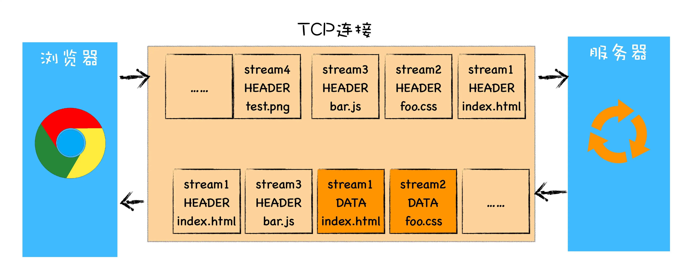
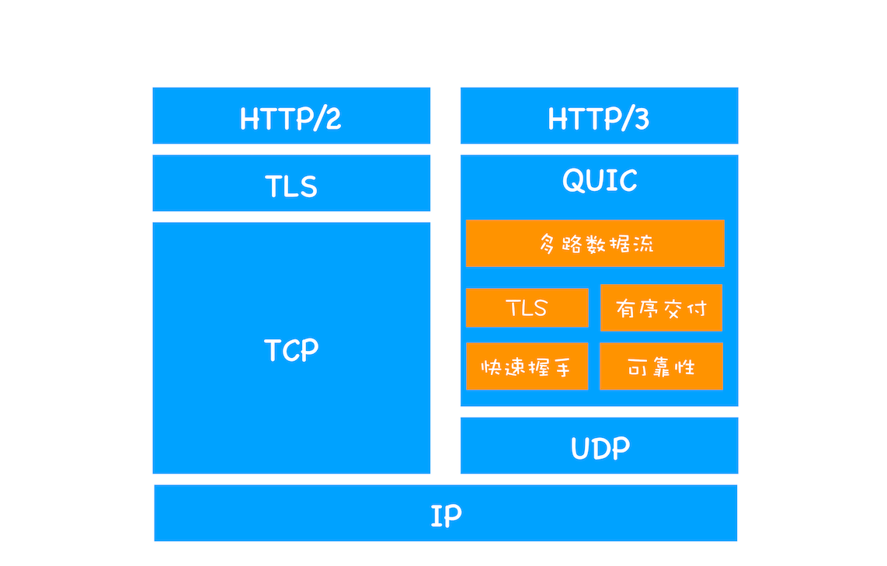
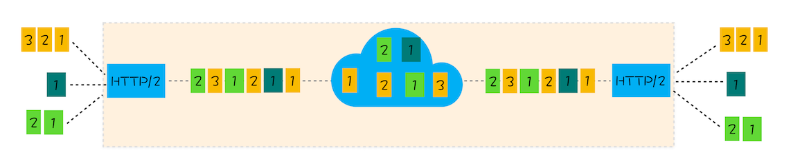

# HTTP发展
 HTTP（超文本传输语言）是浏览器和服务器之间的通信语言。
## HTTP发展阶段
  - HTTP1.0
  - HTTP2.0
  - HTTP3.0
### HTTP1.0
#### 背景
  需要支持多种类型的文件下载

  实现方式：**通过请求头和响应头进行协商,在请求时通过请求头告诉服务器需要什么类型的数据等。比如：accept、accept-encoding、accept-Charset、accept-language**
#### 功能
  - **引入请求头和响应头：**以key-value形式保存，在 HTTP 发送请求时，会携带请求头信息，服务器返回数据时，会返回响应头信息
  - **引入状态码：**告诉浏览器服务器最终处理该请求的情况
  - **提供 Cache 机制：**为了减轻服务器的压力，用来缓存已经下载过的数据
  - **引入了 User-Agent 字段**：统计客户端的基础信息
#### 存在的问题
  - HTTP1.0 每进行一次 HTTP 通信，都需要经历建立 TCP 连接、传输 HTTP 数据 和 断开 TCP 连接三个阶段
  - 每个域名绑定了一个唯一的 IP 地址，一个服务器只能支持一个域名。
  - 必须在响应头中设置完整的数据大小。如：```content-length:901```
### HTTP1.1
#### HTTP1.1改进
  - **增加持久连接：**一个 TCP 连接上可以传输多个 HTTP 请求，只要浏览器或者服务器没有明确断开连接，那么该 TCP 连接会一直保持。目前浏览器对于同一个域名，默认允许同时建立6个 TCP 持久连接
  - **增加 HTTP pipeline（解决队头阻塞的问题）：** HTTP1.1中的管线化是指将多个 HTTP 请求整批提交给服务器的技术，虽然可以整批发送请求，不过服务器依然需要根据请求顺序来回复浏览器的请求。
  
  那时候， FireFox，Chrome都放弃了管线化技术。
  - **请求头增加 Host 字段（解决一台物理主机上绑定多个虚拟主机，每个虚拟主机有自己单独的域名，这些单独的域名都要公用同一个 IP 地址的问题）：**表示当前的域名地址，服务器可以根据不同的 Host 值做不同的处理。
  - **引入 Chunk transfer 机制（解决动态生成内容传输时，浏览器不知道何时接收完完整数据的问题）：**服务器将数据分割成若干个任意大小的数据块，每个数据块发送时会附上上个数据块的长度，最后使用一个零长度的块作为发送完整数据的标志。这样就提供了对动态内容的支持。
  - **引入 Cookie、安全机制**
#### 存在的问题：
  - 带宽利用率不理想：
    * TCP慢启动：是 TCP 协议中用于控制拥塞窗口大小的一种算法，它用于在建立连接或者遭遇网络拥塞时逐渐增加数据传输的效率。
    * 同时开启了多条 TCP 连接，这些连接会竞争固定的带宽
    * 队头阻塞问题：HTTP1.1 中虽然能公用同一个 TCP 管道，但是在一个管道中，同时只能处理一个请求，在当前请求没有结束之前，其他的请求只能处于阻塞状态。这意味着不能随意在一个管道中发送和接收内容。

### HTTP2.0
#### HTTP2.0功能
  - **多路复用：一个域名只使用一个 TCP 长连接来传输数据**。实现资源的并行请求
  
    * 添加二进制分帧层
  - **可以设置请求的优先级：**在帧头部有用于设置请求优先级的字段：权重和依赖。  
  - **服务器推送：**服务器可以直接将数据推送到浏览器。比如：请求一个HTML页面之后，服务器知道当前页面引用了几个重要的js和css文件，那么在接收到HTML请求之后，附带将要使用的css和js文件一并发送给浏览器，这样当浏览器解析完HTML文件之后，就能直接拿到css和js文件，这对首次打开页面的速度起到了至关重要的作用。
  - **头部压缩**


#### HTTP2.0 请求和接收过程
  - 浏览器准备好数据：浏览器准备好请求数据，包括了请求行，请求头，请求体（POST请求）等信息。
  - 二进制分帧层处理数据：将数据转换为一个个带有请求 ID 编号的帧，通过协议栈将这些帧发送给服务器。
  - 服务器合并请求信息：服务器接收到所有帧之后，会将所有 ID 相同的帧合并为一条完整的请求信息。
  - 服务器处理请求： 服务器处理请求，并将处理的响应行，响应头，响应体分别发送到二进制分帧层
  - 二进制分帧层处理数据：将响应数据转换为一个个带有请求 ID 变化的帧，经过协议栈发送给浏览器
  - 浏览器收到响应帧后，会根据  ID 编号将帧的数据提交给对应的请求。

#### 存在的问题
  - HTTP2.0仍然是基于 TCP 协议的，TCP 协议仍然存在数据包级别的队头阻塞问题。
    
    **TCP的队头阻塞指的是在 TCP 传输过程中，由于单个数据包丢失而造成的阻塞**

    在 HTTP2.0 中，多个请求跑在一个 TCP 管道中，如果其中任意一路数据流中出现了丢包的情况，那么会阻塞该 TCP 连接中的所有请求。随意随着丢包率的增加，HTTP2.0 的传输效率也会越来越差。

### HTTP3.0  
#### 背景
  - HTTP2.0 的 TCP 队头阻塞问题
  - TCP 建立连接的延时
#### 改进 TCP 协议的困难
  - 中间设备僵化：中间设备大量依赖 TCP 协议，并且很少升级。
  - TCP 协议都是通过操作系统内核来实现的，应用程序只能使用不能修改。操作系统的更新都滞后于软件的更新，也是导致 TCP 协议僵化的一个原因。  

#### QUIC 协议
  基于以上原因， HTTP3.0 选择了一个折中的方法，基于 UDP 实现了类似于 TCP 的多路数据流，传输可靠性等功能，这套功能统称为 QUIC 协议
  

#### QUIC 协议的功能
  - **实现了类似 TCP 的流量控制、传输可靠性的功能。**

  QUIC 在 UDP 的基础上增加了一层来保证数据可靠性传输。提供了数据包重传、拥塞控制以及其他一些 TCP 中存在的特性。

  - **继承了 TLS 加密功能。**

  减少了握手所花费的 RTT 个数。

  - **实现了 HTTP2.0 中的多路复用功能。**

  和 TCP 不同， QUIC 实现了在同一物理连接上可以有多个独立的逻辑数据流。实现了数据流的单独传输，就解决了 TCP 中队头阻塞问题。

  
  

  - **实现了快速握手功能**

    由于 QUIC 是基于 UDP 的，所以 QUIC 可以实现使用 0-RTT 或者 1-RTT 来建立连接，可以用最快的速度来发送和接收数据，这样可以大大提升首次打开页面的速度。

#### HTTP3.0 面临的挑战
  - 服务器端和浏览器端都没有对 HTTP3.0 提供比较完整的支持。
  - 部署 HTTP3.0 也存在很大的问题。 因为系统内核对 UDP 的优化远远没有达到 TCP 的优化程度，这也是阻塞 QUIC 的一个重大原因。
  - 中间设备僵化问题。这些设备对 UDP 的优化程度远远低于 TCP，目前使用 QUIC 协议会有较大的丢包率。    

## 总结
###  HTTP 1.1

  - 纯文本传输

  - 每次传输都要携带完整的 IP 地址

  - 不考虑 pipeline，实时性和并发性存在问题

###  HTTP 2.0
  - 头部压缩；针对原来需要传输的大量的key，value建立索引表，对相同的头只需要发送对应的索引

  - 将一个 TCP 分成多个流，每个流有自己的id，流可以从客户端 <===> 服务端互相发送，流有优先级

  - 将传输信息分割成更小的帧，用二进制的方式传输。常见的帧有header帧，data帧

  通过这两种机制， HTTP  2.0 的客户端可以将多个请求分到不同的流中，然后将请求内容拆成帧，进行二进制传输。这些帧可以打散乱序发送， 然后根据每个帧首部的流标识符重新组装，并且可以根据优先级，决定优先处理哪个流的数据。

  总结：
   HTTP  2.0 其实是将三个请求变成三个流，将数据分成帧，乱序发送到一个  TCP  连接中。

   HTTP  2.0 成功解决了  HTTP  1.1 的队首阻塞问题，同时，也不需要通过  HTTP  1.x 的 pipeline 机制用多条  TCP  连接来实现并行请求与响应；减少了  TCP  连接数对服务器性能的影响，同时将页面的多个数据 css、js、 jpg 等通过一个数据链接进行传输，能够加快页面组件的传输速度。

###  HTTP 3.0
  - QUIC
    * 无队头阻塞问题
      * 多个stream之间没有依赖
      * 当前流发生丢包时，只会阻塞当前流
    * 更快的连接建立
      * 使用quic协议握手，只有1rtt,握手的目的是确认双方的连接id
    * 连接迁移
      * 没有通过 TCP 四元组来绑定连接，而是通过连接id来标记两个通信的端点

###  HTTPS

#### 前置信息

  - 对称加密：加密和解密的密钥都是一致的

  - 非对称加密：加密和解密的密钥是不同的，公钥加密的信息只有私钥才能解密，私钥加密的信息只有公钥才能解密

#### 如何确保公钥的安全性

  - CA证书（提供公钥、证书所有者、有效期、发布机构）

  - CA签名算法（根据信息进行hash，hash是不可逆的，对hash值加密后和信息一起发送出去）

  - 如何确保ca的真实性（向ca的上级验证，直到root ca）

#### HTTPS 流程

  - 客户端发送tsl版本信息，加密套件列表，压缩候选列表，生成一个随机数，一起给服务端

  - 服务端发送选择使用的tsl版本，加密套件，压缩套件，生成的随机数给客户端

  - 证书校验：根据网站发送的证书，用ca证书给到的公钥去解密网站给到的证书，如果解密成功，说明网站是可信的

  - 客户端生成随机数pre-master，发送client-key-exchange, 用证书给到的公钥进行加密后发送给服务端，服务端收到后用私钥解密

    此时，服务端和客户端分别保存着三个随机数：自己的，对端的以及pre-master

  - 发送encryptedHandshakeMessage,将约定好的参数用协商密钥加密后传递给服务端， 用于数据与握手验证

  - 双方都校验成功之后就可以正常通信
   
###  HTTP 1.0  HTTP 1.1  HTTP 2.0  HTTPS   HTTP 3.0

#### 1.1

  * 长连接

  * 明文传输

  * pipline 管道传输，同一个 TCP 连接，发起多个请求，减少整体的响应时间（ps: 服务器必须按照接收到的请求的顺序来响应）；所以 HTTP 1.1解决了请求的队头阻塞，但是没有解决响应的队头阻塞。


#### HTTPS

  * 基于ssl/tls安全协议

  * TCP 三次握手后，需要ssl/tsl握手过程，才可以进入加密报文传输

  * HTTP 端口：80； HTTPS : 443;

  * HTTPS 需要申请证书

  * **解决了 HTTP 的哪些问题？**

    解决了窃听、篡改、冒充风险

  * **解决方法：**

      使用tls/ssl安全协议，

      对信息加密，

      进行身份校验，

      需要身份证书,

      混合加密，

      摘要算法

  * **加密方案：**

    a. 非对称机密和对称加密结合

    b. 通信前：非对称加密(只有一个秘钥: 私钥加密，公钥解密)；通信中：对称加密(公钥和私钥)；

  * **ssl协议基本流程：**

    a. 客户端向服务端索要公钥

    b. 双发协商产生 会话秘钥

    c. 双方基于会话秘钥进行加密通信
    
## 常见问题
### HTTP1.1 和 HTTP2.0 区别

  - **二进制协议：**HTTP2.0 是一个二进制协议

    HTTP1.1，报文的头部信息必须是文本（ASCII 编码），数据体可以是文本，也可以是二进制

    HTTP2.0 头部和数据体都是二进制，统称为帧，可以分为头部帧和数据帧。帧的概念是实现多路复用的基础

  - **多路复用：**

    HTTP1.1 中的多路复用，一次只能发送一个请求，同一个域名维护6个TCP连接。

    HTTP2.0 中的多路复用仍然复用 TCP 连接，同一个域下只有一个连接，在一个连接里，客户端和服务端可以同时发送多个请求或者回应，而且不用按照顺序一一发送，避免了队头阻塞的问题。  

  - **数据流：** HTTP2.0 使用了数据流的概念

    HTTP2.0 每个请求或回应的所有数据包，称为一个数据流。每个数据流都有一个独一无二的编号。数据包发送时，都必须标记数据流 ID, 用来区分属于哪个数据流。

  - **头部信息压缩：**HTTP2.0实现了头部信息压缩，由于 HTTP1.1 协议不带状态，每次请求都必须附上所有信息。

    HTTP1.1 每次请求都会附带很多重复的字段，会浪费带宽，影响速度

    HTTP2.0 引入了头部压缩机制， 一方面，头部信息使用 gzip 或者 compress 压缩后再发送。另一方面，客户端和服务器同时维护一张头部信息表，所有字段都会存入这个表，生成一个索引号，以后就不用发送同样的字段了，只需要发送索引号，这样就能提高速度了。

  - **服务器推送：**HTTP2.0 允许服务器未经请求，主动向客户端发送资源。

    使用服务器推送提前向客户端推送必要的资源，就可以相对减少一些延迟时间。**HTTP2.0下服务器主动推送的是静态资源，和 WebSocket 以及使用 SSE 等方式向客户端发送的即时数据是不同的。**  

### HTTP 和 HTTPS 的区别
  - HTTPS 需要 CA 证书； HTTP 不需要
  - HTTP 是超文本传输协议，是明文传输的; HTTPS 是具有 安全性的 SSL 加密传输协议
  - 使用不同的连接方式，端口号不同：HTTP 是 80 端口； HTTPS 是 443
  - HTTP 协议连接很简单，是无状态的；HTTPS 是 SSL 和 HTTP 协议构建的可进行加密传输、身份认证的网络协议，比 HTTP 更加安全。

### HTTP 的 无状态指的是什么
在 HTTP（Hypertext Transfer Protocol）中，"无状态"（stateless）是指服务器不会在不同的请求之间保留任何关于客户端的状态信息。每个客户端请求都是独立的，服务器不会在不同请求之间共享数据或上下文。

当客户端发送请求给服务器时，服务器会根据请求的内容进行处理，并返回相应的响应。服务器不会持久地记住之前的请求或与客户端的交互历史。

### TCP 慢启动原理
  TCP 慢启动的主要目标是避免在网络中引发拥塞，即当网络带宽有限或网络拥堵时，逐渐增加数据传输速率以避免过多的数据包堆积和丢失。

  慢启动算法的基本原理如下：

  - **初始阶段：**

    当建立一个新的 TCP 连接时，拥塞窗口（Congestion Window）的大小被设置为一个较小的值，通常为一个报文段（MSS）的大小。

  - **指数增加：**

    在每个传输轮回（Round Trip Time，RTT）中，拥塞窗口的大小会加倍。

    每次传输轮回，发送端可以发送的数据量就会增加一倍。

    这样，随着时间的推移，数据传输速率会呈指数级增长。

  - **拥塞避免：**

    当拥塞窗口的大小达到一个阈值（拥塞避免阈值，Congestion Avoidance Threshold）时，慢启动算法会转变为拥塞避免算法。

    在拥塞避免阶段，拥塞窗口的大小不再按指数增加，而是以线性增加的方式进行。

  - **拥塞检测：**

    如果检测到数据包的丢失或网络拥塞的迹象（例如，收到重复的确认信号），则认为网络出现了拥塞。

    当发生拥塞时，慢启动算法会将拥塞窗口的大小减半，并重新开始慢启动过程。
    
### HTTP2.0 的头部压缩算法是怎样的？
  HTTP2.0 的头部压缩算法是 HPACK 算法。在客户端和服务器两端建立“字典”，用索引号表示重复的字符串，采用哈夫曼编码来压缩整数和字符串，可以达到 50%~90%的高压缩率。

  具体来说：

  在客户端和服务端使用“首部表”来跟踪和存储之前发送的键值对，对于相同的数据，不再通过每次的请求和响应发送。

  首部表在 HTTP2.0 的连接存续期内始终存在，由客户端和服务器共同渐进地更新。

  每个新的首部键值对要么被追加到当前表的末尾，要么替换表中之前的值。

### 说一下 HTTP3.0
  [见连接](#http30)  