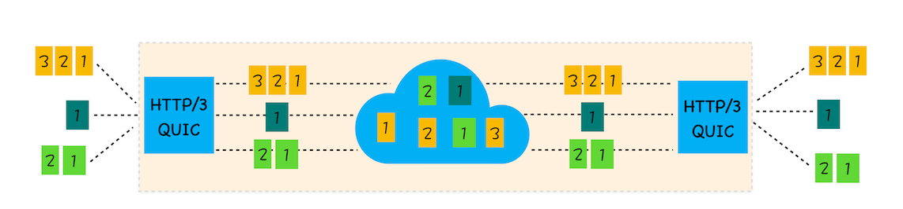

# HTTP发展
 HTTP（超文本传输语言）是浏览器和服务器之间的通信语言。
## HTTP发展阶段
  - HTTP1.0
  - HTTP2.0
  - HTTP3.0
### HTTP1.0
#### 背景
  需要支持多种类型的文件下载

  实现方式：**通过请求头和响应头进行协商,在请求时通过请求头告诉服务器需要什么类型的数据等。比如：accept、accept-encoding、accept-Charset、accept-language**
#### 功能
  - **引入请求头和响应头：**以key-value形式保存，在 HTTP 发送请求时，会携带请求头信息，服务器返回数据时，会返回响应头信息
  - **引入状态码：**告诉浏览器服务器最终处理该请求的情况
  - **提供 Cache 机制：**为了减轻服务器的压力，用来缓存已经下载过的数据
  - **引入了 User-Agent 字段**：统计客户端的基础信息
#### 存在的问题
  - HTTP1.0 每进行一次 HTTP 通信，都需要经历建立 TCP 连接、传输 HTTP 数据 和 断开 TCP 连接三个阶段
  - 每个域名绑定了一个唯一的 IP 地址，一个服务器只能支持一个域名。
  - 必须在响应头中设置完整的数据大小。如：```content-length:901```
### HTTP1.1
#### HTTP1.1改进
  - **增加持久连接：**一个 TCP 连接上可以传输多个 HTTP 请求，只要浏览器或者服务器没有明确断开连接，那么该 TCP 连接会一直保持。目前浏览器对于同一个域名，默认允许同时建立6个 TCP 持久连接
  - **增加 HTTP pipeline（解决队头阻塞的问题）：** HTTP1.1中的管线化是指将多个 HTTP 请求整批提交给服务器的技术，虽然可以整批发送请求，不过服务器依然需要根据请求顺序来回复浏览器的请求。
  
  那时候， FireFox，Chrome都放弃了管线化技术。
  - **请求头增加 Host 字段（解决一台物理主机上绑定多个虚拟主机，每个虚拟主机有自己单独的域名，这些单独的域名都要公用同一个 IP 地址的问题）：**表示当前的域名地址，服务器可以根据不同的 Host 值做不同的处理。
  - **引入 Chunk transfer 机制（解决动态生成内容传输时，浏览器不知道何时接收完完整数据的问题）：**服务器将数据分割成若干个任意大小的数据块，每个数据块发送时会附上上个数据块的长度，最后使用一个零长度的块作为发送完整数据的标志。这样就提供了对动态内容的支持。
  - **引入 Cookie、安全机制**
#### 存在的问题：
  - 带宽利用率不理想：
    * TCP慢启动
    * 同时开启了多条 TCP 连接，这些连接会竞争固定的带宽
    * 队头阻塞问题：HTTP1.1 中虽然能公用同一个 TCP 管道，但是在一个管道中，同时只能处理一个请求，在当前请求没有结束之前，其他的请求只能处于阻塞状态。这意味着不能随意在一个管道中发送和接收内容。

### HTTP2.0
#### HTTP2.0功能
  - **多路复用：一个域名只使用一个 TCP 长连接来传输数据**。实现资源的并行请求
  
    * 添加二进制分帧层
  - **可以设置请求的优先级：**在帧头部有用于设置请求优先级的字段：权重和依赖。  
  - **服务器推送：**服务器可以直接将数据推送到浏览器。比如：请求一个HTML页面之后，服务器知道当前页面引用了几个重要的js和css文件，那么在接收到HTML请求之后，附带将要使用的css和js文件一并发送给浏览器，这样当浏览器解析完HTML文件之后，就能直接拿到css和js文件，这对首次打开页面的速度起到了至关重要的作用。
  - **头部压缩**


#### HTTP2.0 请求和接收过程
  - 浏览器准备好数据：浏览器准备好请求数据，包括了请求行，请求头，请求体（POST请求）等信息。
  - 二进制分帧层处理数据：将数据转换为一个个带有请求 ID 编号的帧，通过协议栈将这些帧发送给服务器。
  - 服务器合并请求信息：服务器接收到所有帧之后，会将所有 ID 相同的帧合并为一条完整的请求信息。
  - 服务器处理请求： 服务器处理请求，并将处理的响应行，响应头，响应体分别发送到二进制分帧层
  - 二进制分帧层处理数据：将响应数据转换为一个个带有请求 ID 变化的帧，经过协议栈发送给浏览器
  - 浏览器收到响应帧后，会根据  ID 编号将帧的数据提交给对应的请求。

#### 存在的问题
  - HTTP2.0仍然是基于 TCP 协议的，TCP 协议仍然存在数据包级别的队头阻塞问题。
    
    **TCP的队头阻塞指的是在 TCP 传输过程中，由于单个数据包丢失而造成的阻塞**

    在 HTTP2.0 中，多个请求跑在一个 TCP 管道中，如果其中任意一路数据流中出现了丢包的情况，那么会阻塞该 TCP 连接中的所有请求。随意随着丢包率的增加，HTTP2.0 的传输效率也会越来越差。

### HTTP3.0  
#### 背景
  - HTTP2.0 的 TCP 队头阻塞问题
  - TCP 建立连接的延时
#### 改进 TCP 协议的困难
  - 中间设备僵化：中间设备大量依赖 TCP 协议，并且很少升级。
  - TCP 协议都是通过操作系统内核来实现的，应用程序只能使用不能修改。操作系统的更新都滞后于软件的更新，也是导致 TCP 协议僵化的一个原因。  

#### QUIC 协议
  基于以上原因， HTTP3.0 选择了一个折中的方法，基于 UDP 实现了类似于 TCP 的多路数据流，传输可靠性等功能，这套功能统称为 QUIC 协议
  

#### QUIC 协议的功能
  - **实现了类似 TCP 的流量控制、传输可靠性的功能。**

  QUIC 在 UDP 的基础上增加了一层来保证数据可靠性传输。提供了数据包重传、拥塞控制以及其他一些 TCP 中存在的特性。

  - **继承了 TLS 加密功能。**

  减少了握手所花费的 RTT 个数。

  - **实现了 HTTP2.0 中的多路复用功能。**

  和 TCP 不同， QUIC 实现了在同一物理连接上可以有多个独立的逻辑数据流。实现了数据流的单独传输，就解决了 TCP 中队头阻塞问题。

  
  
  
  - **实现了快速握手功能**

    由于 QUIC 是基于 UDP 的，所以 QUIC 可以实现使用 0-RTT 或者 1-RTT 来建立连接，可以用最快的速度来发送和接收数据，这样可以大大提升首次打开页面的速度。

#### HTTP3.0 面临的挑战
  - 服务器端和浏览器端都没有对 HTTP3.0 提供比较完整的支持。
  - 部署 HTTP3.0 也存在很大的问题。 因为系统内核对 UDP 的优化远远没有达到 TCP 的优化程度，这也是阻塞 QUIC 的一个重大原因。
  - 中间设备僵化问题。这些设备对 UDP 的优化程度远远低于 TCP，目前使用 QUIC 协议会有较大的丢包率。    
