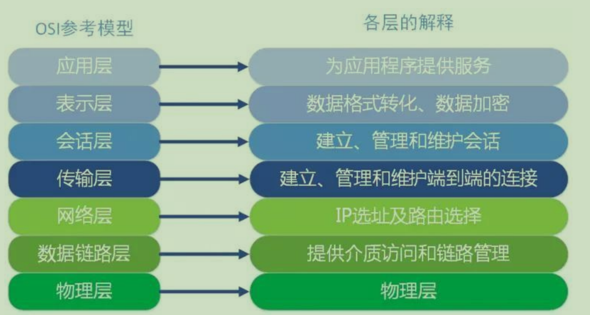
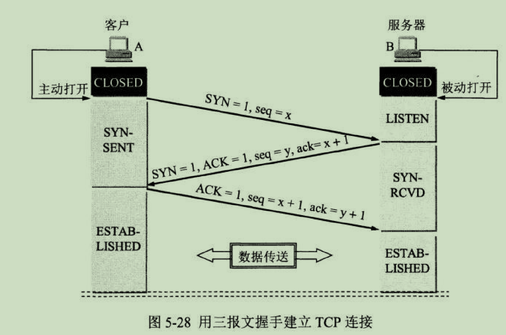
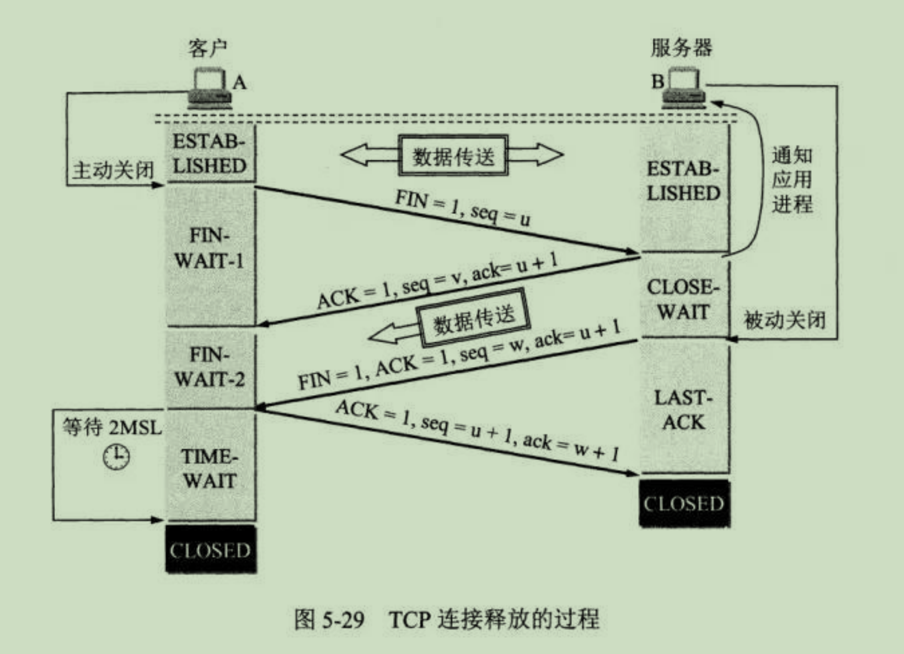

# HTTP-面试题
## 常见面试题
### GET 和 POST 请求的区别
1. **应用场景：** 
  - GET 请求是幂等的，一般 GET 请求用于对服务器资源不会产生影响的场景，比如请求一个网页的资源
  - POST 请求不是幂等的，一般用于对服务器资源产生影响的场景，比如注册用户等操作。
2. **是否缓存：**
  - GET 请求一般会被浏览器缓存
  - POST 请求很少被浏览器缓存
3. **发送的报文格式：**
  - GET 请求报文实体部分为空，参数携带在 URL 上    
  - POST 请求的报文中实体部分一般为向服务器发送的数据
4. **安全性：**
  GET 请求参数再 URL 上，相比于 POST 请求来说不是很安全，因为请求的 URL 会被保存在历史记录中。  
5. **请求长度：**
  - GET 请求由于浏览器对于 URL 长度的限制，会影响 GET 请求发送数据的长度。这个限制是浏览器规定的，并不是 RFC 规定的。
6. **参数类型：**
  - POST 的参数传递支持更多的数据类型。

### POST 请求和 PUT 请求的区别
  - PUT 请求是向服务端发送数据，从而修改数据的内容，但是不会增加数据的种类，也就是说无论进行多少次 PUT 操作，其结果并没有什么不同。（可以理解为更新数据）
  - POST 请求是向服务端发送数据，该请求会改变数据的种类等资源，它会创建新的内容。（可以理解为创建数据）

### 常见的 HTTP 请求头和 HTTP 响应头
#### 请求头
  - Accept: 浏览器能够处理的数据类型
  - Accept-Charset
  - Accept-Encoding
  - Accept-Language
  - Connection: 浏览器与服务器之间连接的类型
  - Cookie: 当前页面设置的 Cookie
  - Host: 发出请求的域
  - Referer: 发出请求的页面的URL
  - User-Agent: 浏览器用户代理字符串
#### 响应头
  - Date
  - Server: 服务器名称
  - Connection
  - Cache-Control: 控制 HTTP 缓存
  - Content-Type
    * application/x-www-form-urlencoded: 浏览器原生的form表单。如果不设置 entype 属性，默认会以该方式提交数据。该种方式提交的数据会放在body里面，数据格式按照key1=val1&key2=val2的方式进行编码，key和val都进行了 URL 转码  
    * application/form-data: 常见的 POST 提交方式，通常表单上传文件时使用这种方式
    * application/json: 服务器消息主体是序列化后的 JSON 字符串
    * text/xml: 用来提交 XML 格式的数据。

### 常见的 HTTP 请求方法
  - GET: 向服务器获取数据
  - POST: 将实体提交给指定的资源，通常会造成服务器资源的修改
  - PUT: 上传文件，更新数据
  - DELETE: 删除服务器上的对象
  - HEAD: 获取报文首部，与 GET 相比，不返回报文主体部分
  - OPTIONS: 询问支持的请求方法，用来跨域请求
  - CONNECT: 要求在代理服务器通信时，建立隧道，使用隧道进行 TCP 通信
  - TRACE: 回显服务器收到的请求，主要用于测试或诊断。

### 什么是 HTTPS
  具体请参考：网络安全-HTTPS

### HTTPS 通信（握手过程）过程
  具体请参考：网络安全-HTTPS

### 完整的 DNS 查询过程
  DNS 服务器解析域名的过程
  - 在浏览器缓存中查找对应的 IP 地址，如果查找到直接返回，找不到进行下一步
  - 将请求发送个本地 DNS 服务器，在本地域名服务器缓存中查询，如果查找到，则直接返回，否则进行下一步
  - 本地 DNS 服务器向根域名服务器发送请求，根域名服务器会返回一个查询域的顶级域名服务器地址
  - 本地 DNS 服务器向顶级域名服务器发送请求，接受请求的服务器查询自己的缓存记录，如果有记录，则直接返回，否则返回下一级的权威域名服务器的地址
  - 本地 DNS 服务器向权威域名服务器发送请求，域名服务器返回对应的结果
  - 本地 DNS 服务器将返回结果保存在缓存中，便于下次使用
  - 本地 DNS 服务器将返回结果返回给浏览器  

  比如要查询 www.baidu.com 的 IP 地址，首先会在浏览器的缓存中 查找是否有该域名的缓存，如果不存在就将请求发送到本地的 DNS 服务器中，本地 DNS 服务器会判断是否存在该域名的缓存，如果不存 在，则向根域名服务器发送一个请求，根域名服务器返回负责 .com 的 顶级域名服务器的 IP 地址的列表。然后本地 DNS 服务器再向其中 一个负责 .com 的顶级域名服务器发送一个请求，负责 .com 的顶级 域名服务器返回负责 .baidu 的权威域名服务器的 IP 地址列表。然 后本地 DNS 服务器再向其中一个权威域名服务器发送一个请求， 最 后权威域名服务器返回一个对应的主机名的 IP 地址列表。

### OSI 七层模型
  
  1. 应用层
    
    最靠近用户的一层，是为计算机提供应用接口，也为用户提供各种网络服务。

    **常见的应用层网络协议： HTTP， HTTPS,  FTP,  POP3,  SMTP**

  2. 表示层

    **表示层提供各种用于应用层数据的编码和转换功能，确保一个系统的应用层发送的数据能够被另一个系统的应用层识别。**如果必要，该层可提供一种标准表示形式，用于将计算机内部的多种数据格式转换成通信中采用的标准表示形式。**数据的压缩和加密也是表示层可提供的转换功能之一。**

    **如果按照功能来划分，base64 应该工作在表示层。**

  3. 会话层

    会话层就是负责建立、管理和终止表示层实体之间的通信会话。该层的通信由不同设备中的应用程序之间的服务请求和响应组成。

  4. 传输层

    传输层建立了主机端到端的连接，传输层的作用是为上层协议提供端到端的可靠和透明的数据传输服务，包括处理差错控制和流量控制等问题。

    该层向高层屏蔽了下层数据通信的细节，使高层用户看到的只是在两个传输实体间的一条主机到主机、可由用户控制和设定的、可靠的数据通路。

    **端口号即是这里的“端”**

    **TCP UDP 就在这一层。**

  5. 网络层

    本层用过 IP 寻址来建立两个节点之间的连接，为源端的运输层送来的分组选择合适的路由和交换节点，正确无误的按照地址传送给目的端的运输层。

    **就是通常说的 IP 层，这一层就是我们经常说的 IP 协议。**

    IP 协议是 Internet 的基础。可以理解为，**网络层规定了数据包的传输线路，而传输层规定了数据包的传输方式。**

  6. 数据链路层

    将比特组合成字节，再将字节组合成帧，使用链路层地址（以太网使用 MAC 地址）来访问介质，并进行差错检测。

    网络层与数据链路层的对比：**网络层规划了数据包的传输线路，而数据链路层就是传输路线。不过，在数据链路层上还增加了差错控制的功能。**

  7. 物理层

    实际最终信号的传输是通过五六层实现的。通过物理介质传输比特流。规定了电平、速度和电缆针脚。
    
    **常用设备有（各种物理设备）集线器、中继器、调制解调器、网线、双绞线、同轴电缆。这些都是物理层的传输介质。**

#### OSI 七层模型的特点
  **对等通信**

  对等通信，为了使数据分组从源传送到目的地，源端 OSI 模型的每一层都必须与目的端的对等层进行通信，这种通信方式策划给你喂对等层通信。在每一层通信过程中，使用本层自己的协议进行通信。

### TCP 的三次握手和四次挥手
#### 三次握手
  

  三次握手指的是建立一个 TCP 连接时，需要客户端和服务器总共发送三个包。

  进行三次握手的主要作用就是为了确认双方的接收能力和发送能力是否正常、指定自己的初始化序列号为后面的可靠性传送做准备。

  实质上就是连接服务器指定端口，建立 TCP 连接，并同步连接双方的序列号和确认好，交换 TCP 窗口大小信息。

  **三次握手的过程**

  1. 客户端处于 Closed 状态，服务端处于 Listen 状态。

  2. 第一次握手：客户端给服务端发送一个 SYN 报文，并指明客户端的初始化序列号 ISN，此时客户端属于 SYN_SEND 状态。

    **首部的同步位 SYN = 1, 初始序号 seq = x, SYN = 1 的报文段不能懈怠数据，但要消耗掉一个序号。**

  3. 第二次握手：服务端收到客户端的 SYN 报文后，会以自己的 SYN 报文作为应答，并且也是指定了自己的初始序列号 ISN. 同时会把客户端的 ISN + 1 作为 ACK 的值，表示自己已经收到了客户端的 SYN，此时服务端属于 SYN_REVD 的状态。

    在确认报文段中 SYN = 1, ACK = 1, 确认号 ack = x+1， 初始序号 seq = y

  4. 第三次握手：客户端收到 SYN 报文之后，会发送一个 ACK 报文，当然，也是一样吧服务器的 ISN + 1 作为 ACK 的值，表示已经收到了服务端的 SYN 报文，此时客户端属于 ESTABLISHED 状态。 服务器收到 ACK 报文之后，也处于 ESTABLISHED 状态。此时双方已经建立了连接。

    确认报文段 ACK =1, 确认号 ack = y + 1, 序号 seq = x + 1（初始值 seq = x, 第二个报文所以要 + 1）,ACK 报文段可以携带数据，不懈怠数据则不消耗序号。

#### 四次挥手
  
  
  刚开始双方都处于 ESTABLISHED 状态。

  **假如是客户端先发起关闭请求。四次挥手的过程如下：**
  
  - 第一次挥手： 客户端会发送一个 FIN 报文，报文中会指定一个序列号。此时客户端处于 FIN_WAIT1 状态。 

    即发出连接释放报文段（FIN=1，序号seq=u），并停止再发送数据， 主动关闭 TCP 连接，进入FIN_WAIT1（终止等待 1）状态，等待服务端的确认。

  - 第二次挥手：服务端收到 FIN 之后，会发送 ACK 报文，且把客户端的序列号值 +1 作为 ACK 报文的序列号值，表明已经收到客户端的报文了，此时服务端处于 CLOSE_WAIT 状态。 

    即服务端收到连接释放报文段后即发出确认报文段（ACK=1，确认号 ack=u+1，序号seq=v），服务端进入CLOSE_WAIT（关闭等待）状态， 此时的TCP 处于半关闭状态，客户端到服务端的连接释放。客户端收到服务端的确认后，进入 FIN_WAIT2（终止等待 2）状态，等待服务端发出的连接释放报文段。 
    
  - 第三次挥手：如果服务端也想断开连接了，和客户端的第一次挥手一 样，发给 FIN 报文，且指定一个序列号。此时服务端处于 LAST_ACK 的状态。

   即服务端没有要向客户端发出的数据，服务端发出连接释放报文段 （FIN=1，ACK=1，序号seq=w，确认号ack=u+1），服务端进入 LAST_ACK （最后确认）状态，等待客户端的确认。 
   
  - 第四次挥手：客户端收到 FIN 之后，一样发送一个 ACK 报文作为应答，且把服务端的序列号值 +1 作为自己 ACK 报文的序列号值，此时客户端处于 TIME_WAIT 状态。需要过一阵子以确保服务端收到自己的 ACK 报文之后才会进入 CLOSED 状态，服务端收到 ACK 报文之 后，就处于关闭连接了，处于 CLOSED 状态。 
  
    即客户端收到服务端的连接释放报文段后，对此发出确认报文段 （ACK=1，seq=u+1，ack=w+1），客户端进入TIME_WAIT（时间等待） 状态。此时 TCP 未释放掉，需要经过时间等待计时器设置的时间 2MSL 后，客户端才进入CLOSED 状态。
    
  **那为什么需要四次挥手呢？**
  
   因为当服务端收到客户端的 SYN 连接请求报文后，可以直接发送 SYN+ACK 报文。其中 ACK 报文是用来应答的，SYN 报文是用来同步的。 但是关闭连接时，当服务端收到 FIN 报文时，很可能并不会立即关闭 SOCKET，所以只能先回复一个 ACK 报文，告诉客户端，“你发的FIN 报文我收到了”。只有等到我服务端所有的报文都发送完了，我才能发 送FIN 报文，因此不能一起发送，故需要四次挥手。

