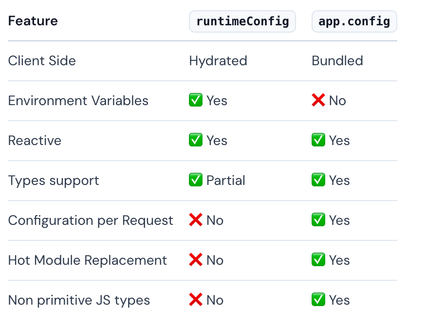
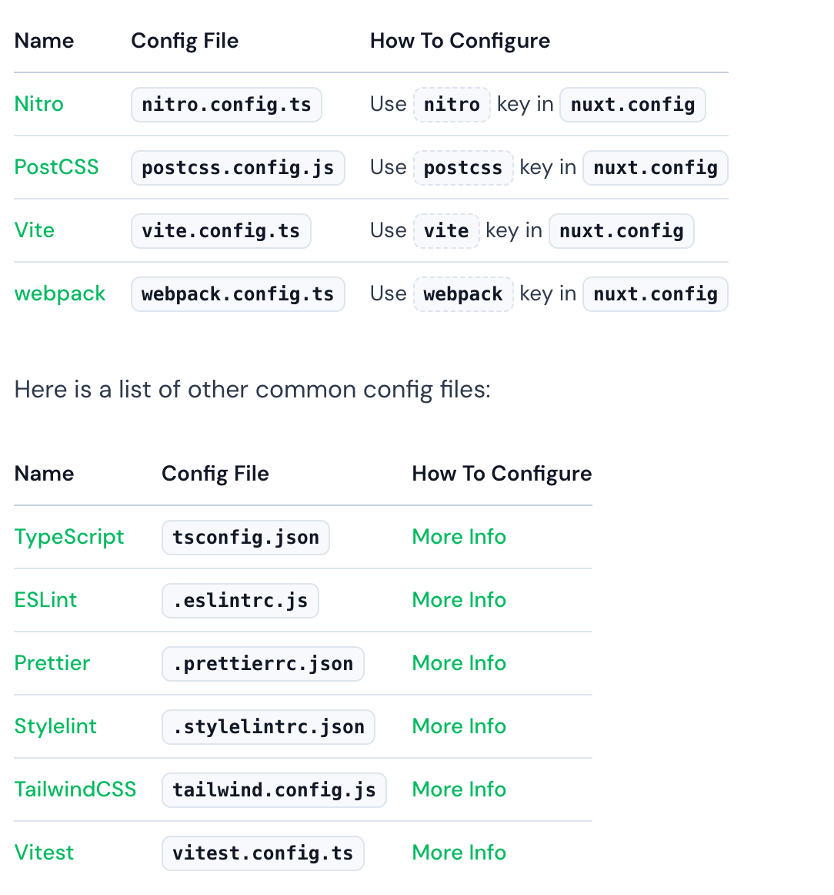

# 服务端渲染-Nuxt
## nuxt简介
  nuxt 是一个用于帮助我们快速构建 SSR 页面的vue框架。

### 特点：
#### 自动化功能
  1. **基于文件的路由：**根据pages目录的结构定义路由。
  2. **代码分割：**nuxt会自动将代码分割成更小的块，有助于减少应用程序的初始加载时间。
  3. **开箱即用的服务端渲染：** nuxt 带有内置的 ssr 功能，因此不必自己设置单独的服务器。
  4. **自动导入：**  可以在各自的文件编写vue组件，而无需导入他们，并且具有 tree-shaking 和 优化 js bundle 的特点
  5. **数据获取程序：** nuxt 提供可组合项来处理 ssr 兼容的数据获取以及不同的策略。
  6. **零配置 TS 支持：**可以通过自动生成的类型和 ```tsconfig.json```来实现ts，而无需专门接入TS
  7. **可配置的构建工具：**默认使用vite

### 服务端渲染
  nuxt 默认内置 SSR 功能，无需自己配置服务器，这样做有很多好处：
  
  1. 更快的首屏加载时间：nuxt 将完全渲染的 HTML 发送到浏览器，可以立即显示。
  2. 友好的SEO：搜索引擎可以更好的索引 SSR 页面，因为 HTML 内容立即可用，而不需要 JS 在客户端呈现内容。
  3. 在低功耗设备上有更好的性能：减少了客户端下载和执行 JS 的数量，这对于难以处理大量 JS 的低功耗设备是很有益的。
  4. 更好的可访问性：内容在初始化页面加载时立即可用，提高了用户的可访问性。
  5. 更轻松的缓存：页面可以在服务端缓存，可以减少生成内容并将内容发送给客户端的时间。

  总体而言， SSR 能够提供更快，更高效的用户体验，并提高搜索引擎优化和可访问性。

#### 服务器引擎
  nuxt 服务器引擎使用 Nitro 解锁了全栈功能。

  1. 在开发过程中，使用 Rollup 和 Node.JS 工作线程隔离服务器代码和上下文。它还通过读取```server/api/```和```server/middleware/```中的服务器中间件来生成服务器API

  2. 在生产环境，Nitro 将应用程序和服务器构建到```.output```目录中。输出内容是很轻量的，因为压缩并移除了 Node.js 模块（除了polyfills）. 可以将输出部署在任何支持 JS 的系统上。

#### 生产部署

  1. nuxt 应用可以部署在 Node 或者 Deno 服务器上，预渲染托管在静态环境中
  2. 部署到serverless和edge providers

#### 模块化
  模块化可以通过实现自定义功能，集成第三方服务来扩展nuxt

#### 架构
  nuxt 由不同的包组成：

  1. core engine: nuxt
  2. bundlers: @nuxt/vite-builder; @nuxt/webpack-builder
  3. command line interface: nuxi
  4. server engine: nitro
  5. development kit: @nuxt/kit
  6. nuxt2 bridge: @nuxt/bridge.

## 配置项
  [文档链接](https://nuxt.com/docs/getting-started/configuration)
### NuxtConfig配置项
  可以通过 ```nuxt.config.ts```文件来配置以达到覆盖或者扩展应用程序的行为。

  特点：

  1. 默认使用 defineNuxtConfig 导出，参数为对象，全局可用，无需导入。
  2. 可以按照环境来区别配置
  3. 使用 ```runtimeConfig``` API 来暴露环境变量等给应用程序。默认这些值只能在服务端渲染时使用。如果想要在客户端渲染时也是用，可以包含在 ```runtimeConfig.public```属性下面。
    
    在页面中可以通过 ```useRuntimeConfig()```来使用。


  ```js
    // 配置文件
    export default defineNuxtConfig({
      // 根据环境来分开配置。
      $production: {

      },
      $development: {

      },
      runtimeConfig: {
        // 只能在服务端渲染时使用
        apiSecret: '',
        // 服务端s渲染和客户端渲染都可以使用
        public: {
          apiBase: '/api'
        }
      }
    })
  ```

### AppConfig
  配置 ```app.config.ts```文件，用于公开在构建时确定的公共变量。与 ```runtimeConfig```选项相反，这些不能使用环境覆盖。

  特点：
  
  1. 默认导出 defineAppConfig 函数，参数为对象，全局可用，无需导入。
  2. 使用 ```useAppConfig```可以把配置项暴露给应用程序。

  ```js
    export default defineAppConfig({
      title: 'Nuxt',
      theme: {
        dark: true,
        colors: {
          primary: red,
        }
      }
    })
  ```

### ```runtimeConfig 和 app.config```的区别

#### 相同点：
  ```runtimeConfig 和 app.config``` 都可以用于向应用程序的其余部分公开变量。

#### 区别：
  1. ```runtimeConfig```: 在构建后需要使用的私有或者公有令牌。
  2. ```app.config```: 在构建时确定的公共令牌，网站配置等（例如：主题，标题和任何不敏感的项目配置项）

  
    

### Vue config
  如果使用vite, 还需要配置一下 ```@vitejs/plugin-vue 或者 @vitejs/plugin-vue-jsx```,可以在 ```nuxt.config``` 文件中配置

  ```js
    export default defineNuxtConfig({
      vite: {
        vue: {
          customElement: true
        },
        vueJsx: {
          mergeProps: true
        }
      }
    })

  ```

### webpack 配置项
  如果使用 webpack, 需要配置 ```vue-loader```, 可以在 ```nuxt.config```文件中添加 ```webpack.loader.vue```键

  ```js
    export default defineNuxtConfig({
      webpack: {
        loaders: {
          vue: {
            hotReload: true,
          }
        }
      }
    })

  ```

### 其他配置项
  

### 启用vue实验性功能
  可以在 ```nuxt.config```中配置。 比如：

  ```js
    export default defineNuxtConfig({
      vue: {
        defineModel: true,
        propsDestructure: true
      }
    })

  ```