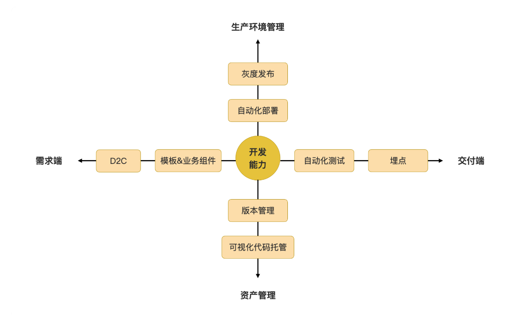
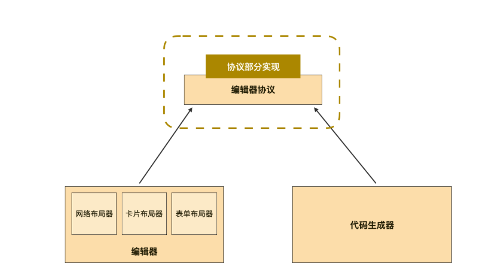
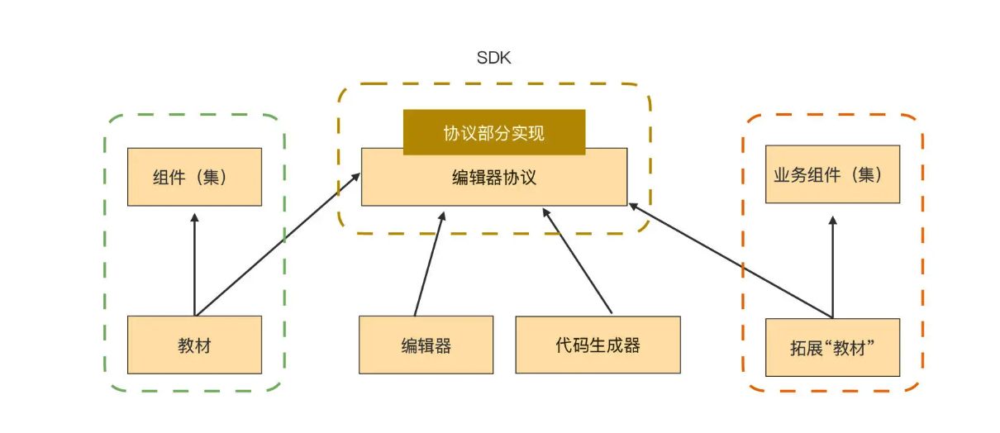
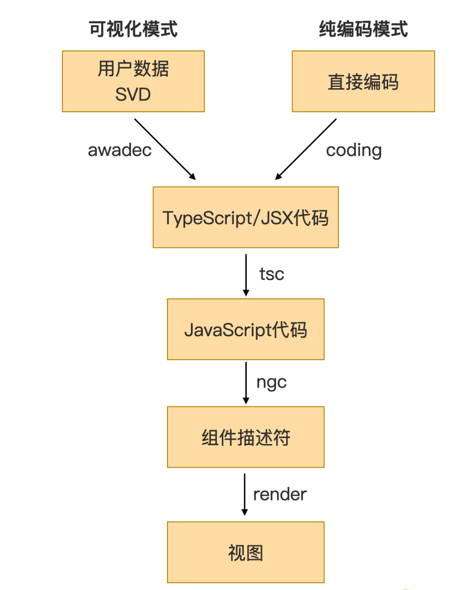
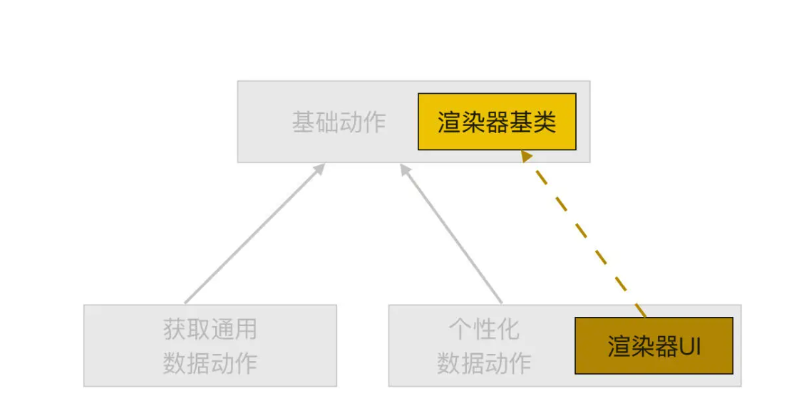
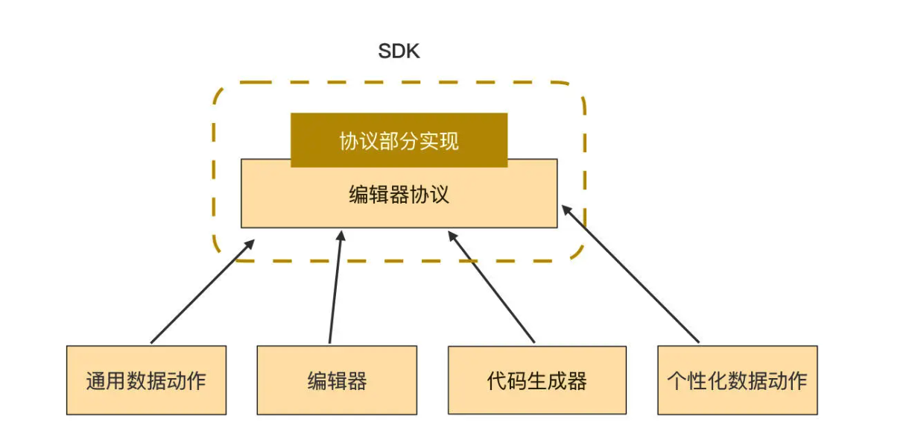
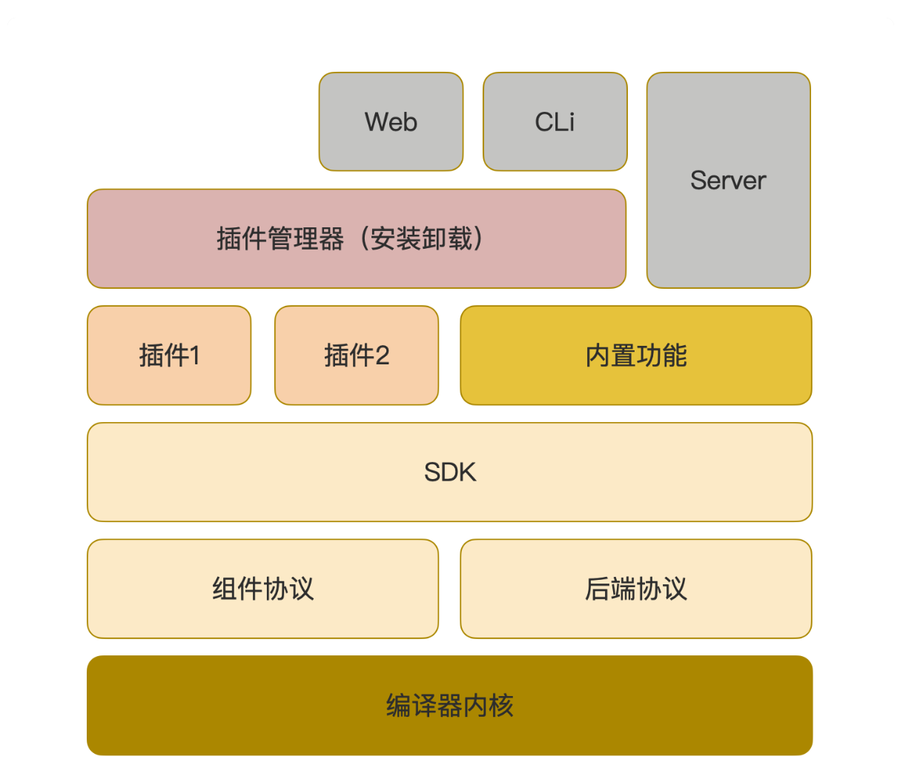

# 低代码
## 低代码平台需具备哪些能力？
  - **适用领域：** 需要支撑不同复杂度的业务。简单的业务需要高效快速实现功能，复杂的业务需要兜底策略（当复杂度超过低代码平台的能力时，低代码平台应该提供一种方法，允许业务人员回退到传统的Pro Code 模式继续开发。）
  - **适用人员：** 专业技术人员，业务人员，介于两者之间的研发人员。
    
    比如：

      - 平缓的学习曲线
      - 尽可能自动化
      - 提供应用范例
      - 提供教材（比如：视频形式的教材）
      - 快速响应（出问题或者有问题能够在第一时间段得到帮助）

  - **与基础设施之间的关系：**    

    - 被其他系统集成
    - 集成其他系统到内部
    - 保持相互独立

    一般根据企业自身定位，选择其中的某种方式进行融合就可以了。

  - **全生命周期**
    - D2C（Design to Code）：从设计稿中识别关键信息，再实现与低代码平台对接与编辑。
    - UX 设计及开发： 基于 D2C, UX 设计师可以直接提供模板和业务组件。
    - APP 开发能力
    - APP 的自动化测试能力：包含两点：一是帮助 APP 自动生成测试代码；二是提供一键式测试环境构建、测试执行、测试报告、乃至自动标注出错位置。
    - 应用的版本管理： 要为应用构建相互独立的开发环境、系统测试时环境、生产环境等，并能实现应用版本的测试、灰度发布、正式上线、紧急回退能力等。
    - 应用生产环境监控：包括两点：一是应用运行时基础信息（CPU/内存/磁盘空间）监控和告警，二是应用埋点数据的植入、采集、分析等。

## 低代码平台可以覆盖开发周期中的哪些功能
  APP开发周期
  
### 需求端
  - **需求端的 D2C 功能和模板能力。**
### 交付端  
  - **交付端的 UI自动化测试**

    UI 自动化测试难点：测试用例调试成本高；测试用例代码维护成本高

    **低代码平台可以自动生成自动化测试代码**

  - **提供自动化程度更高的植入埋点能力和自动分析数据的功能。**

### 生产环境管理
  - 自动部署

    如果是容器化的运行时，我们可以直接提供应用运行时镜像，在镜像中直接把蓝图、Dockerfile，以及其他配置信息都自动处理好，应用团队拿到镜像后就可以直接部署，或者由低代码平台自动推送给自带的服务器上直接部署。如果是物理机环境，我们可以打包所需的各种依赖，直接生成所需的各种脚本，做到应用解压后直接一个 run.sh 就搞定的效果。

  - 灰度发布

    灰度策略配置：

    - 基本策略配置：包括用户规模、覆盖功能、回滚策略、新旧系统部署策略等；
    - 用户画像配置：包括用户特征、年龄、数量、地理、终端、常用功能、友好度、净值度等，根据手里的用户画像数据而定；
    - 分流规则配置：这部分比较灵活，多以手工修改配置文件（如 nginx.conf）或者运维脚本为主，容易出错，可视化集成后收益较高。

  - 紧急回退
#### 自动化能力解决方案：
     
  1. 低代码平台将开发和运行环境合一，直接将开发好的 App“一键”推送给运行时，自动生成一个 URL 对外提供业务价值；

  2. 开发环境和运行环境物理隔离，彻底解耦。  

### 资产管理
  - **代码自动评审、入库**
  - **自动化版本管理**

  低代码平台上的代码托管功能，不需要完整复刻 Git 的各种能力，只需要把代码托管和 App 的工程管理融合在一起即可。
  
  比如，在应用开发者打开应用工程时，自动执行 git pull，在退出应用工程时，自动执行 git commit 提交所做的修改。甚至还可以依托于 gitlab 或者 gerrit 这样的工具，自动就本次修改发起代码走查流程，将当前所做修改推送给管理员进行代码走查。此时 gitlab 或者 gerrit 还可以触发 DevOps 流水线，对当前的修改进行自动构建和测试等一系列操作，然后才进入人工走查阶段。而这一系列操作，都可以由低代码平台在后台静默执行。
  
  这个过程看起来很复杂，但是其实大多数动作都可以由 DevOps 流水线来执行，低代码平台需要做的，只是正确地配置好流水线任务，以及触发 DevOps 流水线。像 gitlab 或者 gerrit 这种一站式代码托管工具，本身就有非常完善的 API，几乎所有操作只需要一个后台 shell 命令就可以触发。其中，gitlab是一个开源软件，社区版是免费的，gerrit是一个商业软件。
  
  App 的版本也可以作为一种资产来对待，一般的软件企业肯定已有 App 版本管理系统了，低代码平台可以打通 App 版本管理系统，从而实现一站式的 App 版本发布和更新。
  
## 发展路径
  - 先通用能力，后满足具体业务能力。

    需要评估：可用资源；用户友好程度；团队面对业务压力时，能扛多久。

## 演进阶段
  - **MVP 阶段：** 快速试错、快速闭环。
  - **成熟期：**侧重发展通用能力。对于业务提交的任何需求，都按照最通用的能力来考虑，同时充分考虑各个场景的共同特征，而暂时忽略他们的个性化特征。坚持采用已有功能实现各种需求，通过这个方法倒逼已有功能的进一步通用化。
  - **超越期：**侧重于发展场景化和提效的能力。重心转移到各个功能的个性化需求，把个性化和易用性提升到最高优先级。必要的话，甚至可以不洗重新设计各个具体场景的开发流程，以获得更高的自动化开发水平，尽可能高的提升代码的自动生成比例，从而最大化的发挥低代码的开发优势。而此时在成熟期留下来的诸多通用功能，就成了平台兜底测罗的一部分，可以兜住场景化所未能覆盖到的 20% 场景。

## 基础设施
   **web组件集：**组件集的能力直接决定了低代码编辑器的开发能力。主要用于解决低代码编辑器的细节管控问题。

   **web组件集主要在三个环节发挥作用：1.构筑低代码编辑器自身；2.构筑编辑器的开发能力；3.构筑业务应用。**

### 什么样的组件集是好的
  - **自主可控**
    1. 配置量
    2. 使用难度
    3. 可适用范围
    4. 定制能力

  - **封装程度高**
    1. 数据驱动封装模式（推荐）：所有 API 都已数据的方式来驱动，彻底将 HTML/CSS 封装在其内部。
    2. 模板驱动封装模式： HTML 部分非常复杂，数据、样式、状态几乎都在 HTML 模板里面实现。
    3. CSS 样式模板：只给出了 CSS 样式，没有带动作。
  - **功能强大**
    #### 如何衡量组件集功能强大：
      1. 组件集包含的原子组件和容器类组件数量：至少50个以上
      2. 具有良好的视图悬浮（气泡化）功能封装和多层视图叠加管理能力。低代码编辑器往往有密集的配置入口，许多配置项需要就地弹出气泡甚至多级气泡来承载，避免打扰当前的开发工作。
      3. 数据采集类的组件（文本框、数字框、下拉选择框）必须对表单友好，这样才能更容易实现出表单类页面
      4. 对常用功能要有统一封装（比如指令），特点是这些功能可以外挂到任何普通 dom 节点、组件节点上，实现功能扩展。比如，任意视图下拉，上传功能，多功能徽标，下拉多级菜单，拖拽功能等都值得封装。
      5. 一个符号图标库。
      6. 组件集性能要求。比如画布所见即所得效果不是采用 iframe 实现的。而是在画布上采用一个动态模块直接渲染出来的，那对编辑器的性能要求就会很高。

## 核心功能-编辑器
  **编辑器核心模块：**
  - 代码生成器
  - 编辑器
  - 插件系统与生态

  

### 生成代码总体流程
  1. 直接法：直接将数据结构生成浏览器能识别的代码
    
    好处：
    
      - 架构简单，不需要引入和协调另外一个编译器，代码量少。
      
      - 效率高， JiT 编译器只需间接法的约 20%-30%，几乎可以做到全程百毫秒以内的 JiT 编译消耗。
    
    劣势：

      - 必须考虑缩在场景里的前端技术栈选型。比如之后可能还要考虑生态问题。

      - 约束了页面组件集的实现。

  2. 间接法：先将 结构化数据 生成出某种 MVVM 框架的代码，再利用其编译器进一步编译成浏览器能识别的代码。

      好处：

        - 可以支持 Low Code 和 Pro Code 混合开发一个 APP。这是直接法做不到的。支持混合开发的重要意义在于，你可以相对妥善地处理好存量代码。

      劣势：
        - 架构复杂，需要额外协调 VUE, REACT, ANGULAR 等提供的编译器。  

### 结构化代码生成法
  把一段结构化的数据转换为代码。

  **具体步骤：**
  1. 将编辑器持久化采用的结构化数据转为插入点数据，然后再传给代码生成器。

  2. 代码生成器会先将各个插入点的数据做校验，一旦发现有冲突，就会报错。校验通过之后，代码生成器需要将各个插入点的结构化代码片段，按照该类插入点的语法拼装成一个代码块。之后，再按照语法要求的顺序将代码块拼装在一起，最终就得到了一大块代码，此时的代码才具有语义和功能，也可以被其他编译器编译了。

  3. HTML 模板生成
    
    **思想：**

      Web 组件集提供的组件可以分为两大类，一类是普通组件，另一类是容器。容器具有普通组件的所有特性，但与普通组件不同的是，容器可以将任何普通组件、容器装到它内部去，这样逻辑上就形成了一棵树。

    **需要解决的问题：**  

      各个节点生成的 HTML 片段都不一样

      需要把这些独立节点的 HTML 片段融合成一个整体。

      为了保持代码有良好的封装内聚性，不允许采用 if else 的方式来解决节点之间的差异。

    **解决办法：**  

      **核心思想：** 采用深度优先的递归调用过程， HTML 片段总是从最深处（树叶）开始真正组装完成，然后一级一级向树根递归出去。直到递归到树叶根时，一个完整的 HTML 代码就生成好了。
      
      给每层树节点上都定义一个相同签名的函数（我们起名为 htmlCoder），每层节点的 htmlCoder 只干两件事情：

      1. 如果该节点有子级，则正确地组织好参数并调用其子级节点的 htmlCoder，驱动其子级生成 HTML 片段；
      
      2. 正确地生成好自己的 HTML 片段，该生成几层包裹层就就生成几层，并将子级返回的 HTML 片段与自身生成的 HTML 包裹片段，正确组装成一个合法的 HTML 片段，并返回给父级节点。

## 编辑器-布局编辑器
### 布局需要考虑哪些问题
  - 通用性
  - 效率
  **单一的布局起是无法同时获得效率和通用能力的。所以，只有采用组合的方式，才能兼顾高效率和通用能力。**   
### 基础能力
  - **响应式布局器：**
  
  特点：提供了响应式布局的布局器，使开发者能够根据不同的屏幕尺寸和设备类型创建适应性布局。可以定义不同的布局和样式规则，以确保应用程序在不同设备上呈现良好的用户体验。

  - **canvas 布局器**

    特点：基于画布的布局器，提供了一个空白的画布区域，开发者可以在上面自由绘制和布置组件。通过拖拽、缩放和调整组件的属性，可以创建自定义的界面布局。  

  - **拖拽布局器**

    特点：基于拖拽和放置操作的布局器，让开发者通过直观的方式来构建界面布局。可以从组件库中选择需要的组件，然后将其拖拽到预览区域，并根据需要进行调整和排列。    
### 常见布局器
  - **网格布局器**

    特点： 使用坐标来定位各个组件，非常容易实现鼠标点选、框选、拖动位置、拖动尺寸等基本操作。由于过度自由，可能需要吸附对齐，设置边距等协助实现。  

  - **卡片布局器（基于容器的布局）** 
    
    特点： 把布局分为水平和垂直两个方向进行无限组合。

  - **表单布局器**  

    特点：采用数据驱动型表单，低代码编辑器只需要采用可视化的方式生成一个复杂的数据对象，然后将这个数据对象给到表单组件，就可以渲染出表单视图了。

    **可参考阿里的 [Formily](https://formilyjs.org/)**

  - **流程编排器**

    特点：特定场景下专用，通用性不高，在适合的场景下，会大幅提升布局效率。

    **可以参考[x6](https://x6.antv.vision/zh)**
  
  **多种布局方式需要相互组合才能发挥各自的最大效用，建议将各个布局器当作容器来实现。容器天然具有多层级相互嵌套的特性，这使得各个布局器可以自由组合使用，应用团队可以按需、按 App 特征挑选合适的布局器来实现快速布局。**

## 编辑器-属性编辑器  
  

  - 编辑器负责收集开发者的编排结果，并驱动代码生成器来生成代码；
  - 代码生成器则根据编辑器收集到的原始数据，从工厂中获取“教材”的实例，然后执行 script 函数获得代码；
  - “教材”负责描述各个具体组件的代码应该如何生成。

## 可视化编程
  - 可视化逻辑编排
    * 流程图式

      缺点： 当逻辑复杂后，它的可读性和可维护性会极大下降。

    * 逻辑树式（如：Blockly）
  - 功能节点  

## Low Code 和 Pro Code 的混合使用
### 为什么需要高低代码混合开发
  - 低代码平台是开放给不同技术水平的人使用的。
  - 低代码平台基于通用性的特性，不可能满足所有的需求
  - 纯代码可以作为一种兜底策略
### 如何实现高低代码混合开发
  - 部分模块使用纯代码开发

    把 App 划分为多个模块，其中的某一个模块可以从可视化转换为纯编码模式开发。

### 高低代码如何混合编译  
  

### 如何提升编码体验
  - 引入编辑器

    可以参考[Monaco](https://microsoft.github.io/monaco-editor/)

  - 插件

    比如 vscode 插件  

## 数据
### 数据获取
  HTTP 请求
### 数据配置
  - **请求参数：**预留位置设定参数。比如：通过 url 传参，通过请求头传参，通过请求 body 传参。
  - 数据结构修正
  - 数据模型  

### 数据打桩
  - 给 XHR 请求加一个拦截器，通过 url 等筛选出需要模拟的 rest 服务，然后直接造假。这样甚至可以做到在不实际发出 XHR 请求的前提下，实现数据打桩。
    
    * 如果你使用的是 VUE/React，一般会使用到 axios 来处理 XHR 请求，axios 有 interceptors 属性，可以用于你添加拦截器；
    
    * 如果你用的是 Angular，那可以直接使用 HttpClient 提供的拦截功能；
    
    * 如果你使用的是 jQuery，可以通过 ajaxSetup 这个函数来设置拦截器。
    
    * 如果没有使用框架，可以直接对浏览器原生的 ```XmlHttpRequest``` 打补丁，比如替换掉 XmlHttpRequest 的 send 函数。

    ```js
      const originSend = XMLHttpRequest.prototype.send;
      XMLHttpRequest.prototype.send = function(body) {
          var info="send data\r\n"+body;
          alert(info);
          originSend.call(this, body);
      };
    ```

### 个性化数据
  
  **插件机制**

  得益于个性化数据只为特定业务设计的特点，我们可以采用比通用数据更加灵活的方式来获取数据、提取模型和模拟。一个插件只专注处理好一种个性化数据就行，不需要考虑除此之外的其他场景，因而插件的实现难度低、效率高。

  

  **基础动作至少包含这几部分：**

  - 信息采集：定义一个收集开发者配置信息的视图

  - 信息保存：可以在基础动作中直接实现，只需要在基类中提供读写数据的 API 给子类使用即可。
  
  - 代码生成：在子类中实现代码生成的具体动作。

  最后，把基础动作的代码合并到下图的编译器协议中，成为 SDK 的一部分。

  

## 多人协同编辑
  - WebSocket
  - WebRTC
### 多人协同编辑难点
  - 如何解决冲突。

    CRDT 算法，也就是 Conflict-free Replicated Data Type，无冲突复制数据类型。可了解（LWW（即 Last Writer Wins）策略。）

    也有对应的库可以参考 Yjs, automerge, ref-crdts.

  - 历史记录管理

    Yjs 提供了一个 UndoManager，可以用于记录使用人的历史记录和正确地执行撤销、重做等功能。

  - CRDT 的解决方案可能用不了

    如果你采用 CRDT 解决方案，数据保存的格式就必须采用它定义的格式。一句话说明 CRDT 的原理：对所有操作打上时间戳，然后通过网络把各人编辑产生的历史记录分发出去，本地接收后，完成合并。合并历史记录时，所有冲突点，都使用 LWW 策略处理冲突。所以历史记录的格式是所有 CRDT 解决方案的根基。

  - 应用数据的归属问题

    低代码平台基本上都会按照用户来隔离应用数据，即用户只能看到自己的应用数据，无法看到他人的数据，甚至多数平台会采用租户的方式，对应用数据做物理隔离。

### CRDT 在低代码平台的不适应性
  - 不能简单粗暴的使用 LWW 策略来处理冲突
  - 性能问题：低代码平台的所见即所得效果会昂贵很多，它需要时间来编译，需要更多的时间来渲染。
  - 修改位置：低代码平台的插入位置会复杂很多。

### CRDT 不适性解决办法
  - 对于冲突问题，有一个比较优雅的解决方案是，使用一个临时的独立的影子历史记录来及时保存所有修改。在确定要保存这个影子记录时，将所有的修改合入主修改记录序列中，否则将其丢弃即可。影子历史记录里的修改依然保持及时被记录的特征，所以在应用 LWW 策略规避冲突时，被直接覆盖的工作就小到可以忍受的程度；
  
  - 对于性能问题，可以考虑约束同时编辑的人数，但这治标不治本。一个更好的方法是引入懒渲染的方式，即只在需要的时候启动渲染，其他情况下只记录并提示有多少未渲染的修改即可；
  
  - 对于多行属性的问题，可以学习一下 git 的做法，你一定用过 git 合并过代码，对不同行所做的修改，git 合并时是不会冲突的，对吧？所以，除了 xpath 外，还需要增加一个行号。只有对同一个 xpath 属性的同一行做编辑，才需要应用 LWW 策略，其他情况直接合并即可。    

### 总结
  **总的来说，如果你现在还有得选，那么我建议你引入 CRDT 算法，作为你的低代码平台的底层数据保存和历史记录管理功能的基础，即使你现在看不到有实现多人协作功能的必要，但 CRDT 也可以提供成熟的数据结构、历史记录管理等有价值的功能** 

## 编辑历史
### 需要具有的能力
  - 基本编辑历史功能的实现
  - 编辑历史多分支的视线
  - 可视化分支管理的实现。
### 实现方式
  - Yjs
  - git

    特点： 轻量级，性能优越；强大的历史分值管理能力，用于多人写作时，可以利用 Git 强大的自动合并功能，避免自行实现多人协作的麻烦。

  - 采用双向链表的方式来存储编辑历史记录和编辑历史分支。  

## 扩展与定制-实现插件系统并形成生态圈  
### 插件系统的设计和实现
  - **sdk 的提取方法**

    通常来说，SDK 主要包括：
      - 接口和类型定义。这部分代码量可能还占不到 SDK 包所有代码的 1/10，但却是最重要的一部分。这些接口和类型就是插件的架构和框架，它们勾勒了整个插件系统的轮廓和概貌；
      - 基类的定义。扩展点通用部分的实现，需要我们尽可能完整地将各个功能实现出来，只留下尽可能少的抽象方法。而二次开发者主要的工作，就是补全所有的抽象方法、覆盖必要的父类方法；
      - 调试工具和构建 & 部署脚本。这是二次开发过程必须的专用工具，包括调试器、构建 & 部署的脚本、脚手架等。如果没有这些工具，二次开发基本就无法继续了，所以我们必须优先实现和提供；
      - 辅助性、功能性工具类。这些就是工具包，封装了常用的功能，目的是降低二次开发难度，提升二次开发效率。它们是辅助性的，没有它们也不会对大局产生多大影响。因此我们可以降低这部分的优先级，在资源允许之后，或者根据二次开发人员的所问所需，针对性地逐渐提供。
  - **可扩展的能力**  
    - 数据与数据模型

      数据存取是存量系统与低代码平台之间最主要的对接方式，这也是插件系统主要需要解决的问题。

      针对各个存量系统打造一个专用插件用来获取数据、提取数据模型这一条路可走。 

    - 自定义组件
      自定义组件是低代码平台最主要的扩展点之一。一般来说，低代码平台内置的组件集都是通用的、常见的，而应用单位自行封装的业务组件，虽然通用性差，但在它适用的那一亩三分地里，价值很高，所以我们需要允许业务团队开发和封装他们适用的业务组件。
      
      另外，再牛的内置组件集也会有功能盲区，在特定场合下，应用团队可以利用这个扩展点来为低代码平台添加新的组件。当然了，作为低代码平台兜底策略的一部分，低代码平台应该要有一种能力能在应用团队无须封装插件的前提下，直接调用原生 API，快速使用第三方库。

    - 自定义交互动作  

      我们前面也说过，可视化编程是可视化开发模式中最难的一个环节，因为可视化编程中，我们需要编排大量的逻辑。
      
      业务组件也有类似场景，比如业务团队内部会积累一些程式化的交互动作。如果我们要用通用动作编排出这些逻辑，需要填写大量复杂、不好维护的参数。这时，我们就可以将这些逻辑封装成自定义交互动作，只暴露出若干输入框作为参数，这样一来，自定义动作卡的使用体验往往就会好许多。
      
      除了封装复杂逻辑之外，自定义交互动作还可以对存量的复杂系统的用法进行场景化归纳，再根据归纳到的使用场景设计相应的参数。动作的使用者只要选定一个预设场景，正确填写所需参数后，低代码平台就可以按预设自动生成相应的代码了。

    - 其他扩展点: 导出、登录等  

      首先，我们在导出应用数据时，如果有扩展点，就可以对导出的原始应用数据做一些转换，转为其他平台或者其他用途的数据。我给你介绍下我碰到过的两个实际场景：第一个是将应用数据一键导出成支持多种运行平台应用包，有的是物理机运行时，有的是 Docker 虚拟机运行时；另一个是将在线 Web 应用直接导出为离线报告，比如 Word、PDF 等格式。我们现在就有应用团队正在研究如何导出有交互能力的离线 Web 应用包。
      
      另外，如果你的低代码平台需要被其他多个系统纳管，或者要部署到客户的系统中，那很可能需要支持多种不同场景的单点登录功能。这个时候，针对每个系统制作登录插件，按需登录，就是一个非常好的做法。

  - **插件二次开发 和 mainfest 设计**
    除了前面说的 SDK 的提取和可扩展点的设置外，在插件系统的设计和实现上，我们还需要考虑插件二次开发和 manifest 设计的问题。
    
    和多数其他系统的插件一样，我们需要有一个 manifest 文件来描述插件的信息，基本信息包括：插件的名字、插件的版本、所用 SDK 的主版本，以及插件功能描述等静态描述信息。
    
    但更关键的是，Schema 必须给出这个插件实现了哪些扩展点、各个扩展点所在的路径，还有各个扩展点的个性化配置信息等。举个例子，如果我们添加了自定义组件，那可能需要为每个新增的组件配置一个图标。  

    比如：
    ```json
      {
      "name": "datahub",
      "module": "DataHubModule",
      "path": "web/dist/@awade/plugin",
      "serviceInfo": {
          "services": [
              {
                  "label": "DataHub",
                  "name": "datahub",
                  "remoteData": {
                      "class": "DataHubRemoteData", "import": "web/src/lib/components/datahub/remote.data-type"
                  },
                  "renderer": {
                      "class": "DataHubRemoteDataRenderer", "import": "web/src/lib/components/datahub/remote.data-renderer"
                  },
                  "initData": {
                      "style": {
                          "dataReviserHeight": "calc(90vh - 410px)", "paramBoxHeight": "calc(90vh - 475px)", "configModalHeight": "calc(90vh - 405px)"
                      }
                  }
              }
          ]
      },
      "actionInfo": {
          "actions": [
              {
                  "category": "事件与数据",
                  "type": "datahub",
                  "action": {
                      "class": "DatahubAction", "import": "web/src/lib/components/datahub/action-type"
                  },
                  "renderer": {
                      "class": "DatahubActionRenderer", "import": "web/src/lib/components/datahub/action-renderer"
                  },
                  "initData": {
                      "style": {
                          "padding": "10px 10px 0 10px",
                          "dataReviserBottom": "10px",
                      }
                  }
              }
          ]
      },
      "metadatas": [{
          "selector": "plx-table",
          "class": "PaletxTable",
          "import": "web/src/lib/components/table/index",
          "category": "dataDisplay",
          "label": "Paletx Table",
          "desc": "Paletx Table",
          "icon": "assets/icon/plugin-paletx-pro/table.svg"
      },
      {
          "selector": "plx-badge",
          "class": "PaletxBadge",
          "import": "web/src/lib/components/status/index",
          "category": "dataDisplay",
          "label": "Paletx Badge",
          "desc": "Paletx Badge",
          "icon": "assets/icon/plugin-paletx-pro/status.svg"
      }]
      }
    ```

    插件系统在拿到一个插件包之后，首先就要读取这个文件，通过它来获取插件的所有信息。因此，这个文件在插件包里的位置和名字必须固定，比如就放在插件包的根目录下，命名为 manifest.json 就可以了。
    
    而二次开发的最主要工作，就是在安装好了 SDK 包之后，按照平台的规范，正确编写各个扩展点的代码。插件的开发工作一般不会特别难，但万事开头难，因此我建议你的平台可以根据不同的扩展点给出一些 Demo 插件，这样应用团队就可以在对应的 Demo 插件包的基础上，依葫芦画瓢完成剩余的工作。

  - **插件生命周期管理**  

  最后，我们还要关注插件的生命周期管理的问题。一个插件的生命周期，大概有这些主要阶段：上传、安装、激活、使用、去激活、迭代更新、卸载。插件系统需要在各个阶段提供对应的通道和工具，支持插件更新和切换自己的状态。
  
  上传比较简单。我们直接在开发平台上开放一个插件上传通道，这样开发者就可以将他的插件上传到系统中来了。
  
  接下来，插件系统就需要对插件包做静态校验，读取 manifest.json 文件，并检查所有必要的配置项是否合法有效。校验通过之后，就可以把插件安装到插件系统中来了。这个过程主要是文件拷贝，在我们的实践中，主要是 JSBundle、NPM 包以及其他静态文件的拷贝，插件系统此时不会去使用或执行相关的代码。完成之后，插件后台管理器会给界面推送一个安装完成的提示，收到这个提示之后，应用就可以激活这个插件了。
  
  插件激活时，插件系统就会实际使用和执行插件包里的代码了，所以这个操作对低代码平台的安全性会构成一定的风险。
  
  具体激活插件时要执行哪些操作，取决于低代码编译器的架构，一般包含前端和后端两部分。前端的部分要把 JSBundle 从服务器下载到浏览器，然后 eval 一下就可以了，后端部分则是执行插件包的初始化代码，把 NPM 包的入口注册到插件包的功能入口上。
  
  可以看到，这两部分都是有安全风险的：前端的激活容易遭受 XSS 攻击，后端在执行插件的初始化脚本时，有可能会执行到恶意代码。
 
  插件激活的时候，插件系统会把插件所提供的各个功能植入到低代码平台的各个环节，比如组件列表中增加对应的业务组件，动作列表中增加对应的自定义动作，获取数据的功能列表里增加对应的数据获取通道，等等。
  
  这些功能都植入好了后，我们就只需要等着应用开发人员按需使用就好了。
  
  与激活和安装的流程相反，插件去激活和卸载的过程需要我们在相应的功能入口处删

### 总结
  根据我们前面的分析，存量系统通过插件，可以将其数据与业务流程和低代码平台相连，应用团队通过插件，可以把业务组件、业务模板、方法和低代码平台连接。当连接的节点逐渐增多之后，你会发现原本相互隔离的人和数据之间，间接地产生了连接。
  
  数据与数据之间、人与数据之间、人与人之间相互打通，形成了一个圈子。随着加入成员越来越多，每个成员可以从圈子里获得更多收益，同时也会吸引更多的成员加入，这是一个正向的增强回路。  

  低代码平台不能仅仅是另一个新系统，而是要成为企业的核心，通过插件连通各个存量系统，贯通数据，让存量数据创造更大的价值。从这个角度看，低代码平台实际上起到的是中台的作用。这一点我在第一讲也说过，低代码平台的演进线路有相当一部分与中台是同向，甚至是重叠的，这两者可以、也必须放在一起考虑。

  具体架构图可以参考下图：

  

  在编译器内核之上，是一层协议层。它是编译器对外的抽象，所有的扩展点都是由协议层来定义和约束的。SDK 则是建立在协议层之上的，它提供了编译器协议的默认实现，以及所有扩展点的基类的定义。这些基类不仅能在减轻二次开发的难度的同时，更重要的是也约束了插件必须遵守的编译协议，插件的二次开发只能按照协议所画出的套路来实现。
  
  SDK 之上，就是各个插件了。从架构图上可以看到，内置功能和插件一样，也必须要遵守编译器协议。因此，从架构角度来说，内置功能与插件是平起平坐的，这样才能确保插件具有充分的扩展能力。当然，这只是从架构角度的设计，实际上插件能有多大能耐，还是取决于你的 SDK。这样就可以在实现层面上，保持内置功能的优势。